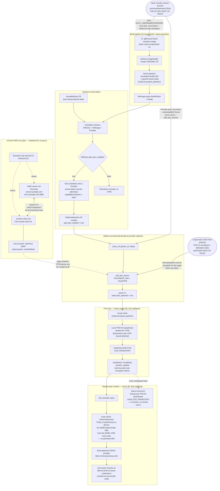

# Banlieue and TPM-Backed Encryption for Kairos + k0s

**Audience:** Security / architecture review
**Status:** Living document — vTPM/kcrypt disk encryption is implemented
(ADR-0039) **and validated end-to-end below (§3a, §4a)**. The k0s etcd
Secrets encryption piece described in §5 was a proposed new project as of
the last revision of this doc; it is now **implemented and validated
end-to-end** as `sceau` — see §5 for the full command transcript proving a
Secret written through the Kubernetes API is stored in etcd as TPM-sealed
ciphertext. **§8 (new)** covers a gap found while planning the migration of
a real multi-controller HA cluster onto this design — `sceau`'s per-node
TPM sealing does not survive a load-balanced multi-`kube-apiserver`
topology as-is — and the fix (`sceau` ADR-0003, `Accepted`, not
yet implemented).
**Scope:** How a k0s control-plane node goes from "VM request" to "running
node with disk-at-rest encryption and etcd Secrets envelope encryption,"
across three separate codebases, and what each encryption layer does and
does not protect against.

---

## 1. Systems involved

Three independently-versioned projects cooperate. None of them call each
other over RPC — everything is either a Kubernetes CRD watch/status update,
or a build-time artifact handoff (container image → ISO → template).

| Project | Repo | Role |
|---|---|---|
| **banlieue** | [`firestoned/banlieue`](https://github.com/firestoned/banlieue) (public OSS on the maintainer's GitHub, no organization-specific content) | Kubernetes-native VM lifecycle API. `VirtualMachine`/`VMClass`/`VMImage`/`Provider` CRDs; schedules VMs onto vSphere via CAPI-style infra CRDs (`VSphereMachine`). |
| **kairos-operator** | upstream, [kairos-io/kairos](https://github.com/kairos-io) | Not banlieue code. Owns the `OSArtifact` CRD (`build.kairos.io/v1alpha2`) that actually builds Kairos ISOs/raw disk images. banlieue's `banlieue-imagebuilder` reconciler creates `OSArtifact` objects but never installs or forks kairos-operator's CRD — it's treated as an opaque `DynamicObject`. |
| **image pipeline** | private CI (GitHub Actions) | Builds the Kairos container images consumed by `OSArtifact` builds — a glibc (RHEL-based) variant and a musl (Alpine-based) variant — drives ISO creation via Auroraboot, and clones vSphere templates. Owns the base cloud-config layer every node boots with. Not banlieue code and not open-sourced; treated here as an external input, same as kairos-operator. |
| **sceau** | [`firestoned/sceau`](https://github.com/firestoned/sceau) (public OSS on the maintainer's GitHub; image pushed to `registry.example.com/sceau`) | Rust daemon implementing the Kubernetes KMSv2 gRPC contract, backed by the node's vTPM. Lets k0s encrypt etcd Secret values without a remote KMS. **Implemented and validated end-to-end** — see §5. (This is the project referred to as "tpm-kms-plugin" in earlier revisions of this doc.) |

---

## 2. End-to-end flow, at a glance



Rendered PNG: `docs/design/diagrams/encryption-flow.png`.

There is also a machine-readable [FINOS CALM](https://calm.finos.org) model
of this same architecture at
`docs/architecture/calm/vtpm-kairos-k0s-encryption.calm.json`
(validates clean against calm-cli 1.56.0, same convention as this repo's
main `docs/architecture/calm/architecture.json`). Its rendered system diagram — every node
this doc describes and how they connect, generated straight from the CALM
JSON via the same Handlebars template used elsewhere in this repo family —
is at `docs/design/diagrams/encryption-calm-system.png`.

### 2a. Where trust actually starts — this is not §3

§3 starts the story at `VMClass.spec.tpm_enabled` and the scheduler
gating a `Provider`. That's a **policy** decision inside banlieue — it is
not where trust originates, and describing it first makes the chain look
more self-contained than it is. Tracing back far enough, every step in
§3–§5 (add_tpm_device, kcrypt sealing, sceau sealing) is only possible
because *something* was already able to talk to vCenter as an
authenticated, privileged principal, and that authority comes from
exactly one place:

**A vCenter service-account username/password held in Vault.** Concretely,
two independent code paths both bottom out in that same credential:

1. **Template creation, one-time, out of band, before banlieue exists at
   all.** The image pipeline's build scripts (§1) call `govc` directly:
   ```console
   $ export GOVC_URL GOVC_USERNAME GOVC_PASSWORD GOVC_TLS_CA_CERTS GOVC_DATACENTER
   ```
   — with a comment right next to that export in the build script:
   `# Supplied by the caller/CI from the secrets store (Vault / GitHub
   Actions secret).` This is what actually builds the glibc/musl Kairos
   base template banlieue later clones — `govc vm.create`/`import.ova`/
   `vm.clone`, run by CI with a Vault-issued credential, with no banlieue
   involvement whatsoever.
2. **Every subsequent clone + `add_tpm_device` banlieue itself performs.**
   `banlieue-provider-vsphere`'s reconciler
   (`crates/banlieue-provider-vsphere/src/reconciler/provider.rs`,
   `read_credentials`) reads a `username`/`password` pair out of a
   Kubernetes Secret referenced by `Provider.spec.connection.credentialsRef`
   — the `Provider` object (`vcenter-example` in this environment) plus its
   Secret, both living in `banlieue-system`. **That Secret's contents are
   the same class of Vault-held vCenter credential as step 1** — in this
   deployment it was materialized into the Secret directly from Vault
   rather than kept in sync by an `ExternalSecret`. This is not a
   hypothetical improvement: the same class of credential is *already*
   synced this way elsewhere in the fleet —
   ```console
   $ kubectl get externalsecrets.external-secrets.io \
       -n virtrigaud-system vsphere-creds
   NAME            STORETYPE            STORE      REFRESH INTERVAL   STATUS         READY   LAST SYNC
   vsphere-creds   ClusterSecretStore   platform   1h                 SecretSynced   True    44d
   ```
   `virtrigaud-system`'s own `vsphere-creds` `ExternalSecret`, backed by
   the `platform` `ClusterSecretStore`, has been syncing successfully for
   44 days. Wiring banlieue's `Provider` credentials Secret to the same
   `ClusterSecretStore` is adopting an established pattern already proven
   in this environment, not inventing a new one — tracked in §7.

The `govc kms.ls`/`govc kms.ls -json` calls that produced §3a's proof
required this exact credential to authenticate — that command only works
*because* a Vault-sourced GOVC_USERNAME/GOVC_PASSWORD was already
exported in the shell running it.

**Why this matters for the rest of the doc:** `VMClass.spec.tpm_enabled`
and the scheduler's failure-domain gating (§3) are *authorization policy
on top of* this credential, not a replacement for securing it. Anyone
holding the Vault secret can `govc` a `VirtualTPM` onto any VM by hand,
entirely outside banlieue's scheduler — the CRD-level gate stops banlieue
users from doing that accidentally, it does not stop someone with direct
vCenter credentials from doing it at all. Every encryption control this
doc validates (§3a's KMS trust, §4/§4a's kcrypt, §5/§5a's sceau) is
downstream of, and only as trustworthy as, this one Vault-held secret.
Compromise it and every subsequent layer's "TPM-backed, no human, no
remote server" story stops being true for a VM created after that point,
because a `VirtualTPM` device gives no cryptographic evidence of *who*
attached it.

---

## 3. vTPM device provisioning (implemented — ADR-0039)

A vTPM is a per-VM virtual device, not a shared resource. It is attached
by banlieue at clone time, before first boot:

1. `VMClassSpec.tpm_enabled: bool` (`crates/banlieue-api/src/banlieue/vmclass.rs`) —
   a class-level, non-overridable capability flag, the same shape as the
   existing `firmware` field. There is deliberately **no per-VM override**.
2. The scheduler (`crates/banlieue-controller/src/reconciler/scheduler.rs`)
   only schedules a `tpm_enabled: true` `VMClass` onto a `Provider` whose
   failure domain advertises the well-known feature string
   `FEATURE_VTPM = "vtpm"` in `capabilities.features` — this is a manual,
   explicit opt-in per Provider, not auto-discovered.
3. `VSphereMachineSpec.tpm_enabled` is resolved onto the vSphere-specific
   infra CR, and `banlieue-provider-vsphere`'s `ensure_vm`
   (`crates/banlieue-provider-vsphere/src/reconciler/vspheremachine.rs`)
   sequences: **clone (powered off) → `add_tpm_device` (a `ReconfigVM_Task`
   with a `VirtualTPM` device spec — the same vSphere API call the vCenter
   UI and PowerCLI's `New-VTpm` use) → power on.** Attaching the device
   before first boot is the hard requirement — Kairos's `kcrypt` seals
   against the TPM during the unattended install, so the device has to
   already exist.
4. `VSphereMachineStatus.tpm_attached: Option<bool>` records whether the
   attach succeeded; a failure surfaces through the VM's normal
   `Ready`/`InfrastructureReady` conditions, not a separate alert path.

**Dependency on vCenter's KMS:** attaching a vTPM device is a vSphere
platform feature gated on vCenter having a healthy, registered Key
Provider (Configure → Key Providers) — in this environment, a KMIP-backed
provider fronting a Thales CipherTrust/KeySecure server. This KMS governs
whether vSphere *permits* the vTPM device to exist at all; it plays **no
role** in what gets sealed into that vTPM once it exists — that is entirely
Kairos's/kcrypt's local decision, described next.

### 3a. Proof: vCenter's registered KMS (Key Provider) and its internally-issued trust cert

`govc` (against the maintainer's vCenter, `vcenter-example`) shows the registered KMIP
Key Provider that gates vTPM device creation cluster-wide:

```console
$ govc about
FullName:     VMware vCenter Server 8.0.3 build-25600417
Name:         VMware vCenter Server
Vendor:       VMware, Inc.
Version:      8.0.3
Build:        25600417
OS type:      linux-x64
API type:     VirtualCenter
API version:  8.0.3.0
Product ID:   vpx
UUID:         a670e212-69c6-464a-a189-d96bd4fa411e

$ govc kms.ls
NonProd KMIP  Standard  green  default
```

`govc kms.ls -json` shows the full trust chain — both directions of the
mutual-TLS handshake between vCenter and the KMIP server
(`kms.example.com:5696`), each certificate issued by the maintainer's internal
CA (**the internally-issued cert**, requested per this doc's §5 update):

```console
$ govc kms.ls -json
{
  "info": [
    {
      "clusterId": { "id": "NonProd KMIP" },
      "servers": [
        { "name": "KMS1", "address": "kms.example.com", "port": 5696 }
      ],
      "useAsDefault": true,
      "managementType": "vCenter"
    }
  ],
  "status": [
    {
      "clusterId": { "id": "NonProd KMIP" },
      "overallStatus": "green",
      "managementType": "vCenter",
      "servers": [
        {
          "name": "KMS1",
          "status": "green",
          "certInfo": {
            "subject": "commonName                = kmip-server.example.com\norganizationalUnitName    = NDevices\norganizationalUnitName    = Devices\norganizationalUnitName    = Internal\norganizationName          = Example Corp
countryName               = US",
            "issuer": "organizationalUnitName    = Example Corp Internal CA
organizationName          = Example Corp
countryName               = US",
            "serialNumber": "0x5F352604",
            "notBefore": "2025-02-27T17:12:45Z",
            "notAfter": "2027-05-27T17:42:45Z",
            "fingerprint": "09:EF:6B:D3:8A:62:41:AD:4A:E0:15:FE:3F:C9:F3:B2:F7:6F:3D:85"
          },
          "clientTrustServer": true,
          "serverTrustClient": true
        }
      ],
      "clientCertInfo": {
        "subject": "commonName                = vcenter-client-01\norganizationalUnitName    = NDevices\norganizationalUnitName    = Devices\norganizationalUnitName    = Internal\norganizationName          = Example Corp
countryName               = US",
        "issuer": "organizationalUnitName    = Example Corp Internal CA
organizationName          = Example Corp
countryName               = US",
        "serialNumber": "0x5F35D5CE",
        "notBefore": "2026-08-24T11:06:39Z",
        "notAfter": "2028-11-24T11:36:39Z",
        "fingerprint": "CC:0A:27:45:2C:68:FF:2D:92:8F:51:2D:AC:53:30:04:D9:3F:58:89"
      }
    }
  ]
}
```

Reading this both ways:

- **`certInfo`** is the KMIP server's (`KMS1` / `kms.example.com`)
  certificate, as presented to vCenter — subject CN
  `kmip-server.example.com`, issued by the same internal CA.
  `clientTrustServer: true` means vCenter trusts this cert.
- **`clientCertInfo`** is vCenter's own client certificate (CN
  `vcenter-client-01`) presented back to the KMIP server, issued by
  the same the maintainer's internal CA. `serverTrustClient: true` means the KMIP server
  trusts it.
- Both certs are currently valid (`overallStatus: green`) and chain to
  **Example Corp Internal CA** — this is the internally-issued trust
  anchor referenced above, confirmed live against the running KMIP
  integration rather than assumed from config.

This is the *only* place vCenter's KMS participates in **gating** this
stack — per §3, it gates whether a vTPM device can be attached at all.
§3b traces the *other* half of the story: what actually happens at the
VIM-call level when `add_tpm_device` executes, and it turns out the same
KMS Key Provider has one more role there — protecting the VM's encrypted
NVRAM, distinct from gating device creation.

### 3b. Proof: the actual VIM-level trust chain — physical host identity → ESXi → per-VM vTPM, no physical TPM chip involved

§3's `ReconfigVM_Task` + `VirtualTPM` device spec is one API call from
banlieue's point of view. Read literally, "physical → ESXi → VM" implies
a hardware TPM chip is somewhere in this chain. It isn't — vSphere's vTPM
is entirely software-emulated, per VM, with no physical TPM chip
involved at any point. What's actually there, verified live against this
environment's real inventory (not vSphere docs in the abstract):

**1. ESXi host identity — what authorizes the host to accept vCenter's
privileged reconfigure call at all:**

```console
$ govc host.cert.info -host.dns esxi-host01.example.com
Certificate Status:          good
Issued To:
  Common Name (CN):          esxi-host01.example.com
  Organization (O):          Example Corp
  Organizational Unit (OU):  NDevices,Devices,Internal
Issued By:
  Organization (O):          Example Corp
  Organizational Unit (OU):  Example Corp Internal CA
Validity Period:
  Issued On:                 2026-03-09 08:40:35 +0000 UTC
  Expires On:                2028-03-09 09:10:35 +0000 UTC
```

This ESXi host's own machine certificate is issued by **the same internal
CA** that issues vCenter's KMIP client cert in §3a — this environment runs vSphere's "Custom CA" certificate-management
mode, replacing the vCenter-default self-signed VMCA certs for
host/vCenter machine identity with certs from the organization's own PKI.
This is the trust that lets vCenter's `AddDeviceSpec` `ReconfigVM_Task`
land on *this specific, mutually-authenticated* ESXi host — banlieue
never talks to the host directly; it talks to vCenter (§2a), and vCenter
talks to the host over this TLS relationship.

**2. What the host does — no physical TPM chip, an emulated one, with
its own manufacturer-style cert:**

`hostd` on the ESXi host creates a **software-emulated TPM 2.0 instance**
scoped to that one VM — the same emulated device §4a's boot-log proof
(`ACPI: TPM2 ... VMWARE VMW_TPM2`) shows the guest OS sees. As part of
creating it, that emulated TPM generates its own RSA-2048 **Endorsement
Key (EK)** locally and produces a CSR. Pulled directly off the live VM's
`VirtualTPM` device (`govc vm.info -json`, decoding the
`endorsementKeyCertificate` field — itself base64-inside-base64 in the
API response):

```console
$ govc vm.info -json <vm-path> | jq -r '.virtualMachines[0].config.hardware.device[] | select(.deviceInfo.label=="Virtual TPM")'
{
  "key": 11000,
  "deviceInfo": { "label": "Virtual TPM", "summary": "Virtual Trusted Platform Module" },
  "endorsementKeyCertificate": [ "<base64>", "<base64>" ]
}

$ echo "<base64>" | base64 -d | base64 -d > ek.der
$ openssl x509 -in ek.der -inform DER -noout -subject -issuer -dates
subject=tcg-at-tpmManufacturer=id:564D5700, tcg-at-tpmModel=VMware TPM2, tcg-at-tpmVersion=id:00020065
issuer=CN=CA, DC=vsphere, DC=local, C=US, ST=California, O=vcenter01.example.com, OU=VMware Engineering
notBefore=Sep  5 09:42:13 2026 GMT
notAfter=Sep  3 15:49:15 2035 GMT
```

`tpmManufacturer=id:564D5700` decodes to ASCII `"VMW"` — this is vSphere's
own manufacturer ID for its emulated TPM, the software equivalent of the
vendor string burned into a physical TPM chip at the factory. The
**issuer is `CN=CA, DC=vsphere, DC=local`** — vCenter's **internal VMCA**,
a *third*, separate CA from both the organization's own CA (host/KMIP certs, above) and
`sceau`'s TPM-derived key material (§5). VMCA signing this EK cert is
what makes it possible for anything checking "is this really a
VMware-emulated TPM 2.0, not something spoofed" to verify that claim — it
is the direct software analogue of a physical TPM's manufacturer EK
certificate, minted by vCenter itself at device-creation time rather than
burned in at a factory.

**3. The other KMS role, promised above — protecting the VM's encrypted
NVRAM (where the vTPM's persisted state, including anything `kcrypt`
seals into it, actually lives):**

```console
$ govc vm.info -json <vm-path> | jq '.virtualMachines[0].config.keyId'
{
  "keyId": "62a8658479f6476f9c70f56e369f1d13e4c556299b154610967dc96698700d5a",
  "providerId": { "id": "NonProd KMIP" }
}
```

This is a **direct, per-VM reference** from this specific VM's config
back to the exact Key Provider validated live in §3a
(`providerId.id: "NonProd KMIP"`) — proof that the same KMIP integration
that gates whether a vTPM device can be created (§3a) is also the thing
protecting the confidentiality of this VM's NVRAM file at rest (where
vTPM state — not `sceau`'s etcd Secret sealing, a completely separate
TPM object hierarchy per §5 — is stored). `config.hardware.version` for
this VM is `vmx-21` and `config.firmware` is `efi`, both well above vTPM's
minimum requirements (`vmx-14`+, EFI firmware) — also confirmed live,
not assumed.

**Putting the whole chain together, correcting the "physical → ESXi →
VM" framing:** it's the organization-CA-issued mutual trust (host ↔ vCenter, and
vCenter ↔ KMIP) that authorizes the privileged VIM call to happen at all
→ the ESXi host emulates the TPM 2.0 device entirely in software, no
hardware chip anywhere → vCenter's own internal VMCA (a third CA) mints
that emulated TPM's Endorsement Key certificate at creation time → the
same KMIP-backed Key Provider from §3a separately protects the VM's
NVRAM at rest via a per-VM `keyId`. Only *after* all of that has already
happened does Kairos boot and start using the resulting device purely
locally (§4a: `/dev/tpmrm0`, zero further network calls) — the guest's
vTPM device itself is never backed by a physical chip. **Correction from
an earlier draft of this section, per §3c below: the ESXi host's *own*
physical TPM chip is real and does participate — as the thing the host
itself is attested against and seals its own local state to, a
precondition for the host to be trusted with encrypted-VM operations at
all, not as the backing store for any individual VM's vTPM.**

### 3c. The physical layer, for real this time — ESXi host TPM attestation and key persistence

Two teams, two separate jobs, confirmed directly by the people who did
them: **the crypto team enrolled/attested each ESXi host's physical TPM
chip; the VM engineering team registered the KMIP Key Provider in
vCenter (§3a).** Those are two different trust roots maintained by two
different teams, and this doc's earlier drafts of §3/§3b undersold the
first one. Live proof, pulled from every host in this environment
(`govc host.tpm.info -json`):

```console
$ govc host.tpm.info -json
[
  {
    "name": "esxi-host01.example.com",
    "supported": true,
    "version": "2.0",
    "txtEnabled": true,
    "attestation": { "time": "2026-09-05T18:54:19Z", "status": "accepted" },
    "stateEncryption": {
      "protectionMode": "tpm",
      "requireSecureBoot": true,
      "requireExecInstalledOnly": false
    }
  },
  ... (12 hosts total, all identical shape, all "status": "accepted")
]
```

Every field here is doing real work:

- **`supported: true, version: "2.0"`** — this ESXi host has an actual,
  physical TPM 2.0 chip on the motherboard. Not emulated, not virtual —
  this is the hardware root §3b's per-VM vTPM explicitly is *not*.
- **`txtEnabled: true`** — Intel TXT (Trusted Execution Technology) is
  active: the host's boot chain is measured into that physical chip's
  PCRs at every boot, hardware-enforced, before ESXi's own software gets
  a chance to lie about what booted.
- **`attestation: {status: "accepted"}`** — vCenter has remotely
  challenged this specific physical TPM and verified its PCR values
  against an expected-good baseline, and it currently passes. Pulling
  the actual PCR values off this same host confirms there's real
  measured-boot data behind the "accepted" status, not just a boolean:
  ```console
  $ govc host.tpm.report
  PCR 0   SHA256  29fb5af8dc0f6c051fd974997738645e7b83aa4fe29ebd386a0d2fec95a2cf45
  PCR 7   SHA256  6f8788d7f019c7e85a2ac6c4fee1043bfeee22227b1daed4a7fb0c6672ab0276
  ... (24 PCRs total)
  ```
  (PCR 7 specifically is the Secure Boot policy/state register — the
  same PCR ADR-0001's deferred follow-up for `sceau` proposes binding
  *guest*-side sealing to, §5's "Negative/risks.")
- **`stateEncryption: {protectionMode: "tpm", requireSecureBoot: true}`**
  — this is the payoff of the crypto team's enrollment work: the ESXi
  host protects its *own* local encryption state (including cached
  key-encryption keys it has already fetched from the KMS Provider in
  §3a — vSphere's "TPM-based key persistence," which lets a host keep
  using already-retrieved KMS keys across a reboot without needing the
  KMS reachable at that exact moment) by sealing it to **this host's own
  physical TPM**, and `requireSecureBoot: true` means that seal is
  contingent on the measured boot chain above still checking out.

**How this composes with §3a and §3b:** the crypto team's host-TPM
enrollment is what makes a given ESXi host *eligible* to be trusted with
encrypted-VM workloads at all — a host that fails attestation is a host
vSphere has hardware-backed evidence didn't boot what it claims to have
booted. The VM engineering team's KMIP Key Provider registration (§3a)
is the separate, KMS-side half: it's what makes vCenter able to issue
KEKs to hosts in the first place. Only with *both* pieces in place does
§3b's per-VM emulated vTPM story make sense: a host that's both
attested (this section) and talking to a registered KMS (§3a) is what
`add_tpm_device` actually executes against. The physical chip protects
the *host's* keys; the KMS protects the *VM's* keys; the two meet at
"is this host currently trustworthy enough to be handed either."

### 3d. Does trust chain from the internally-issued cert/key up to the vTPM? No — verified directly

Asked directly, and worth answering precisely rather than assuming:
**does the internally-trusted cert/key material (§3c's host certs, §3a's KMIP
client cert) chain up to the vTPM's own identity (§3b's Endorsement Key
cert)?** No. Two independent PKI systems, confirmed not to intersect:

```console
$ govc about.cert -show | openssl x509 -noout -issuer
issuer=C=US, O=Example Corp, OU=Example Corp Internal CA
```

vCenter's *own* machine SSL certificate is issued by the same internal
CA as the ESXi host cert (§3c) and the KMIP client cert (§3a) —
this environment runs vSphere's "Custom CA" mode for every
machine-identity certificate. But the vTPM's Endorsement Key certificate
(§3b) is issued by `CN=CA, DC=vsphere, DC=local` — vCenter's **own
internal VMCA**, a self-signed root entirely independent of the organization's own CA.
Replacing machine SSL certs with an enterprise CA (already done here)
does not touch VMCA's internal root; VMCA keeps minting vTPM EK certs
(and solution-user certs, guest customization certs, etc.) from its own
identity regardless.

**What this means in practice:** the organization's PKI governs *who is authorized
to make the API call* — host↔vCenter, vCenter↔KMIP mutual TLS. It does
not govern *the vTPM's own cryptographic identity*. Those are two
parallel chains that both happen to gate the same feature without one
attesting to the other. "Is this vTPM genuinely a VMware-emulated TPM
2.0" and "is this API call coming from someone this environment trusts" are answered
by two unrelated CAs today.

**On the physical ESXi host TPM specifically:** a TPM 2.0 chip's Storage
Root Key is derived from silicon-vendor-provisioned seed material at
manufacture — no crypto team can substitute an organization-issued key
as that hardware root. §3c's "crypto team added keys to hardware TPM"
most plausibly means enrolling/registering the hosts' TPM identities
with vCenter's attestation service (`attestation.status: accepted`)
and/or provisioning the host state-encryption feature
(`protectionMode: tpm`) — neither of which inserts the organization key material as
the TPM's hardware root, and neither reaches the guest vTPM's EK chain
either.

**The real path to actually connect them, if that's a goal:**
reconfigure vCenter's VMCA into "Subordinate CA" mode with the organization's CA as
the parent. VMCA-signed artifacts — including every vTPM's EK
certificate, going forward — would then chain up through the organization's root,
closing the gap this section identifies. This is a vCenter-wide
certificate-management mode change with real operational blast radius
(every VMCA-issued artifact is affected, not just vTPMs going forward),
not a narrow toggle — a decision for the crypto/VM eng teams jointly,
not something to flip as a side effect of this doc. A lower-blast-radius
complementary option already tracked in this doc: PCR-policy binding for
`sceau`'s and kcrypt's sealing (§5/§6, deferred in `sceau` ADR-0001) ties
trust to "this exact attested measured-boot state" rather than to a CA
chain — a different, and arguably more directly relevant, kind of trust
for this specific threat model.

---

## 4. Kairos `kcrypt` disk encryption of `COS_PERSISTENT` (implemented, minus the cloud-config stanza)

Kairos is an immutable-OS framework: the root filesystem is read-only, and
writable state lives on a separate `COS_PERSISTENT` partition, overlaid
onto specific paths via bind mounts. In this stack that's exactly where the
sensitive data lives — the base cloud-config layer (built by the CI
image pipeline in §1) bind-mounts `/var/lib/k0s` (which contains **etcd's on-disk data**),
`/etc/k0s`, `/opt/k0s`, and `/opt/cni/bin` onto `COS_PERSISTENT`.

Kairos's `kcrypt` component can LUKS-encrypt `COS_PERSISTENT` and seal the
LUKS key to the TPM instead of a remote unlock server, via an
`install.encrypted_partitions` cloud-config stanza. **This stanza does not
exist in the base cloud-config yet** — it currently only sets
`install.auto`/`install.device`. Adding it is the remaining step to turn
ADR-0039's vTPM attach into actual disk encryption.

The delivery mechanism for that stanza already exists in banlieue
(ADR-0037): `VMImageSpec.cloud_configs: Vec<CloudConfigSource>` lets
`banlieue-imagebuilder` fetch one or more Secrets, deep-merge them in
order, and SSA-apply the merged result as a Secret that `OSArtifact`
references (`cloudConfigRef`), which Auroraboot bakes into the ISO via
`--cloud-config`. Adding `install.encrypted_partitions` means adding one
more layer to that merge — no CRD schema change required.

At first boot, with the vTPM already present (per §3):

1. `kcrypt` generates a random passphrase.
2. Seals it via `TPM2_Seal` into the VM's vTPM (optionally bound to a PCR
   policy, so it only unseals if the boot chain is unmodified).
3. `cryptsetup luksFormat`s `COS_PERSISTENT` with that passphrase.
4. On every subsequent boot, `TPM2_Unseal`s the passphrase and unlocks the
   volume automatically — no human interaction, no remote server, no
   dependency on vCenter's KMS after the device exists.

### 4a. Proof: TPM-sealed unlock, live on a running node

Validated 2026-09-05 on a Kairos test VM with a vTPM attached
(`kairos@<node-ip>`, `/dev/tpm0` + `/dev/tpmrm0` present). The boot log shows
`kairos-immucore` (Kairos's early-boot init) unlocking `COS_PERSISTENT`
via the TPM, with **zero human interaction and zero network calls**:

```console
$ sudo journalctl -b --no-pager | grep -i "kcrypt\|luks\|tpm"
Sep 05 09:43:59 localhost kernel: ACPI: TPM2 0x000000000FBFACEE 00004C (v03 VMWARE VMW_TPM2 00000001 VMW  00000001)
Sep 05 09:43:59 localhost kernel: tpm_tis VMW0004:00: 2.0 TPM (device-id 0x830, rev-id 1)
Sep 05 09:44:04 localhost immucore[622]: 2026-09-05T09:44:04Z INF Found unmounted LUKS partition device=/dev/sda5 label=COS_PERSISTENT
Sep 05 09:44:04 localhost kairos-immucore[622]: Using local TPM NV passphrase for encryption
Sep 05 09:44:04 localhost kairos-immucore[622]: TPM 2.0 device found at /dev/tpmrm0
Sep 05 09:44:04 localhost immucore[622]: 2026-09-05T09:44:04Z INF Using encryption method for unlock method="Local TPM NV passphrase"
Sep 05 09:44:04 localhost immucore[622]: 2026-09-05T09:44:04Z INF Unlocking encrypted partitions method="Local TPM NV passphrase" partitions=["COS_PERSISTENT"]
```

Elapsed time from TPM device discovery (kernel, `09:43:59`) to disk
unlock committed (`09:44:04`): **5 seconds**, entirely within early boot,
before any systemd unit or network interface is up.

`ACPI: TPM2 ... VMWARE VMW_TPM2` in the same log confirms this TPM is the
**virtual** TPM device vSphere attaches per §3 (a physical/passthrough TPM
would report different ACPI vendor strings) — i.e. this is the vTPM
device banlieue's `add_tpm_device` reconciler attached before first boot,
not a host-level TPM.

`lsblk` confirms `COS_PERSISTENT` — which every sensitive k0s/etcd path is
bind-mounted onto (§4 intro) — is a LUKS2 volume:

```console
$ lsblk -f
sda5    crypto_LUKS 2   COS_PERSISTENT  85c39d0f-...
  sda5  ext4        1.0 COS_PERSISTENT  d0fcce3f-...   /var/lib/etcd
                                                        /var/lib/k0s
                                                        /etc/k0s
                                                        ... (all sensitive paths)
```

Note for anyone comparing against `cryptsetup luksDump`: this method
(`kcrypt`'s "Local TPM NV passphrase") stores the sealed passphrase in a
**TPM NV index**, not as a LUKS2 metadata token — so `luksDump`'s
`Tokens:` section is legitimately empty; that is not evidence of a missing
TPM binding. The boot-log unlock method line above is the authoritative
signal, not `luksDump`.

---

## 5. k0s etcd Secrets encryption via a local TPM-backed KMSv2 plugin (implemented — `sceau`, validated end-to-end 2026-09-05)

Disk encryption (§4) and Kubernetes Secret encryption-at-rest are
independent controls that solve different threats:

| | Protects against | Does **not** protect against |
|---|---|---|
| **kcrypt LUKS on `COS_PERSISTENT`** (§4) | Disk theft; forensic examination of a powered-off VM/VMDK; a snapshot lifted from datastore | Anyone with live access to the running filesystem/etcd process; an `etcdctl` snapshot copied off-node (the snapshot file itself is plaintext once outside the encrypted volume) |
| **k0s/etcd Secrets envelope encryption** (this section) | Secret *values* remaining encrypted even inside an etcd snapshot backup, or if etcd storage is read directly bypassing the Kubernetes API/RBAC | Nothing at the disk level — this is defense-in-depth *in addition to* §4, not instead of it |

Kubernetes' `EncryptionConfiguration` supports a `kms` (v2) provider:
kube-apiserver generates a per-object data-encryption key (DEK) and asks an
external plugin — over a local Unix-socket gRPC service it dials on every
Secret read/write — to wrap/unwrap that DEK with a key-encryption key
(KEK) the plugin holds. Kubernetes ships no TPM-backed plugin; **`sceau`
is that plugin.**

**Why a new, separate repo — not banlieue, not the image pipeline:**
banlieue is CRD-only VM lifecycle management; it has no involvement in a
node's running Kubernetes control plane. This plugin is a long-lived,
security-critical node daemon with its own lifecycle (kube-apiserver
blocks on it for every Secret operation), unrelated to VM scheduling. It
sits alongside these projects, not inside either. Repo:
[`firestoned/sceau`](https://github.com/firestoned/sceau)
(public OSS, ADR-0001 in that repo records the design); image published to
`registry.example.com/sceau`.

**Implementation (as built, ADR-0001 in the `sceau` repo):**

- **Language/libraries:** Rust — `tonic`/`prost` generate the KMSv2 server
  trait directly from Kubernetes' published `k8s.io/kms/apis/v2` proto;
  `tss-esapi` (the Rust TPM2 Software Stack bindings) provides safe TPM
  calls.
- **Key material — deterministic SRK, not a persisted random key.** The
  original design sketch above proposed generating a random AES key once
  and `TPM2_Seal`-ing it. The as-built design is different and stronger:
  on **every startup**, `sceau` recreates the standard RSA-2048 restricted
  decryption *storage root key* (SRK template — `fixedTpm`, `fixedParent`,
  `sensitiveDataOrigin`, empty auth) via `TPM2_CreatePrimary` in the TPM's
  owner hierarchy. Because that template is fully deterministic, the exact
  same primary key material is recreated on the same TPM after every
  reboot — **there is no persisted key-encryption key anywhere, sealed or
  otherwise.** Each Kubernetes Secret's DEK is individually sealed as a
  keyed-hash object under that freshly-recreated SRK; `key_id` (surfaced to
  kube-apiserver) is derived from a hash of the SRK's Name, so it's stable
  per-TPM across reboots and `Decrypt` rejects ciphertext tagged with any
  other `key_id`. This uses the **same vTPM device** ADR-0039 already
  attaches to the controller VM (a distinct TPM object hierarchy from
  kcrypt's own LUKS passphrase in §4 — same hardware, no interaction
  between the two).
- **Socket:** `/run/sceau/sceau.sock`, mode `0600`, root-owned.
- **k0s side (config only, no new k0s code):** `spec.api.extraArgs.encryption-provider-config`
  in the k0s `ClusterConfig`, pointing at a static `EncryptionConfiguration`
  file — see §5a for the exact YAML used in the validated run.
- **Image-pipeline side (not yet done — tracked in §7):** bake the plugin
  *binary* and a disabled-by-default systemd unit into the base Kairos
  image (same treatment as any other base-image package). The
  encryption-config file and unit *enablement* are delivered at
  provisioning time via cloud-config (same `VMImageSpec.cloud_configs`
  mechanism as §4), not baked into the template — this mirrors why vTPM
  attach itself isn't in the template: it's per-cluster/per-node config,
  not a shared image concern.

### 5a. Proof: full validated command transcript

Validated 2026-09-05, single k0s controller+worker node installed via
`k0sctl` onto a Kairos VM with a vTPM (the same node as §4a), etcd as the
storage backend (not kine). All commands below were run for real against
that node; output is copied verbatim (secret *values* are test strings
chosen to be obviously non-sensitive).

**1. Install `sceau` as a systemd unit on the node**, pointed at the same
vTPM device §4a already unlocked disk encryption with:

```console
$ sudo systemctl status sceau --no-pager
● sceau.service - sceau KMS v2 plugin (TPM-sealed etcd encryption)
     Active: active (running)
     Main PID: 4651 (sceau)
     CGroup: /system.slice/sceau.service
             └─4651 /opt/sceau/bin/sceau --socket /run/sceau/sceau.sock --tcti device:/dev/tpmrm0

$ sudo journalctl -u sceau --no-pager -n 3
Sep 05 10:11:09 node01.k8s.example.com systemd[1]: Started sceau.service - sceau KMS v2 plugin (TPM-sealed etcd encryption).
Sep 05 10:11:09 node01.k8s.example.com sceau[4651]: 2026-09-05T10:11:09.677992Z  INFO sceau: TPM primary key ready key_id=sceau-ec955c22a1933da6 tcti=device:/dev/tpmrm0
Sep 05 10:11:09 node01.k8s.example.com sceau[4651]: 2026-09-05T10:11:09.678050Z  INFO sceau: serving KMS v2 socket=/run/sceau/sceau.sock
```

This is `sceau`'s very first start on this node (`Main PID: 4651`, matching
the `systemctl status` output above): two log lines, ~60μs apart, and
that's the entire startup sequence — `TPM primary key ready` is the
`TPM2_CreatePrimary` call recreating the deterministic SRK described in
§5 (`key_id=sceau-ec955c22a1933da6` derived from its Name), then
`serving KMS v2` is the gRPC server binding the unix socket. No key
generation step, no network call, no state loaded from disk — everything
between "process starts" and "ready to serve kube-apiserver" happens
against the TPM device (`tcti=device:/dev/tpmrm0`) alone.

`key_id=sceau-ec955c22a1933da6` — derived from this specific vTPM's SRK
Name, per the design above.

**2. `EncryptionConfiguration` on the node** (`/etc/k0s/encryption-config.yaml`):

```yaml
apiVersion: apiserver.config.k8s.io/v1
kind: EncryptionConfiguration
resources:
  - resources:
      - secrets
    providers:
      - kms:
          apiVersion: v2
          name: sceau
          endpoint: unix:///run/sceau/sceau.sock
          timeout: 3s
      - identity: {}
```

**3. k0s wired to it** — `kube-apiserver`'s actual runtime flags (from
`ps`), confirming the flag is live, not just configured:

```console
$ ps aux | grep kube-apiserver
kube-apiserver ... --encryption-provider-config=/etc/k0s/encryption-config.yaml ...
```

**4. Create a Secret through the normal Kubernetes API** — this is the
"golden path": nothing about `kubectl create secret` changes from a
cluster with no encryption configured:

```console
$ kubectl create secret generic sceau-e2e-test --from-literal=hello=world-tpm-sealed
secret/sceau-e2e-test created

$ kubectl get secret sceau-e2e-test -o yaml
apiVersion: v1
data:
  hello: d29ybGQtdHBtLXNlYWxlZA==
kind: Secret
metadata:
  name: sceau-e2e-test
  namespace: default
type: Opaque
```

`kubectl` sees plaintext (base64) — correct: the API server decrypts on
read for an authorized, authenticated client. The proof has to come from
**below** the API, directly against etcd.

**5. Read the raw etcd record directly** (bypassing the Kubernetes API
entirely, via `etcdctl` against the node's local etcd using the
apiserver's own etcd client cert):

```console
$ ETCDCTL_API=3 sudo etcdctl \
    --endpoints=https://127.0.0.1:2379 \
    --cacert=/var/lib/k0s/pki/etcd/ca.crt \
    --cert=/var/lib/k0s/pki/apiserver-etcd-client.crt \
    --key=/var/lib/k0s/pki/apiserver-etcd-client.key \
    get /registry/secrets/default/sceau-e2e-test

/registry/secrets/default/sceau-e2e-test
k8s:enc:kms:v2:sceau:
<binary ciphertext> ... sceau-ec955c22a1933da6 ... <binary ciphertext>
```

This is the proof: the raw etcd value has the `k8s:enc:kms:v2:sceau:`
KMSv2 envelope prefix, followed by binary ciphertext that embeds the exact
`key_id` (`sceau-ec955c22a1933da6`) `sceau` logged when it derived that
key from the TPM in step 1 — tying the on-disk ciphertext to *this specific
TPM* — and **neither the plaintext `world-tpm-sealed` nor its base64 form
`d29ybGQtdHBtLXNlYWxlZA==` appears anywhere in the raw etcd record.**

**6. Reboot-resilience check** (restarting `sceau`, which re-derives the
SRK from the TPM exactly as a real reboot would, per the deterministic-SRK
design above):

```console
$ sudo systemctl restart sceau
$ sudo journalctl -u sceau --no-pager -n 2
Sep 05 10:35:01 node01.k8s.example.com sceau[8030]: 2026-09-05T10:35:01.202793Z  INFO sceau: TPM primary key ready key_id=sceau-ec955c22a1933da6 tcti=device:/dev/tpmrm0
Sep 05 10:35:01 node01.k8s.example.com sceau[8030]: 2026-09-05T10:35:01.202881Z  INFO sceau: serving KMS v2 socket=/run/sceau/sceau.sock

$ kubectl get secret sceau-e2e-test -o jsonpath='{.data.hello}' | base64 -d
world-tpm-sealed

$ kubectl create secret generic sceau-e2e-test2 --from-literal=foo=bar-after-restart
secret/sceau-e2e-test2 created
$ kubectl get secret sceau-e2e-test2 -o jsonpath='{.data.foo}' | base64 -d
bar-after-restart
```

`10:35:01` here vs. `10:11:09` for the very first start in step 1 — **24
minutes and a full process restart apart, same `key_id`.** That's the
deterministic-SRK re-derivation (§5) confirmed by timestamp, not just by
inspection of the code.

Same `key_id` recreated from the TPM after the restart; the
pre-existing Secret still decrypts correctly, and a brand-new Secret
encrypts/decrypts correctly post-restart — confirming the deterministic-SRK
approach survives a process restart (and, by the same TPM mechanism, would
survive a full VM reboot) without any key backup or escrow.

**Operational note discovered during this validation:** k0s runs
`kube-apiserver` as `uid=kube-apiserver`, **`gid=0` (root)** — not the
`kube-apiserver` *group*. `sceau`'s socket therefore needs group `root`
(not a `kube-apiserver` group ACL) with mode `0660` for the apiserver to
connect; this is a `sceau`-unit permissions detail, not a k0s or sceau
design change, but worth calling out for whoever bakes the systemd unit
into the base image (§7).

---

## 6. Security tradeoffs to flag explicitly

- **No remote key escrow, by design, for either §4 or §5.** kcrypt's LUKS
  key is sealed to that specific VM's vTPM; `sceau`'s per-Secret DEKs are
  sealed under an SRK *deterministically re-derived* from that same vTPM on
  every start (§5), so there is no persisted KEK to escrow at all — an even
  stronger version of the original tradeoff, not a new risk class. Deleting,
  rebuilding, or clearing (`tpm2_clear`) the VM's vTPM destroys the ability
  to unseal either.
- **Practical consequence for backups:** an `etcdctl` snapshot restored
  onto a *different* VM (different vTPM → different SRK →
  different `key_id`) will contain Secret values that are permanently
  unreadable — `sceau`'s `Decrypt` explicitly rejects ciphertext tagged
  with a `key_id` that doesn't match the current TPM's SRK. The whole
  point of §5 is that this key is *not* portable. Any DR/backup plan for
  this cluster needs to account for that explicitly, or accept that DR
  means "rebuild encryption keys, restore everything except old Secret
  values."
- **Availability coupling — confirmed empirically in §5a.** With `sceau`
  live, kube-apiserver hard-blocks on it for every Secret read/write; the
  validation run's transcript includes the exact failure mode when this
  goes wrong (a socket permission mismatch produced continuous
  `grpc: addrConn.createTransport failed ... permission denied` retries
  and a stalled `/readyz`) — this is sharper than kcrypt's failure mode
  (matters once, at boot) and needs its own health monitoring/restart
  policy. `sceau`'s systemd unit already sets `Restart=on-failure`;
  `Before=k0scontroller.service` ordering is also recommended so the
  socket exists before the first apiserver start attempt.
- **vCenter KMS dependency is narrow — confirmed live in §3a.** The
  registered KMIP Key Provider gates *whether vTPM devices can be created
  at all* in vCenter; it is not in the runtime path for either kcrypt or
  `sceau` once a VM's vTPM exists. Losing connectivity to that KMIP server
  does not affect already-provisioned VMs' ability to unseal keys.
- **The real single point of compromise is upstream of everything else in
  this doc — see §2a.** All of §3–§5's TPM-backed controls assume the
  `VirtualTPM` device attached to a given VM was attached by a legitimate
  banlieue reconcile. That assumption holds only as long as the Vault-held
  vCenter credential §2a describes stays uncompromised and scoped —
  anyone holding it can attach a `VirtualTPM` (or clone a VM, or read any
  VM's disk) directly via `govc`, bypassing `VMClass.spec.tpm_enabled`
  and the scheduler's failure-domain gate entirely. This is not a flaw
  introduced by §3–§5; it is the existing vSphere/govc trust boundary this
  whole feature is built on top of, made explicit instead of implicit.
- **A second upstream dependency, alongside §2a's Vault credential: host
  TPM attestation health (§3c).** Confirmed live that all 12 hosts in
  this environment currently report `attestation.status: "accepted"`.
  What's *not* independently confirmed here is whether an ESXi host
  falling out of attestation (a firmware change, a Secure Boot policy
  violation, a failed re-attestation) actually blocks vCenter from
  scheduling encrypted-VM/vTPM operations onto it, or whether that's
  purely advisory/monitoring-only in this vSphere version and
  configuration. Worth verifying before treating host attestation as a
  hard control rather than a signal.

---

## 7. Open items

- [ ] Add `install.encrypted_partitions` to the base image's cloud-config layering
      (§4) — currently the only missing piece to make ADR-0039's vTPM attach
      result in actual disk encryption. (§4a's TPM-unlock proof used a node
      where this was already enabled manually, not via this cloud-config
      path yet.)
- [x] Build the KMSv2 plugin (§5) — done as `sceau`
      ([`firestoned/sceau`](https://github.com/firestoned/sceau)), validated end-to-end against a real vTPM and
      real k0s/etcd (§5a).
- [ ] Bake `sceau`'s binary + a disabled-by-default systemd unit into
      the base Kairos image, matching how the plugin was installed
      manually for §5a's validation (§5 "image-pipeline side"). Deliver the
      `EncryptionConfiguration` file and unit enablement via cloud-config
      (`VMImageSpec.cloud_configs`), not the template.
- [x] Fix the socket-permission gotcha found in §5a
      (`kube-apiserver` runs `gid=0`, not a dedicated group) directly in
      `sceau`'s shipped systemd unit — done in `contrib/systemd/sceau.service`
      (`sceau` repo); re-confirmed live on the two-node fleet run (§8a).
- [ ] Decide and document the backup/DR story for sealed key material
      (§6), before this goes anywhere near a production cluster.
- [ ] PCR-policy binding for `sceau`'s TPM sealing (deferred in
      `sceau` ADR-0001) — currently possession-of-TPM only, like kcrypt.
- [ ] Wire banlieue's `Provider` credentials Secret (§2a) to an
      `ExternalSecret` against the `platform` `ClusterSecretStore`,
      matching `virtrigaud-system`'s already-working `vsphere-creds`
      `ExternalSecret` (44 days synced, confirmed live) instead of the
      current manually-materialized Secret — so rotating the vCenter
      credential in Vault actually propagates instead of silently going
      stale. This is adopting an existing pattern, not building a new one.
- [ ] Decide whether the image pipeline's template-build credential and
      banlieue's `Provider` clone/reconfig credential (§2a) should be two
      separately-scoped vCenter service accounts instead of the same
      class of credential doing both jobs — least-privilege review, not
      yet done.
- [ ] Confirm with the crypto team whether ESXi host TPM-attestation
      failure (§3c) actually blocks vCenter from placing encrypted-VM /
      vTPM operations on that host, or is monitoring/advisory-only in
      this vSphere version and Trust Authority configuration. This
      determines whether §3c is a hard control or a detective signal —
      currently unverified either way.
- [ ] Decide, jointly with the crypto team, whether closing §3d's gap
      (reconfiguring vCenter's VMCA into Subordinate CA mode under the
      the organization CA, so vTPM EK certs chain to it) is worth the operational
      blast radius, or whether §5/§6's PCR-policy binding is the more
      appropriate control for this threat model instead. Not yet
      decided either way.
- [x] Build `sceau genesis`/`enroll`/`join` (§8, `sceau` ADR-0003, revised)
      — done and live-verified end to end, including the actual
      cross-node Secret decrypt this whole design exists for (§8a).
      **Note the CLI shape changed from the ADR's original
      `--genesis`/`--enroll`/`--join` flags to subcommands**
      (`sceau genesis [--force]`, `sceau enroll --listen=...`,
      `sceau join --seed=...`, `sceau serve`) partway through
      implementation — any future automation (cloud-config, systemd units)
      targeting this must use the subcommand form.
- [x] Decide the ephemeral `enroll` listener's exact lifecycle — resolved
      in ADR-0003: `genesis`/`enroll`/`join` are all one-shot invocations
      that exit (`0` on success), never a long-running mode transition.
- [ ] Bake `sceau`'s Phase-5 steady-state behavior (auto-detect + prefer
      the fleet key over the per-node SRK, `Decrypt`-only fallback to the
      SRK for pre-join ciphertext) into vm-build's base image alongside the
      item above — not yet done; still installed/run manually per §5a/§8a.
- [ ] EK-backed hardening of `sceau join` via TPM credential-activation
      attestation (ADR-0003 Phase 6 — design decided as a Decision 3
      addendum, not yet implemented) — today's `join` authenticates the
      *machine* (k0s-issued mTLS cert) but never verifies the joiner's TPM
      is a genuine, unmodified vTPM. The decided mechanism is standard TPM2
      `MakeCredential`/`ActivateCredential` + `Quote` (not
      `TPM2_PolicySecret`, an earlier, since-superseded idea), layered as a
      second, independent gate alongside the existing mTLS/Node check. A
      real gap, smaller than the pre-ADR-0003 SSH design's, not a
      regression from it.

---

## 8. HA multi-controller clusters: etcd join is fine, `sceau`'s TPM sealing is not (found 2026-09-05; fix designed, built, and live-verified 2026-09-06 — see §8a)

Section 5 validated `sceau` against a single control-plane node. Planning
the actual migration of an existing, unencrypted, **6-node HA k0s cluster**
(`auth01`–`auth06`, all labeled `control-plane`, confirmed live via
`kubectl get nodes` against that cluster) onto this design surfaced a real
gap that a single-node validation run can't see.

**etcd membership itself is not the problem.** Raft doesn't care what's
below the filesystem on a member — a new vTPM+kcrypt+`sceau` node can join
an existing plaintext etcd cluster exactly like any other new member:
`etcd member add` (or k0s's own controller-join flow), sync via snapshot +
Raft log replay, done. The standard one-at-a-time rolling replacement
(join one new node, remove one old node, repeat, never dropping below
quorum) works regardless of what any given member's disk encryption looks
like. This also answers a related question precisely: once a Secret's
*value* is envelope-encrypted (§5) before the API server hands it to
etcd, the *ciphertext* — not plaintext — is what Raft replicates to every
member, including old, disk-unencrypted ones. Storage durability (Raft)
and decrypt availability (KMS) are independent properties; only the first
is unconditionally HA here.

**`sceau`'s sealing *is* the problem, for exactly the reason its own
ADR-0001 treats as a feature.** Every seal object is created
`fixedTpm`+`fixedParent` — hardware-enforced non-duplicable, by design.
Kubernetes' KMS v2 transport is a **local Unix socket only** — there is no
`kube-apiserver`/k0s config that lets one node's apiserver call another
node's `sceau` socket over the network, so this cannot be fixed at the k0s
or `EncryptionConfiguration` layer. Concretely: a Secret written through
`auth03`'s apiserver is sealed to `auth03`'s TPM specifically. A read of
that same Secret routed (by the load balancer, normal round-robin traffic)
to `auth01` fails outright — `auth01` has a complete copy of the
ciphertext via Raft, but its local `sceau` cannot unseal something tagged
with a `key_id` that isn't its own TPM's.

**Two fixes were evaluated; `sceau` ADR-0003 (`Accepted`, in the `sceau`
repo) adopts the second:**

1. **Cross-node decrypt relay**, keyed off `key_id` (already embedded per
   ciphertext, per §5). Preserves today's per-node blast radius but does
   **not** restore real read HA — a Secret is still unreadable
   cluster-wide if the one node that sealed it is down, relay or not.
2. **Shared key via `TPM2_Duplicate`/`TPM2_Import`** — duplicate one
   sealing key into every node's TPM at enrollment. Real read HA: any
   node can decrypt anything any other node sealed. Trade: compromising
   *any one* node's TPM now exposes every Secret sealed under that key,
   not just that node's own — the opposite of ADR-0001's headline
   guarantee, traded deliberately because losing all reads whenever any
   one control-plane node is down was judged worse in practice.

**Scope, worth being precise about: this is per-cluster, not "fleet-wide"
across every VM or cluster banlieue manages.** The shared key covers
exactly one thing — the control-plane nodes sharing a single etcd
quorum, for one k0s cluster. Worker-only nodes that don't run
`kube-apiserver` against that quorum have no reason to hold it. A
different cluster, even on the same hosts and the same banlieue/vCenter,
gets its own independent key from its own independent genesis — nodes
are never enrolled across cluster boundaries, and an operator running
many clusters ends up with as many independent keys as clusters, never
one key covering everything banlieue has ever provisioned.

**A sequential "single-writer during the change window" migration does
not avoid needing option 2 — it only controls the cutover moment safely.**
The tempting-looking plan — pin all apiserver traffic to one node,
provision a new TPM node, cut traffic to it, rebuild the other 5 with
their *own separate* TPMs, then resume load-balanced traffic to all 6 — is
sound for the cutover itself (avoids two nodes racing to be authoritative
mid-migration), but does not solve the underlying problem: none of the
other 5 nodes' fresh TPMs ever sealed anything written during the
single-writer window, so reads of that historical data still only succeed
if routed back to the one node that sealed it. Rebuilding all 6 with
distinct TPMs relocates the single point of decrypt failure; it doesn't
remove it. Real fleet-wide read HA still requires option 2 (or option 1,
with its own limits) as a **permanent runtime property**, not just a
migration technique.

**Neither `banlieue` nor `k0s` is the right place for the
`TPM2_Duplicate`/`Import` ceremony itself, and (revised from an earlier
draft of this section) neither is a new external SSH-orchestrated tool.**
It's a live cryptographic operation against a running TPM's command
interface (`/dev/tpmrm0`) — there is no vSphere/govmomi API that reaches
into a vTPM's command interface (banlieue's `add_tpm_device`, ADR-0039,
only ever attaches inert virtual TPM *hardware* before first boot), and
folding it into k0s's own join-token flow would conflate Kubernetes
control-plane bootstrap with TPM key custody in one channel. `sceau`
ADR-0003 (revised 2026-09-05) instead performs the ceremony **inside
`sceau` itself**, in three startup modes:

- **Genesis** (`sceau genesis [--force]`) — the first controller node
  creates the fleet's duplicable sealing key with no peer to enroll
  against: a plain RSA-2048 storage key (`fixedTpm`/`fixedParent` both
  *clear*, unlike ADR-0001's SRK) with an `authPolicy` restricted to
  `TPM2_PolicyCommandCode(Duplicate)` — the only thing this key can ever
  be used for besides normal sealing is being duplicated, nothing else.
  `--force` deletes and recreates it, for recovering a key that predates a
  later fix; never the default, since it orphans every other node's copy
  on an already-enrolled fleet.
- **Seed/server** (`sceau enroll --listen=<addr> [--max=<n>]
  [--timeout-secs=<d>]`) — any node already holding the fleet key opens a
  network listener serving *only* the duplicate RPC, bounded by count
  and/or timeout, then closes for good — reverting to unix-socket-only
  operation with no network code path live afterward. Only the serving
  side ever listens; joiners are pure outbound clients. The listener mints
  its own short-lived TLS server identity at startup, signed by k0s's own
  CA — k0s's kubelet-client cert (used for the *joiner* side, below) has no
  SAN and can't itself serve as a TLS server identity, so this is a
  purpose-built leaf under the same CA, not a new trust root.
- **Joiner/client** (`sceau join --seed=<host>:<port>`) — creates a fresh,
  plain duplicable storage key of its own (**not** its vTPM's Endorsement
  Key directly — revised during implementation; using the EK itself as the
  `TPM2_Duplicate` wrapping target would need `TPM2_PolicySecret` against
  the Endorsement hierarchy, materially more involved TPM session handling
  than anything else in `sceau`, and is tracked as later hardening, not
  done here), sends that key's public area to the seed, authenticates via
  its own **k0s-issued mTLS client cert** (so this step must run *after*
  the node's own k0s controller-join completes — a systemd ordering
  dependency, since that cert doesn't exist before), receives the
  duplicate blob, `TPM2_Import`s it under its own fresh key, and
  **persists it via `TPM2_EvictControl`** so a reboot doesn't require
  re-enrollment. `<host>` must be the seed's k0s node name (its
  `system:node:<name>` identity) — that's the only SAN on the seed's
  minted TLS certificate.

**Authentication reuses k0s's own PKI; authorization is a separate check
`sceau` owns, since k0s's PKI has no opinion on it.** mTLS proves *which
machine* is asking (trust that already exists as a byproduct of that node
completing k0s's own bootstrap) — it says nothing about whether that
machine is *entitled* to the fleet key. The seed closes that gap by
checking the authenticated peer's identity against the cluster's own
`Node` objects before serving a duplicate request — the bar becomes "has
already independently passed k0s's own join," not "holds any valid cert,"
and needs no separately-maintained allowlist to stay in sync with cluster
membership.

**This replaces this section's earlier draft's biggest flagged risk
outright, rather than mitigating it later:** there is no `sceauctl`, no
SSH access to every node, and no static Vault-held master key valid
fleet-wide indefinitely. The only thing a joining node needs beyond its own
TPM is a k0s-issued client cert (already gets it, from joining the control
plane it was going to join anyway) — no new standing high-value credential
to protect. This is a direct, explicit exception to `sceau` ADR-0001's "no
network calls" framing (recorded there, not left as a silent
contradiction), scoped to this one bounded RPC and nowhere else.

**Enrollment only creates and distributes the fleet key — steady-state
`sceau` still has to actually *use* it, and that's a separate decision
(ADR-0003 Decision 5).** `sceau serve` checks once at startup whether a
fleet key exists (`genesis`/`join` having run previously) and, if so,
prefers it over ADR-0001's per-node deterministic SRK for both `Encrypt`
and as `Decrypt`'s first choice — no separate flag, no manual cutover
step. The per-node SRK is kept alive alongside it as a `Decrypt`-*only*
fallback (never used for new `Encrypt` calls), so a Secret sealed before a
node ever ran `join` stays readable indefinitely afterward, instead of
requiring an immediate re-encryption sweep the moment a node enrolls. On
the k0s side, this needs exactly one thing: `EncryptionConfiguration`
pointing `kube-apiserver` at `sceau`'s socket (`spec.api.extraArgs.
encryption-provider-config` in `k0s.yaml`, §8a) — `sceau` itself decides
which key backs that socket, k0s has no opinion on it.

See [`sceau` ADR-0003](https://github.com/firestoned/sceau/blob/main/docs/adr/0003-fleet-key-duplication-for-ha-multi-controller.md)
for the full, revised decision record.

### 8a. Proof: full validated fleet-key round trip, both directions (2026-09-06)

Validated against two real controller+worker nodes, both vTPM-backed,
built/joined via `banlieue`'s vSphere provider the same way as §5's
single-node run. Node identifiers below are placeholders — see
`rules/no-real-infrastructure.md`; this is a public repo.

**Genesis, enroll, join** (`sceau` v0.1.0):

```
# node1
sudo /opt/sceau/bin/sceau genesis --force --tcti device:/dev/tpmrm0
sudo /opt/sceau/bin/sceau enroll --listen 0.0.0.0:8443 --tcti device:/dev/tpmrm0
# node2, while node1's enroll is listening
sudo /opt/sceau/bin/sceau join --seed node1.k8s.example.com:8443 --tcti device:/dev/tpmrm0
```

`join` printed `fleet sealing key imported and persisted` and exited `0` —
`TPM2_Duplicate`/`TPM2_Import` genuinely transferred the sealing key
between two separate physical vTPM instances.

**`EncryptionConfiguration` rollout** (`docs/migration-ha-existing-cluster.md`
§4 in the `sceau` repo), one controller at a time:

```yaml
# /etc/k0s/encryption-config.yaml — identical on both nodes
apiVersion: apiserver.config.k8s.io/v1
kind: EncryptionConfiguration
resources:
  - resources:
      - secrets
    providers:
      - kms:
          apiVersion: v2
          name: sceau
          endpoint: unix:///run/sceau/sceau.sock
          timeout: 3s
      - identity: {}
```

```yaml
# spec.api.extraArgs in k0s.yaml, both nodes
spec:
  api:
    extraArgs:
      encryption-provider-config: /etc/k0s/encryption-config.yaml
```

Config was pushed to both nodes before restarting either `k0scontroller` —
mid-rollout, node2's controller was still running its *pre-restart*
process with no `--encryption-provider-config` flag at all (confirmed via
its own `/proc/<pid>/cmdline`) purely because it hadn't been restarted
yet, not a bug — exactly the "push everywhere, restart one at a time"
sequencing the runbook calls for.

**The actual proof — a Secret sealed on one node, read from the other,
in both directions:**

| Timestamp (UTC) | Action | Result |
|---|---|---|
| `2026-09-06T15:29:22Z` | `sceau-ha-test` created via node1's apiserver, read back via **node2's** apiserver | correct plaintext |
| `2026-09-06T15:44:27Z` | `sceau-ha-test-2` created via **node2's** apiserver, read back via node1's | correct plaintext |

Both nodes' etcd reads agreed on identical `creationTimestamp` values for
both objects (expected — one Raft-replicated etcd, not per-node storage),
confirming the reads weren't hitting stale/cached data. Node2 decrypted
data it never sealed itself, and vice versa — the literal claim ADR-0003
exists to establish, confirmed both ways, not just once.

---

## Appendix A: Full command transcript and generated files (2026-09-05 validation run)

§5a is the narrative proof; this appendix is the reproducibility record —
every command run and every generated file's final content, in order, so
this exact result can be redone or diffed against a future run. All
commands were run from the maintainer's Mac against the Kairos test node
(`kairos@<node-ip>`, key `~/.ssh/vmware-k0s-key`) unless noted otherwise.
Two non-obvious environment rules applied throughout: proxy env vars
(`HTTP_PROXY`/`HTTPS_PROXY`/...) must be **unset** before any SSH/on-prem
call, and everything here is a single all-in-one `controller+worker` node,
not the multi-node banlieue-managed cluster described in §1–§4.

### A.1 Extract the `sceau` binary + TPM2-TSS libs from the pushed image

No container runtime needed on the target host — `crane` pulls and
exports the image filesystem directly on the Mac:

```console
$ crane export registry.example.com/sceau:v0.1.0@sha256:04624a5b1c223d4913aeac43e5fd009f77e112d389d8cadfc4effe847ad1a31b - \
    > sceau-rootfs.tar
$ tar -xf sceau-rootfs.tar -C rootfs
$ file rootfs/usr/local/bin/sceau
rootfs/usr/local/bin/sceau: ELF 64-bit LSB pie executable, x86-64, ... stripped
$ find rootfs -iname "*tss2*" | wc -l
32
```

### A.2 Install `sceau` on the node

```console
$ scp -i ~/.ssh/vmware-k0s-key rootfs/usr/local/bin/sceau kairos@<node-ip>:/tmp/sceau
$ scp -i ~/.ssh/vmware-k0s-key -r rootfs/usr/lib/x86_64-linux-gnu kairos@<node-ip>:/tmp/sceau-libs
$ ssh -i ~/.ssh/vmware-k0s-key kairos@<node-ip> '
    sudo mkdir -p /opt/sceau/bin /opt/sceau/lib /etc/k0s
    sudo cp /tmp/sceau /opt/sceau/bin/sceau && sudo chmod 0755 /opt/sceau/bin/sceau
    sudo cp /tmp/sceau-libs/*.so* /opt/sceau/lib/ && sudo chmod 0644 /opt/sceau/lib/*.so*
  '
```

`/usr/local/bin` and `/usr/local/lib` were **not** used as the install
target — this Kairos image has a `systemd-sysext` overlay (a Java
extension, unrelated to this work) read-only-mounted over exactly those
two paths. `/opt` is a plain writable bind-mount onto `COS_PERSISTENT`
(same partition §4/§4a's LUKS encryption covers), so that's where `sceau`
lives.

**Final `sceau.service`** (`/etc/systemd/system/sceau.service`):

```ini
[Unit]
Description=sceau KMS v2 plugin (TPM-sealed etcd encryption)
After=network.target
Before=k0scontroller.service

[Service]
Type=simple
Environment=LD_LIBRARY_PATH=/opt/sceau/lib
ExecStart=/opt/sceau/bin/sceau --socket /run/sceau/sceau.sock --tcti device:/dev/tpmrm0
ExecStartPost=/bin/sh -c 'for i in $(seq 1 50); do [ -S /run/sceau/sceau.sock ] && break; sleep 0.2; done; chmod 0660 /run/sceau/sceau.sock'
Restart=on-failure
RestartSec=2
User=root
RuntimeDirectory=sceau
RuntimeDirectoryMode=0750

[Install]
WantedBy=multi-user.target
```

```console
$ ssh -i ~/.ssh/vmware-k0s-key kairos@<node-ip> '
    sudo cp sceau.service /etc/systemd/system/sceau.service
    sudo systemctl daemon-reload
    sudo systemctl enable --now sceau
  '
```

**Why `Group=`/`RuntimeDirectoryMode=0750`/the `ExecStartPost` chmod, and
not a simpler unit** — this is the socket-permission investigation
referenced in §5a, in full:

1. First attempt: `RuntimeDirectoryMode=0700`, default group. k0s's
   `kube-apiserver` failed to connect:
   `dial unix /run/sceau/sceau.sock: connect: permission denied`, visible
   as a continuous retry loop in `journalctl -u k0scontroller` — same two
   lines repeating every few seconds for as long as the bad permissions
   stood:
   ```
   Sep 05 10:26:33 node01.k8s.example.com k0s[5818]: E0905 10:26:33.575382 5883 grpc_service.go:70]
     "failed to create connection to unix socket" err="dial unix /run/sceau/sceau.sock: connect: permission denied"
   Sep 05 10:26:33 node01.k8s.example.com k0s[5818]: W0905 10:26:33.575406 5883 logging.go:55]
     grpc: addrConn.createTransport failed to connect to {Addr: "/run/sceau/sceau.sock", ...}.
     Err: connection error: desc = "transport: Error while dialing: dial unix /run/sceau/sceau.sock: connect: permission denied"
   Sep 05 10:26:34 node01.k8s.example.com k0s[5818]: E0905 10:26:34.575799 5883 grpc_service.go:70] ... (same error, retry 2)
   Sep 05 10:26:36 node01.k8s.example.com k0s[5818]: E0905 10:26:36.335289 5883 grpc_service.go:70] ... (retry 3)
   Sep 05 10:26:39 node01.k8s.example.com k0s[5818]: E0905 10:26:39.313694 5883 grpc_service.go:70] ... (retry 4, backoff growing)
   ```
   and `/readyz` never came up (`kubernetes not ready: context deadline exceeded`).
   The correct fix (step 4 below) landed with a `sceau` restart at
   `10:32:23`; the first `sealing DEK` log line to succeed afterward is
   at `10:32:41` (§5a step 4 / A.9) — `kube-apiserver`'s own retry loop
   picked up the now-connectable socket on its next attempt without
   needing a restart itself.
2. Hypothesis 1 (wrong): `kube-apiserver` runs as OS user `kube-apiserver`
   (per k0s's `installConfig.users.kubeAPIserverUser`), so the socket
   needs `chgrp kube-apiserver` + mode `0660`. Applied it — same error.
3. Root cause, found via `/proc/<pid>/status`:
   ```console
   $ pgrep -f "bin/kube-apiserver"
   6817
   $ sudo cat /proc/6817/status | grep -iE "^(Uid|Gid|Groups):"
   Uid:	995	995	995	995
   Gid:	0	0	0	0
   Groups:
   ```
   `kube-apiserver` runs `uid=kube-apiserver` (995) but **`gid=0` (root)**,
   with no supplementary groups. Setting `installConfig.users.kubeAPIserverUser: root`
   in `k0s.yaml` (below) had **no observed effect** on this — the process
   uid stayed `kube-apiserver` regardless of that setting.
4. Fix: leave the socket's group as `root` (the default for a `User=root`
   unit — no explicit `Group=` needed) and set `RuntimeDirectoryMode=0750`
   (0700 has no group bits at all, which is what broke attempt 1) plus
   `chmod 0660` on the socket file itself via `ExecStartPost` (the daemon
   otherwise re-creates the socket at `0600` on every start, per its own
   hardcoded `set_permissions` call). Verified:
   ```console
   $ sudo ls -la /run/sceau/
   drwxr-x---  2 root root   60 ... .
   srw-rw----  1 root root    0 ... sceau.sock
   ```

### A.3 `EncryptionConfiguration`

`/etc/k0s/encryption-config.yaml`:

```yaml
apiVersion: apiserver.config.k8s.io/v1
kind: EncryptionConfiguration
resources:
  - resources:
      - secrets
    providers:
      - kms:
          apiVersion: v2
          name: sceau
          endpoint: unix:///run/sceau/sceau.sock
          timeout: 3s
      - identity: {}
```

### A.4 `k0sctl.yaml` (final)

```yaml
apiVersion: k0sctl.k0sproject.io/v1beta1
kind: Cluster
metadata:
  name: sceau-e2e
spec:
  hosts:
  - role: controller+worker
    uploadBinary: true
    k0sBinaryPath: <local path to k0s binary, downloaded from the internal Artifactory GitHub-release mirror>
    ssh:
      address: <node-ip>
      user: kairos
      port: 22
      keyPath: ~/.ssh/vmware-k0s-key
  k0s:
    version: 1.35.1+k0s.1
    config:
      apiVersion: k0s.k0sproject.io/v1beta1
      kind: Cluster
      metadata:
        name: k0s
      spec:
        api:
          k0sApiPort: 9443
          port: 6443
          extraArgs:
            encryption-provider-config: /etc/k0s/encryption-config.yaml
        installConfig:
          users:
            etcdUser: etcd
            kineUser: kube-apiserver
            konnectivityUser: konnectivity-server
            kubeAPIserverUser: root
            kubeSchedulerUser: kube-scheduler
        konnectivity:
          adminPort: 8133
          agentPort: 8132
        network:
          kubeProxy:
            disabled: false
            mode: iptables
          kuberouter:
            autoMTU: true
            mtu: 0
          podCIDR: 10.244.0.0/16
          provider: kuberouter
          serviceCIDR: 10.96.0.0/12
        images:
          repository: quay-mirror.example.com
          pause:
            image: quay-mirror.example.com/k0sproject/pause
            version: "3.10.1"
        podSecurityPolicy:
          defaultPolicy: 00-k0s-privileged
        storage:
          type: etcd
        telemetry:
          enabled: false
```

Two host-environment gotchas hit before `k0sctl apply` succeeded:

- **`k0sctl`'s SSH client ignored `ssh.keyPath`** when the local
  `ssh-agent` already had a *different* unrelated key loaded — it silently
  fell back to "use all keys from the agent" and failed auth
  (`ssh: unable to authenticate, attempted methods [none publickey]`).
  Fix: `ssh-add ~/.ssh/vmware-k0s-key` before running `k0sctl apply`.
- **`/usr/local/bin` was read-only** for the same `systemd-sysext` reason
  as A.2, which broke k0sctl's own binary upload
  (`install: cannot create regular file '/usr/local/bin/k0s.tmp...':
  Read-only file system`). Fix: `sudo umount /usr/local/bin /usr/local/lib`
  before the install phase (the overlay only shadows those two exact
  paths; nothing else on the node is affected).

```console
$ ssh-add ~/.ssh/vmware-k0s-key
$ ssh -i ~/.ssh/vmware-k0s-key kairos@<node-ip> 'sudo umount /usr/local/bin /usr/local/lib'
$ k0sctl apply --config k0sctl.yaml --kubeconfig-out kubeconfig
...
level=info msg="k0s cluster version v1.35.1+k0s.1 is now installed"
```

### A.5 `k0s.yaml` (as actually running on the node — `/etc/k0s/k0s.yaml`)

This is `k0sctl.yaml`'s `spec.k0s.config` after `k0sctl` renders and
installs it — included here because the `images:` block was added
*after* the initial install (see A.6), so this is the file's final state,
not what the first `k0sctl apply` produced:

```yaml
apiVersion: k0s.k0sproject.io/v1beta1
kind: Cluster
metadata:
  name: k0s
spec:
  api:
    extraArgs:
      encryption-provider-config: /etc/k0s/encryption-config.yaml
    k0sApiPort: 9443
    port: 6443
    sans:
    - <node-ip>
  images:
    repository: quay-mirror.example.com
    pause:
      image: quay-mirror.example.com/k0sproject/pause
      version: "3.10.1"
  installConfig:
    users:
      etcdUser: etcd
      kineUser: kube-apiserver
      konnectivityUser: konnectivity-server
      kubeAPIserverUser: root
      kubeSchedulerUser: kube-scheduler
  konnectivity:
    adminPort: 8133
    agentPort: 8132
  network:
    kubeProxy:
      disabled: false
      mode: iptables
    kuberouter:
      autoMTU: true
      mtu: 0
    podCIDR: 10.244.0.0/16
    provider: kuberouter
    serviceCIDR: 10.96.0.0/12
  podSecurityPolicy:
    defaultPolicy: 00-k0s-privileged
  storage:
    type: etcd
  telemetry:
    enabled: false
```

### A.6 Image-mirror fix (node went `Ready → NotReady`, unrelated to `sceau`)

After the encryption validation itself succeeded, the node still showed
`NotReady` — `kube-router`/`kube-proxy` couldn't create pod sandboxes:

```console
$ kubectl describe pod -n kube-system kube-router-l76tf
...
Warning  FailedCreatePodSandBox  ...  failed to pull image "quay.io/k0sproject/pause:3.10.1":
  ... failed to resolve reference ... Head "https://quay.io/v2/k0sproject/pause/manifests/3.10.1":
  net/http: TLS handshake timeout
```

`quay.io` is not reachable directly from this network; it needs the same
internal-Artifactory-mirror rewrite already used elsewhere in this stack
(`quay-mirror.example.com`). First attempt used a containerd
`hosts.toml` registry-mirror drop-in (`config_path` + per-host
`certs.d`-style directories) — this did **not** work; direct `ctr images
pull` through it still hit `quay.io` unmirrored. The approach that
actually worked, confirmed against a a known-good k0s node's config elsewhere in the fleet, is
k0s's own native `spec.images.repository` field:

```console
$ kubectl get pods -A -o jsonpath='{range .items[*]}{.metadata.name}{" -> "}{.spec.containers[*].image}{"\n"}{end}'
coredns-... -> quay-mirror.example.com/k0sproject/coredns:1.14.1
kube-router-... -> quay-mirror.example.com/k0sproject/kube-router:v2.7.1-iptables1.8.11-0
...
```

**`spec.images.repository` alone was not sufficient**, though — it
rewrites the *component* image references (coredns, kube-proxy,
kube-router, ...) but **not** kubelet/containerd's CRI `sandbox_image`
(the "pause" image), which comes from a separate `spec.images.pause`
field:

```console
$ sudo grep sandbox_image /run/k0s/containerd-cri.toml
# before the pause override:
    sandbox_image = "quay.io/k0sproject/pause:3.10.1"
# after adding spec.images.pause to k0s.yaml + systemctl restart k0scontroller:
    sandbox_image = "quay-mirror.example.com/k0sproject/pause:3.10.1"
```

Once both `repository` and `pause` were set and `k0scontroller` restarted,
`kube-proxy`/`kube-router` came up and the node flipped to `Ready`:

```console
$ kubectl get nodes
NAME             STATUS   ROLES           AGE   VERSION
node01.k8s.example.com  Ready    control-plane   11m   v1.35.1+k0s
```

### A.7 Reading raw etcd data — installing `etcdctl`

k0s bundles the `etcd` server binary but not an `etcdctl` client. Fetched
the matching version from the same internal Artifactory GitHub-release
mirror used for the k0s binary itself:

```console
$ sudo /var/lib/k0s/bin/etcd --version
etcd Version: 3.6.8
$ curl -fsSL -o etcd.tar.gz \
    https://artifactory.example.com/artifactory/oss-vcs-github/etcd-io/etcd/releases/download/v3.6.8/etcd-v3.6.8-linux-amd64.tar.gz
$ tar -xzf etcd.tar.gz
$ scp -i ~/.ssh/vmware-k0s-key etcd-v3.6.8-linux-amd64/etcdctl kairos@<node-ip>:/tmp/etcdctl
$ ssh -i ~/.ssh/vmware-k0s-key kairos@<node-ip> '
    chmod +x /tmp/etcdctl && sudo mv /tmp/etcdctl /usr/local/bin/etcdctl
  '
```

(`/usr/local/bin` was writable again by this point — the `sysext`
overlay only needed unmounting for the k0sctl binary-upload phase in A.4;
files placed directly are unaffected once that phase is past.)

### A.8 The full `sceau` + etcd validation sequence (referenced narratively in §5a)

```console
$ export KUBECONFIG=./kubeconfig   # from A.4's --kubeconfig-out

$ kubectl create secret generic sceau-e2e-test --from-literal=hello=world-tpm-sealed
secret/sceau-e2e-test created

$ ETCDCTL_API=3 sudo etcdctl \
    --endpoints=https://127.0.0.1:2379 \
    --cacert=/var/lib/k0s/pki/etcd/ca.crt \
    --cert=/var/lib/k0s/pki/apiserver-etcd-client.crt \
    --key=/var/lib/k0s/pki/apiserver-etcd-client.key \
    get /registry/secrets/default/sceau-e2e-test
/registry/secrets/default/sceau-e2e-test
k8s:enc:kms:v2:sceau:
<binary ciphertext, embeds "sceau-ec955c22a1933da6">

$ sudo systemctl restart sceau
$ kubectl get secret sceau-e2e-test -o jsonpath='{.data.hello}' | base64 -d
world-tpm-sealed
$ kubectl create secret generic sceau-e2e-test2 --from-literal=foo=bar-after-restart
secret/sceau-e2e-test2 created
$ kubectl get secret sceau-e2e-test2 -o jsonpath='{.data.foo}' | base64 -d
bar-after-restart

$ sudo systemctl restart k0scontroller   # full control-plane restart, not just sceau
$ kubectl get secret sceau-e2e-test sceau-e2e-test2 -o jsonpath='{range .items[*]}{.metadata.name}{"="}{.data}{"\n"}{end}'
sceau-e2e-test={"hello":"d29ybGQtdHBtLXNlYWxlZA=="}
sceau-e2e-test2={"foo":"YmFyLWFmdGVyLXJlc3RhcnQ="}
```

### A.9 `sceau`'s own logs of every TPM seal/unseal call

The strongest proof that TPM operations actually happened, independent of
etcd or kube-apiserver, is `sceau`'s own log: it already emits a
structured `INFO` line for **every** `Encrypt`/`Decrypt` gRPC call it
serves (`src/kms.rs` — `tracing::info!(uid, key_id, "sealing DEK" /
"unsealing DEK")`), so no code change was needed to get this — it just
hadn't been pulled into this doc yet:

```console
$ sudo journalctl -u sceau --no-pager | grep -i "sealing\|unsealing"
Sep 05 10:32:41 node01.k8s.example.com sceau[7302]: 2026-09-05T10:32:41.973164Z  INFO sceau::kms: sealing DEK   uid=b11eb650-ba11-4fba-b886-5cffe8db6fe3 key_id=sceau-ec955c22a1933da6
Sep 05 10:38:45 node01.k8s.example.com sceau[8030]: 2026-09-05T10:38:45.437745Z  INFO sceau::kms: sealing DEK   uid=bb3a9e4f-f617-4027-8c3f-191be83ca903 key_id=sceau-ec955c22a1933da6
Sep 05 10:38:45 node01.k8s.example.com sceau[8030]: 2026-09-05T10:38:45.530414Z  INFO sceau::kms: unsealing DEK uid=52de3513-5bb4-4ca0-a1ee-cce3e1695bd0 key_id=sceau-ec955c22a1933da6
Sep 05 10:41:22 node01.k8s.example.com sceau[8030]: 2026-09-05T10:41:22.156715Z  INFO sceau::kms: sealing DEK   uid=f53fb563-123d-4d92-9a52-07d6bf30f1d6 key_id=sceau-ec955c22a1933da6
Sep 05 10:41:22 node01.k8s.example.com sceau[8030]: 2026-09-05T10:41:22.250281Z  INFO sceau::kms: unsealing DEK uid=a46d3131-5fec-4f77-890f-7902611238bc key_id=sceau-ec955c22a1933da6
Sep 05 10:43:30 node01.k8s.example.com sceau[8030]: 2026-09-05T10:43:30.459690Z  INFO sceau::kms: sealing DEK   uid=c40ffbb1-88d9-478f-bc07-65565da2a109 key_id=sceau-ec955c22a1933da6
Sep 05 10:43:30 node01.k8s.example.com sceau[8030]: 2026-09-05T10:43:30.555339Z  INFO sceau::kms: unsealing DEK uid=8965bdce-c37c-4bc7-ac69-be6035a87c3a key_id=sceau-ec955c22a1933da6
```

Note the PID jump: `sceau[7302]` (first line, right after the fix at
`10:32:23`, per A.2) then `sceau[8030]` for every line after — that's the
`10:35:01` restart from §5a step 6/A.8 landing in between two of these
calls, and it made zero difference to `key_id`. The five-line gap between
`10:32:41` and `10:38:45` also lines up with the image-mirror
troubleshooting in A.6 happening in between — `sceau` and `kube-apiserver`
kept serving Secret traffic the whole time that was going on, since it's
an orthogonal problem (CNI/pod-sandbox images) from encryption.

Every line ties back to one of the `kubectl create secret` /
`kubectl get secret` calls in A.8: a `create` (or any write) triggers
kube-apiserver to call `Encrypt` ("sealing DEK"), a `get` (or any read)
triggers `Decrypt` ("unsealing DEK") — each tagged with the same
`key_id=sceau-ec955c22a1933da6` seen throughout §5a, i.e. the same
TPM-derived SRK on every call, across every restart in this run. `uid` is
a per-call correlation ID kube-apiserver generates, not a Secret
identifier — it's there so a specific gRPC call in `sceau`'s log can be
matched to a specific apiserver-side audit log entry if needed, not to
name which Secret was involved.

Both Secrets, created before and after multiple `sceau`/`k0scontroller`
restarts, decrypt correctly every time — end-to-end confirmation that the
deterministic-SRK re-derivation (§5) survives process and control-plane
restarts with no key backup step.
