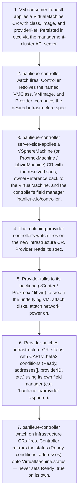
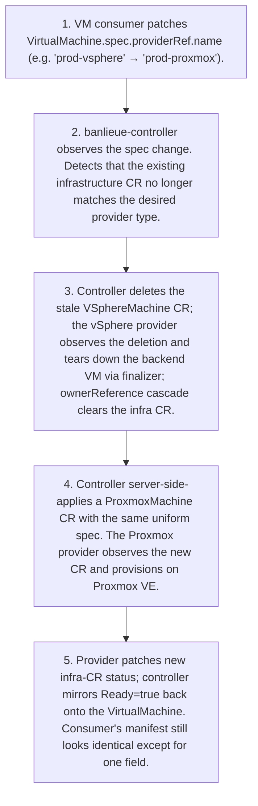
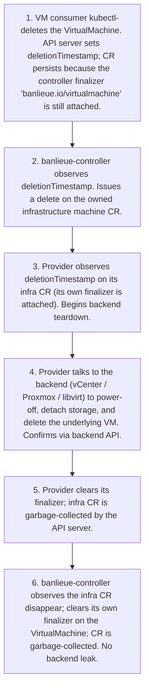

# Architecture Flows

!!! note "Auto-generated"

    Rendered from `docs/architecture/calm/architecture.json` by the CALM
    CLI (`calm template`). **Do not edit this file by hand** — edit the
    architecture JSON or the Handlebars template at
    `docs/architecture/calm/templates/mermaid/flows.md.hbs` and regenerate
    with `make calm-diagrams`.

Each business flow defined in the CALM architecture is rendered below as
its own Mermaid `flowchart TD` — one diagram per flow, linking the
transitions in sequence order. Three flows are modelled today:

- **Create a VirtualMachine** — the happy path from `kubectl apply` to
  `Ready=true`.
- **Swap a VirtualMachine's backend** — the canonical least-touch
  demonstration: change one field, the controller rebuilds the infra.
- **Delete a VirtualMachine** — finalizer-gated teardown that guarantees
  no backend leaks.

## Create a VirtualMachine

User applies a VirtualMachine CR; the banlieue controller resolves its references and creates a backend-specific infrastructure CR; the matching provider controller observes the infra CR, provisions on its backend, and patches status; the banlieue controller mirrors the status back onto the VirtualMachine.

Source: flow `flow-create-virtualmachine` in `architecture.json`.

## Swap a VirtualMachine&#x27;s backend (least-touch)

User changes a single field — VirtualMachine.spec.providerRef.name — to repoint a VM from one backend to another. The banlieue controller tears down the old infrastructure CR and creates a new one of the right kind on the new provider. The user's manifest does not otherwise change. This is the canonical demonstration of banlieue's abstraction principle.

Source: flow `flow-swap-provider` in `architecture.json`.

## Delete a VirtualMachine (finalizer cleanup)

Deletion is gated by two finalizers (controller, provider) to guarantee that the backend VM is torn down BEFORE the CR is removed from etcd. No leaks.

Source: flow `flow-delete-virtualmachine` in `architecture.json`.

