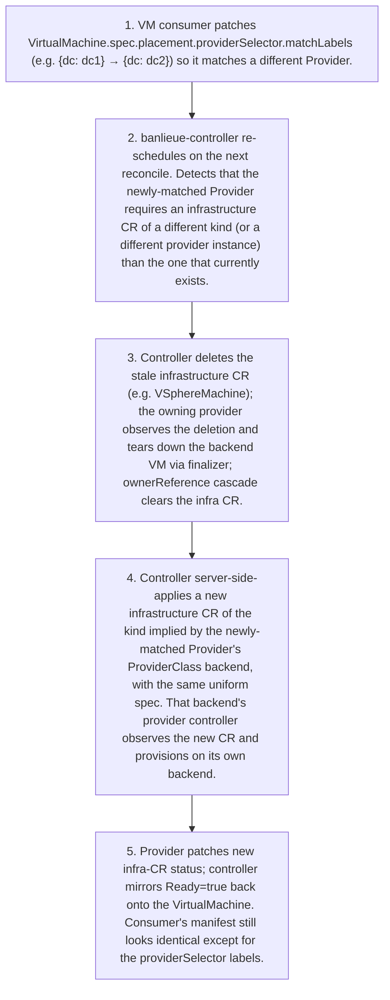
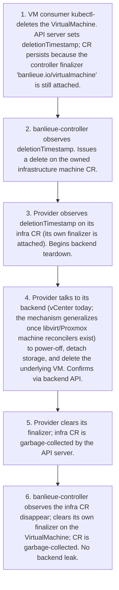
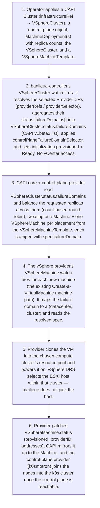
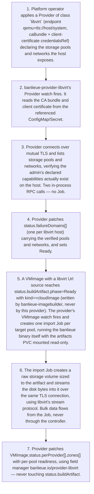

# Architecture Flows

!!! note "Auto-generated"

    Rendered from `docs/architecture/calm/architecture.json` by the CALM
    CLI (`calm template`). **Do not edit this file by hand** — edit the
    architecture JSON or the Handlebars template at
    `docs/architecture/calm/templates/mermaid/flows.md.hbs` and regenerate
    with `make calm-diagrams`.

Each business flow defined in the CALM architecture is rendered below as
its own Mermaid `flowchart TD` — one diagram per flow, linking the
transitions in sequence order. Three flows are modelled today:

- **Create a VirtualMachine** — the happy path from `kubectl apply` to
  `Ready=true`.
- **Swap a VirtualMachine's backend** — the canonical least-touch
  demonstration: change one field, the controller rebuilds the infra.
- **Delete a VirtualMachine** — finalizer-gated teardown that guarantees
  no backend leaks.

## Create a VirtualMachine

User applies a VirtualMachine CR; the banlieue controller resolves its references and creates a backend-specific infrastructure CR; the matching provider controller observes the infra CR, provisions on its backend, and patches status; the banlieue controller mirrors the status back onto the VirtualMachine.

```mermaid
flowchart TD
    t1["1. VM consumer kubectl-applies a VirtualMachine CR with classRef, imageRef, and (optionally) placement.providerSelector. Persisted in etcd via the management-cluster API server."]
    t2["2. banlieue-controller watch fires. Controller resolves the referenced VMClass and VMImage, matches placement.providerSelector/failureDomainSelector against candidate Provider CRs to pick one, and computes the desired infrastructure spec."]
    t3["3. If VirtualMachine.spec.userData is set, banlieue-controller first reads that Secret or ConfigMap (namespace-scoped Role in banlieue-system, ADR-0025/ADR-0038 — it never gets a cluster-wide Secret grant) and placeholder-substitutes it (ADR-0024's fixed set). It then server-side-applies a VSphereMachine CR with the resolved spec — including the rendered userData content, inlined rather than referenced — ownerReference back to the VirtualMachine, and the controller's field manager 'banlieue.io/controller'. (VSphereMachine is the only infrastructure CR kind implemented today; a ProxmoxMachine/LibvirtMachine equivalent is future work — see ADR-0011.)"]
    t4["4. The matching provider controller's watch fires on the new infrastructure CR. Provider reads its spec."]
    t5["5. Provider talks to its backend to create the underlying VM. On vSphere (the only backend with a working machine reconciler today) this is a CloneVM_Task from the per-zone template resolved off VMImage.status, with guestinfo network + templated cloud-config set in the same clone call for any statically-addressed interface (ADR-0024), followed by PowerOnVM_Task."]
    t6["6. Provider patches infrastructure-CR .status with CAPI v1beta2 conditions (Ready, addresses[], providerID, etc.) using its own field manager (e.g. 'banlieue.io/provider-vsphere')."]
    t7["7. banlieue-controller watch on infrastructure CRs fires. Controller mirrors the status (Ready, conditions, addresses) onto VirtualMachine.status — never sets Ready=true on its own."]
    t1 --> t2 --> t3 --> t4 --> t5 --> t6 --> t7
```

Source: flow `flow-create-virtualmachine` in `architecture.json`.

## Swap a VirtualMachine&#x27;s backend (least-touch)

User changes VirtualMachine.spec.placement.providerSelector (a label selector, not a direct name reference) to reschedule a VM onto a different Provider. The banlieue controller tears down the old infrastructure CR and creates a new one of the right kind for the newly-matched Provider's backend. The user's manifest does not otherwise change. This is the canonical demonstration of banlieue's abstraction principle. NOTE: because only the vSphere backend has a working machine reconciler today (ADR-0011: libvirt has no LibvirtMachine reconciler yet; Proxmox has no provider at all), this flow is currently only exercisable between two vSphere Providers (e.g. two vCenters) — cross-backend swap (vSphere ↔ libvirt/Proxmox) is the design target but not yet runnable end-to-end.

```mermaid
flowchart TD
    t1["1. VM consumer patches VirtualMachine.spec.placement.providerSelector.matchLabels (e.g. {dc: dc1} → {dc: dc2}) so it matches a different Provider."]
    t2["2. banlieue-controller re-schedules on the next reconcile. Detects that the newly-matched Provider requires an infrastructure CR of a different kind (or a different provider instance) than the one that currently exists."]
    t3["3. Controller deletes the stale infrastructure CR (e.g. VSphereMachine); the owning provider observes the deletion and tears down the backend VM via finalizer; ownerReference cascade clears the infra CR."]
    t4["4. Controller server-side-applies a new infrastructure CR of the kind implied by the newly-matched Provider's ProviderClass backend, with the same uniform spec. That backend's provider controller observes the new CR and provisions on its own backend."]
    t5["5. Provider patches new infra-CR status; controller mirrors Ready=true back onto the VirtualMachine. Consumer's manifest still looks identical except for the providerSelector labels."]
    t1 --> t2 --> t3 --> t4 --> t5
```

Source: flow `flow-swap-provider` in `architecture.json`.

## Delete a VirtualMachine (finalizer cleanup)

Deletion is gated by two finalizers (controller, provider) to guarantee that the backend VM is torn down BEFORE the CR is removed from etcd. No leaks.

```mermaid
flowchart TD
    t1["1. VM consumer kubectl-deletes the VirtualMachine. API server sets deletionTimestamp; CR persists because the controller finalizer 'banlieue.io/virtualmachine' is still attached."]
    t2["2. banlieue-controller observes deletionTimestamp. Issues a delete on the owned infrastructure machine CR."]
    t3["3. Provider observes deletionTimestamp on its infra CR (its own finalizer is attached). Begins backend teardown."]
    t4["4. Provider talks to its backend (vCenter today; the mechanism generalizes once libvirt/Proxmox machine reconcilers exist) to power-off, detach storage, and delete the underlying VM. Confirms via backend API."]
    t5["5. Provider clears its finalizer; infra CR is garbage-collected by the API server."]
    t6["6. banlieue-controller observes the infra CR disappear; clears its own finalizer on the VirtualMachine; CR is garbage-collected. No backend leak."]
    t1 --> t2 --> t3 --> t4 --> t5 --> t6
```

Source: flow `flow-delete-virtualmachine` in `architecture.json`.

## Provision a Kubernetes cluster via CAPI (banlieue as infra provider)

The platform operator provisions a k0s cluster by applying upstream CAPI objects plus banlieue's VSphereCluster (InfraCluster) and a VSphereMachineTemplate. banlieue does NOT own cluster lifecycle — CAPI + a control-plane provider (k0smotron) do. banlieue's job is to advertise failure domains (VSphereCluster) and realise each machine (VSphereMachine). 'replicas: N' spread across failure domains is how a tier (e.g. 6/6 'platinum') is expressed (ADR-0001).

```mermaid
flowchart TD
    t1["1. Operator applies a CAPI Cluster (infrastructureRef → VSphereCluster), a control-plane object, MachineDeployment(s) with replica counts, the VSphereCluster, and a VSphereMachineTemplate."]
    t2["2. banlieue-controller's VSphereCluster watch fires. It resolves the selected Provider CRs (providerRefs / providerSelector), aggregates their status.failureDomains[] into VSphereCluster.status.failureDomains (CAPI v1beta2 list), applies controlPlaneFailureDomainSelector, and sets initialization.provisioned + Ready. No vCenter access."]
    t3["3. CAPI core + control-plane provider read VSphereCluster.status.failureDomains and balance the requested replicas across them (count-based round-robin), creating one Machine + one VSphereMachine per placement from the VSphereMachineTemplate, each stamped with spec.failureDomain."]
    t4["4. The vSphere provider's VSphereMachine watch fires for each new machine (the existing Create-a-VirtualMachine machine path). It maps the failure domain to a (datacenter, cluster) and reads the resolved spec."]
    t5["5. Provider clones the VM into the chosen compute cluster's resource pool and powers it on. vSphere DRS selects the ESXi host within that cluster — banlieue does not pick the host."]
    t6["6. Provider patches VSphereMachine.status (provisioned, providerID, addresses); CAPI mirrors it up to the Machine, and the control-plane provider (k0smotron) joins the nodes into the k0s cluster once the control plane is reachable."]
    t1 --> t2 --> t3 --> t4 --> t5 --> t6
```

Source: flow `flow-provision-capi-cluster` in `architecture.json`.

## Build a VMImage from an OCI/Kairos image and import it per zone

A VMImage with a spec.sources[].kind==Url entry (an OCI-referenced Kairos image, e.g. from a nightly build pipeline) is turned into a typed build artifact — a raw cloud image for libvirt, a bootable ISO with a baked-in default cloud-config for vSphere — by banlieue-imagebuilder via kairos-operator, then imported into every zone of a matching vSphere Provider by banlieue-provider-vsphere as a fully installed, generalized, marked template. The two controllers never call each other; VMImage.status.buildArtifact is the entire handoff. See ADR-0010, ADR-0020, ADR-0021, and ADR-0022.

```mermaid
flowchart TD
    t1["1. Platform operator (or a nightly CI job authenticated as one) applies/updates a VMImage with a Url source pointing at the newly-built Kairos OCI image, optionally with spec.cloudConfigs[] (an ordered, layered list of secretRef/configMapRef sources, ADR-0037), spec.isoOverlay (secretRef + files[], ADR-0022), and spec.template (rootFolder / network[] / disk / force knobs) for the vSphere template."]
    t2["2. banlieue-imagebuilder's VMImage watch fires. It server-side-applies an OSArtifact CR requesting a cloud image (libvirt sources) or an ISO with artifacts.cloudConfigRef resolved from the merged spec.cloudConfigs[] (vsphere sources, ADR-0037), sets VMImage.status.buildArtifact.phase=Building, and — when spec.isoOverlay is set — adds spec.volumes[] (a Secret volume named by the declared key/path list) plus artifacts.overlayISOVolume pointing at it, the same auroraboot --overlay-iso mechanism the maintainer's proven manual ISO-build pipeline already relies on (ADR-0022). Only the Secret's name and declared key names are read, never its content."]
    t3["3. kairos-operator's OSArtifact watch fires. It pulls the OCI image and builds the artifact — a raw disk, or auroraboot build-iso with --cloud-config for an ISO — writing it to a PVC it creates, progressing status.phase through Building -> Exporting -> Ready."]
    t4["4. banlieue-imagebuilder's OSArtifact watch fires on the Ready transition. It patches VMImage.status.buildArtifact with kind (cloudImage | iso), phase=Ready, the artifacts PVC reference, the artifact file name, and the checksum."]
    t5["5. banlieue-provider-vsphere's VMImage watch fires. It finds a Url-kind vsphere source with buildArtifact.phase==Ready and kind==iso and begins a per-zone import for each of its Providers' status.failureDomains[]."]
    t6["6. For each zone, an image-import Job (banlieue binary's image-import subcommand, imagebuild namespace, artifacts PVC mounted read-only) verifies the ISO against buildArtifact.checksum, uploads it to the zone's datastore — reusing the datastore-cluster member already holding it, else the emptiest — ensures <spec.template.rootFolder>/<failure-domain-name> (every zone gets its own subfolder, since vSphere folders are scoped per-datacenter, not per-cluster, and zones commonly share a datacenter), and creates the VM: empty EFI VM (pvscsi disk from spec.template.disk, vmxnet3 NIC on the spec.template.network or zone port group), ISO attached as CD-ROM. It then powers the VM on and waits for the cloud-config's unattended Kairos install to run its after-install-chroot identity-wipe stage and power the VM off itself (install.poweroff, no reboot), bounded by spec.template.installTimeoutSeconds; on success it removes the CD-ROM device and MarkAsTemplate — the disk is never booted by the build, so each real clone's first boot generates its own machine-id/SSH host keys (ADR-0021)."]
    t7["7. banlieue-provider-vsphere patches VMImage.status.perProvider[].zones[] with per-zone readiness and resolvedRef (the template's [datastore] folder/name), using its own field manager — never touching status.buildArtifact."]
    t1 --> t2 --> t3 --> t4 --> t5 --> t6 --> t7
```

Source: flow `flow-build-vmimage-from-oci` in `architecture.json`.

## Import a built raw disk into libvirt storage pools

The libvirt half of ADR-0010's pipeline: once banlieue-imagebuilder has produced a raw disk, banlieue-provider-libvirt imports it into each storage pool the Provider advertises. Demonstrates the same build-then-import split as the vSphere path, on a backend that needs no proprietary SDK. See ADR-0011.

```mermaid
flowchart TD
    t1["1. Platform operator applies a Provider of class `libvirt` (endpoint qemu+tls://host/system, caBundle + client-certificate credentialsRef) declaring the storage pools and networks the host exposes."]
    t2["2. banlieue-provider-libvirt's Provider watch fires. It reads the CA bundle and client certificate from the referenced ConfigMap/Secret."]
    t3["3. Provider connects over mutual TLS and lists storage pools and networks, verifying the admin's declared capabilities actually exist on the host. Two in-process RPC calls — no Job."]
    t4["4. Provider patches status.failureDomains[] (one per libvirt host) carrying the verified pools and networks, and sets Ready."]
    t5["5. A VMImage with a libvirt Url source reaches status.buildArtifact.phase=Ready with kind==cloudImage (written by banlieue-imagebuilder, never by this provider). The provider's VMImage watch fires and creates one import Job per target pool, running the banlieue binary itself with the artifacts PVC mounted read-only."]
    t6["6. The import Job creates a raw storage volume sized to the artifact and streams the disk bytes into it over the same TLS connection, using libvirt's stream protocol. Bulk data flows from the Job, never through the controller."]
    t7["7. Provider patches VMImage.status.perProvider[].zones[] with per-pool readiness, using field manager banlieue.io/provider-libvirt — never touching status.buildArtifact."]
    t1 --> t2 --> t3 --> t4 --> t5 --> t6 --> t7
```

Source: flow `flow-import-vmimage-libvirt` in `architecture.json`.

## Register a backend and have its controller provisioned automatically

The flow that makes banlieue an operator in the strict sense: a platform owner declares a ProviderClass once (image, resources, namespace), then applies a Provider CR per backend instance. banlieue-operator turns each Provider into a dedicated Deployment + ServiceAccount + Role + RoleBinding, so one hung or slow backend cannot stall reconciliation for any other and each pod holds exactly one backend's credentials. Deleting the Provider garbage-collects the whole set via owner references. See ADR-0003 (per-instance topology) and ADR-0012.

```mermaid
flowchart TD
    t1["1. Platform operator installs the platform with `banlieue bootstrap operator` — namespace, CRDs built from the binary's own Rust types, controller and operator RBAC and Deployments, plus one ProviderClass per backend compiled into the binary (ADR-0013). `--dry-run` emits the same YAML for a GitOps repo instead of applying it."]
    t2["2. Platform operator applies a Provider CR naming its ProviderClass, the backend endpoint, and a credentials Secret in the same namespace."]
    t3["3. banlieue-operator's Provider watch fires. It resolves the referenced ProviderClass and server-side-applies a ServiceAccount, a Role scoped by resourceNames to just that Provider's credentials Secret, a RoleBinding, and a Deployment running `banlieue provider <backend>` — all carrying an ownerReference back to the Provider."]
    t4["4. The spawned provider pod starts, acquires its own leader-election Lease (banlieue-provider-<class>-<provider-name>), and begins a server-side filtered watch on labelSelector banlieue.io/provider=<name> so its informer cache holds only its own infra objects."]
    t5["5. The provider logs in to its backend with the one credential it can read, introspects the inventory, and publishes reachable failure domains to Provider.status.failureDomains — the input the main controller's scheduler matches VirtualMachines against."]
    t6["6. banlieue-operator's Deployment watch fires as replicas become ready and mirrors readiness into Provider.status.workload. It deliberately does not write status.conditions — that list is owned by the provider's own field manager, and a plain list without x-kubernetes-list-type:map cannot be merged per-entry by two managers."]
    t1 --> t2 --> t3 --> t4 --> t5 --> t6
```

Source: flow `flow-provision-provider-workload` in `architecture.json`.

## Upgrade every backend of a class with one edit

The payoff of putting install metadata on a ProviderClass rather than on each Provider: bumping a fleet is a one-object edit, not one edit per backend. banlieue-operator watches ProviderClass and maps each edit back to every Provider referencing it, so the change lands at once instead of waiting on a periodic requeue. The same path makes un-pausing a class immediate. See ADR-0012.

```mermaid
flowchart TD
    t1["1. Platform operator edits one field — `kubectl patch providerclass vsphere -p '{"spec":{"image":{"tag":"v0.2.0"}}}'`. To canary a single backend instead, they create a second class pinning the new image and repoint one Provider at it."]
    t2["2. banlieue-operator's ProviderClass watch fires. kube calls the mapper synchronously, so it cannot list Providers itself — it reads the controller's own reflector store, already maintained for the primary Provider watch, and emits one reconcile request per referencing Provider. Without this the edit would only be noticed on the next periodic requeue."]
    t3["3. Each Provider reconciles: the workload is re-applied with the new image and the Deployment rolls. If the edit changed the Provider's CLASS rather than the class's contents, the derived name changes too, so the superseded workload is pruned by label — including the ClusterRoleBinding, which no owner reference can reclaim and a name-based cleanup could never find again."]
    t4["4. The operator publishes ProviderClass.status: how many Providers reference this class, and a Ready condition reporting whether the shared per-backend ClusterRole exists. That surfaces an unusable class in `kubectl get providerclasses` before any Provider is created, rather than as 403s in a provider pod's log afterwards."]
    t1 --> t2 --> t3 --> t4
```

Source: flow `flow-upgrade-provider-fleet` in `architecture.json`.

