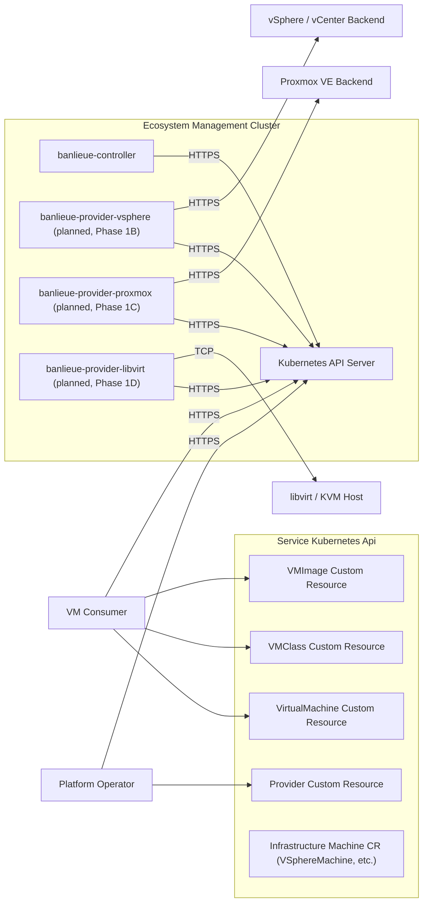

# System Architecture

!!! note "Auto-generated"

    Rendered from `docs/architecture/calm/architecture.json` by the CALM
    CLI (`calm template`). **Do not edit this file by hand** — edit the
    architecture JSON or the Handlebars template at
    `docs/architecture/calm/templates/mermaid/system.md.hbs` and regenerate
    with `make calm-diagrams`.

A single Mermaid `flowchart LR` of every node in the CALM architecture
and the connections between them. `connects` and `interacts`
relationships become arrows (the protocol, when defined, labels the
arrow); `deployed-in` / `composed-of` containers become subgraphs.

Note: nodes whose `name` includes "(planned, Phase 1B/C/D)" are not yet
implemented in the repo — the diagram shows the *target* architecture so
contributors and users have one canonical picture.

Source: nodes and relationships in `architecture.json`.
