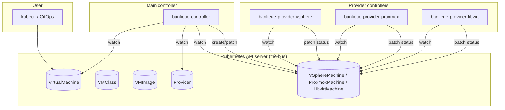

# Architecture

banlieue is a multi-controller Kubernetes operator. There is **one main
controller** (the banlieue controller) and **N provider controllers** (one per
backend: vSphere, Proxmox, libvirt, …). Everything else is CRDs.

!!! info "Machine-checked architecture"

    Two companion pages, **[System Diagram (CALM)](../architecture/system.md)**
    and **[Architecture Flows (CALM)](../architecture/flows.md)**, are rendered
    from a single [FINOS CALM](https://calm.finos.org/) document at
    `docs/architecture/calm/architecture.json`. The CALM document is
    validated against the meta-schema in CI (`make calm-validate`) and is
    the canonical source of truth for nodes, relationships, flows, and
    controls. Edit it — not the rendered Markdown — to change the diagrams.

## Components

### Source of truth

The Rust types under
[`crates/banlieue-api/`](https://github.com/firestoned/banlieue/tree/main/crates/banlieue-api)
are the source of truth for every CRD. The generated YAMLs in `deploy/crds/`
are produced by the `crdgen` binary and **never hand-edited**.

### Crates

| Crate | Phase | Role |
| --- | --- | --- |
| `banlieue-api` | 0 (done) | CRD types: `Provider`, `VMClass`, `VMImage`, `VirtualMachine`, and infra CRDs. |
| `banlieue-controller` | 1A | The main controller. Watches `VirtualMachine`, creates infra CRs, mirrors status. |
| `banlieue-provider-sdk` | 1A | Shared library for provider controllers (status, finalizers, SSA, client). |
| `banlieue-provider-vsphere` | 1B | First reference provider. |
| `banlieue-provider-proxmox` | 1C | Second provider. |
| `banlieue-provider-libvirt` | 1D | Third provider. |

## Reconcile flow (happy path)

1. **User applies a `VirtualMachine`.**
2. **Main controller** sees the new CR, resolves `class` (→ `VMClass`),
   `image` (→ `VMImage`), and `providerRef` (→ `Provider`).
3. **Main controller** creates a provider-specific infra CR
   (e.g. `VSphereMachine`) carrying the uniform spec, owned by the
   `VirtualMachine`.
4. **Provider controller** sees the infra CR, talks to its backend's native
   API, and provisions the VM.
5. **Provider controller** patches `.status` on the infra CR with the CAPI
   v1beta2-shaped conditions (`Ready`, `Provisioned`, `addresses`, etc.).
6. **Main controller** watches the infra status and **mirrors** it onto the
   `VirtualMachine.status`. `VirtualMachine.status.ready=true` *only* when the
   infra says so.

No step in that flow uses any protocol other than the Kubernetes API.

## Watches, not polling

Every controller uses `kube-runtime`'s event-driven `Controller::new()`. There
are no polling loops, no `sleep()`-based synchronisation, no timers. State
changes propagate through K8s watch events.

## Idempotency, finalisers, server-side apply

- **Idempotent reconciliation.** Reconcilers compute the desired state and
  patch toward it. Replays are safe.
- **Finalisers.** The main controller adds a finaliser on `VirtualMachine`s so
  it can guarantee infra cleanup on delete. Each provider adds its own
  finaliser on its infra CR for the same reason.
- **Server-side apply.** Owned objects are reconciled with SSA so that
  ownership of individual fields is explicit and conflicts are surfaced
  rather than silently overwritten. Each controller uses a distinct field
  manager (`banlieue.io/controller`, `banlieue.io/provider-vsphere`, …).

## Where the design decisions live

- The *why* of every architectural choice on this page is in
  [Why banlieue?](../reasoning/index.md). Specifically:
    - [Abstraction principle](../reasoning/abstraction-principle.md) — why
      `VirtualMachine` has no backend-specific fields.
    - [CRD-only contract](../reasoning/crd-only-contract.md) — why no RPC.
    - [Infrastructure CRDs & CAPI](infra-crds-capi.md) — why we satisfy CAPI's
      v1beta2 InfraMachine contract.
