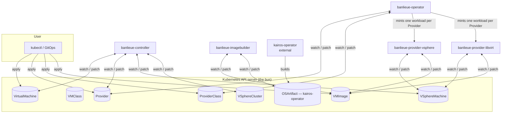
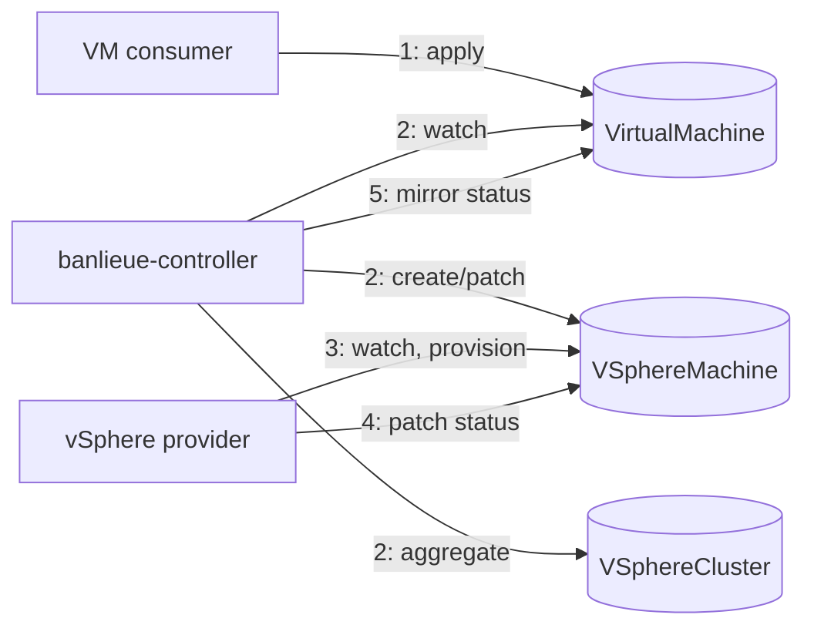
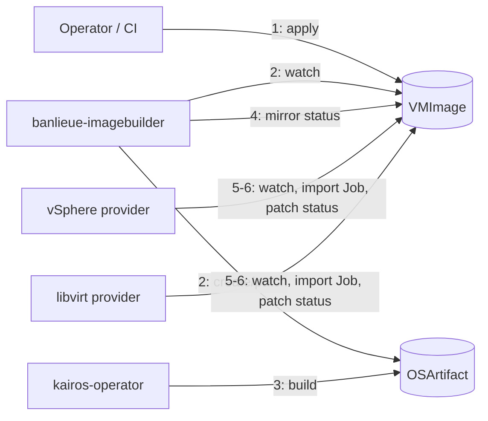
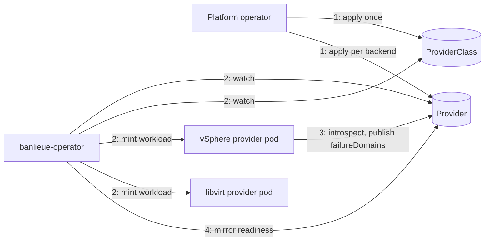

# Architecture

banlieue is a multi-controller Kubernetes operator. Four kinds of
controllers share the work: **one main controller** (banlieue-controller),
**one provider lifecycle operator** (banlieue-operator), **one image
builder** (banlieue-imagebuilder), and **N provider controllers** (one per
backend instance: vSphere, libvirt, …). Everything else is CRDs.

!!! info "Machine-checked architecture"

    Two companion pages, **[System Diagram (CALM)](../architecture/system.md)**
    and **[Architecture Flows (CALM)](../architecture/flows.md)**, are rendered
    from a single [FINOS CALM](https://calm.finos.org/) document at
    `docs/architecture/calm/architecture.json`. The CALM document is
    validated against the meta-schema in CI (`make calm-validate`) and is
    the canonical source of truth for nodes, relationships, flows, and
    controls. Edit it — not the rendered Markdown — to change the diagrams.

## Components

This is the structure only — every controller, every CRD, and which
controller talks to which CRD. The detailed read/write traffic (watch vs.
create/patch vs. status-patch, one arrow per verb) is broken out per
scenario in [Interactions](#interactions) below, each with its own small
diagram — cramming both into one diagram made it unreadably wide.


```mermaid
flowchart TB
    subgraph User
      u[kubectl / GitOps]
    end

    subgraph "Kubernetes API server (the bus)"
      vm[(VirtualMachine)]
      vmc[(VMClass)]
      vmi[(VMImage)]
      prov[(Provider)]
      provc[(ProviderClass)]
      infra[(VSphereMachine)]
      infrac[(VSphereCluster)]
      osa[(OSArtifact — kairos-operator)]
    end

    mc[banlieue-controller]
    op[banlieue-operator]
    ib[banlieue-imagebuilder]
    pv[banlieue-provider-vsphere]
    pl[banlieue-provider-libvirt]
    kairos[kairos-operator<br/>external]

    u -- apply --> vm & prov & provc & vmi
    mc <-- watch / patch --> vm & prov & infra & infrac
    op <-- watch / patch --> prov & provc
    op -- mints one workload per Provider --> pv & pl
    ib <-- watch / patch --> vmi & osa
    kairos -- builds --> osa
    pv <-- watch / patch --> infra & vmi
    pl <-- watch / patch --> infra & vmi
```

No arrow connects two controllers directly — every interaction is a CRD
read or write through the API server (the
[CRD-only contract](../reasoning/crd-only-contract.md)). The single
exception is bulk data: image artifacts (hundreds of MB) travel on a
shared PVC between kairos-operator and the per-zone import Jobs, because a
CRD cannot carry a disk image.

## Controllers

All controllers ship in **one `banlieue` binary**; the role is chosen at
runtime by the subcommand (ADR-0004). Each writes status with its own
server-side-apply field manager, so two controllers never contend over the
same field (ADR-0015).

| Controller | Subcommand | Watches | Creates / owns | Field manager |
| --- | --- | --- | --- | --- |
| banlieue-controller | `banlieue controller` | `VirtualMachine`, `Provider`, `VMClass`, `VMImage`, infra CRs | Infra CRs (`VSphereMachine`) per VM; aggregates `Provider.status.failureDomains[]` into `VSphereCluster.status`; mirrors infra status onto `VirtualMachine.status` | `banlieue.io/controller` |
| banlieue-operator | `banlieue operator` | `Provider`, `ProviderClass`, spawned Deployments | One workload per Provider: Deployment, ServiceAccount, Role, RoleBinding, ClusterRoleBinding; mirrors Deployment readiness into `Provider.status.workload` | `banlieue.io/operator` |
| banlieue-imagebuilder | `banlieue imagebuilder` | `VMImage`, `OSArtifact` | `OSArtifact` CRs (kairos-operator) for `Url`-kind sources; `VMImage.status.buildArtifact` | `banlieue.io/imagebuilder` |
| banlieue-provider-vsphere | `banlieue provider vsphere` | Its `Provider`, `VSphereMachine`, `VMImage` | vCenter VMs/templates via the BYOC vim client; per-zone `image-import` Jobs; `Provider.status.failureDomains[]`, `VMImage.status.perProvider[]` | `banlieue.io/provider-vsphere` |
| banlieue-provider-libvirt | `banlieue provider libvirt` | Its `Provider`, `LibvirtMachine`, `VMImage` | libvirt domains via the pure-Rust `banlieue-libvirt` RPC client; per-pool import Jobs; `Provider.status.failureDomains[]`, `VMImage.status.perProvider[]` | `banlieue.io/provider-libvirt` |
| kairos-operator (external) | — | `OSArtifact` | Artifact builds (raw cloud image or `auroraboot build-iso` ISO) onto a PVC | — |

Two support libraries factor out the shared machinery:
`banlieue-provider-sdk` (process bootstrap, SSA helpers, finalizers,
leader election, status) and `banlieue-libvirt` (the XDR/TLS libvirt wire
client, ADR-0011). `banlieue-vex` is release tooling, not a runtime
component.

## CRDs

The Rust types under
[`crates/banlieue-api/`](https://github.com/firestoned/banlieue/tree/main/crates/banlieue-api)
are the source of truth for every CRD. The generated YAMLs in
`deploy/crds/` are produced by the `crdgen` binary and **never
hand-edited**. The full field-by-field reference is
[API Reference](../reference/api.md).

### User-facing CRDs (`banlieue.io/v1alpha1`)

| CRD | Scope | Written by | Purpose |
| --- | --- | --- | --- |
| `VirtualMachine` | namespaced | VM consumer | One VM, backend-agnostic. Spec: `classRef` (→ `VMClass`), `imageRef` (→ `VMImage`), `placement` (provider / failure-domain selectors, anti-affinity), `desiredPowerState`, `userData` (Secret ref), `migrationPolicy`. Status: `scheduled` placement, conditions, addresses — mirrored from the infra CR, never set directly by the controller. |
| `VMClass` | cluster | VM consumer | Virtual hardware shape: `hardware` (CPUs, memory, `disks[]` with `DiskProvisioning` thin/thick/eagerZeroed), `network.interfaces[]` referencing abstract network classes. |
| `VMImage` | cluster | VM consumer / CI | Guest image. Spec: `osFamily` / `osDistribution` / `osVersion` / `architecture`, `guestAgent`, `sources[]` (per-provider-class mappings; `kind: Url` triggers the build pipeline), `cloudConfig` (secretRef — default cloud-config baked into the built artifact, ADR-0020), `template` (vSphere template knobs: `rootFolder`, `network`, `disk.{size,type,controller}`, `forceUpload`, `forceCreate`, ADR-0020). Status: `buildArtifact` (see below), `perProvider[].zones[]` readiness, conditions. |
| `Provider` | namespaced | platform operator | One backend instance. Spec: `providerClassRef`, `connection` (endpoint, `credentialsRef`, `caBundle`, TLS knobs), `capabilities` (declared `storageClasses[]` / `networkClasses[]` with backend `target`s, `features[]`), `paused`, `useContentLibrary` (vSphere, default off, ADR-0020). Status: `failureDomains[]` (verified against the backend — ADR-0019 introspection filters declared classes to what actually exists), `workload` (from the operator), conditions. |
| `ProviderClass` | cluster | platform operator | Install metadata for a backend type: which `banlieue provider <backend>` subcommand, the image, resources, namespace, logging. One edit upgrades every Provider of the class (ADR-0012). Status: referencing-Provider count, Ready condition. |

### Infrastructure CRDs (`infrastructure.banlieue.io/v1beta2`, CAPI contract)

| CRD | Purpose |
| --- | --- |
| `VSphereMachine` | CAPI v1beta2 InfraMachine for vSphere. Created by banlieue-controller per `VirtualMachine` (or by CAPI from a `VSphereMachineTemplate`); realised on vCenter by the vSphere provider. |
| `VSphereMachineTemplate` | CAPI MachineTemplate form, consumed by CAPI MachineDeployments. |
| `VSphereCluster` | CAPI v1beta2 InfraCluster. banlieue-controller aggregates the selected Providers' `status.failureDomains[]` into `VSphereCluster.status.failureDomains` so CAPI can spread replicas across zones (ADR-0001, ADR-0002). No vCenter access. |

### External CRDs (not shipped by banlieue)

| CRD | Owner | Role |
| --- | --- | --- |
| `OSArtifact` | kairos-operator | Build request for a `Url`-kind image: `artifacts.cloudImage` (raw disk, for libvirt) or `artifacts.iso` + `cloudConfigRef` (bootable ISO, for vSphere). Output lands on a PVC in the imagebuild namespace. |
| `Cluster` / `MachineDeployment` | Cluster API (upstream) | Cluster provisioning: CAPI reads `VSphereCluster.status.failureDomains` and stamps one `VSphereMachine` per placement. |

### `VMImage.status` — the build/import handoff

`VMImage.status` is where the image pipeline's two halves meet, with
server-side apply keeping the writers apart (ADR-0015):

```yaml
status:
  buildArtifact:            # written ONLY by banlieue-imagebuilder
    kind: iso               # cloudImage (libvirt) | iso (vSphere)
    phase: Ready            # Pending | Building | Ready | Failed
    pvcRef: { name: …, namespace: banlieue-imagebuild }
    file: kairos-ubuntu-2404.iso
    checksum: sha256:…
  perProvider:              # one row per Provider, written by THAT provider
    - providerName: vsphere-dc1
      zones:
        - name: cluster-a
          ready: true
          resolvedRef: "[ds-cluster-a] templates/kairos/kairos-ubuntu-2404"
```

- **`buildArtifact.kind` mirrors kairos-operator's `OSArtifactKind`**, so
  one status field carries either artifact type without parallel fields
  (ADR-0020 §1).
- **Providers gate on `buildArtifact`, never write it.** The vSphere
  provider acts when `phase == Ready && kind == iso`; the libvirt provider
  when `phase == Ready && kind == cloudImage`.
- **Import Jobs verify `buildArtifact.checksum`** before writing anything
  to a backend — fail closed on mismatch (SEC-004).

## Interactions

The [Architecture Flows](../architecture/flows.md) page renders each of
these step by step from the CALM model. In short:

### Provision a VM


```mermaid
flowchart LR
    u[VM consumer] -- 1: apply --> vm[(VirtualMachine)]
    mc[banlieue-controller] -- 2: watch --> vm
    mc -- 2: create/patch --> infra[(VSphereMachine)]
    mc -- 2: aggregate --> infrac[(VSphereCluster)]
    pv[vSphere provider] -- "3: watch, provision" --> infra
    pv -- 4: patch status --> infra
    mc -- "5: mirror status" --> vm
```

1. User applies a `VirtualMachine`.
2. **Main controller** resolves `classRef` / `imageRef` and filters
   candidate Providers and failure domains through `placement`
   (provider selector, failure-domain selector, anti-affinity), then
   server-side-applies a `VSphereMachine` owned by the `VirtualMachine`.
3. **Provider controller** (the pod the operator spawned for that
   Provider) sees the infra CR and provisions on its backend.
4. **Provider** patches the infra CR's status with CAPI v1beta2-shaped
   conditions (`Ready`, `addresses`, `providerID`).
5. **Main controller** mirrors the infra status onto
   `VirtualMachine.status`. `Ready=true` only when the infra says so.

No step uses any protocol other than the Kubernetes API.

### Build and import an image (`Url` source)


```mermaid
flowchart LR
    u[Operator / CI] -- 1: apply --> vmi[(VMImage)]
    ib[banlieue-imagebuilder] -- 2: watch --> vmi
    ib -- 2: create/patch --> osa[(OSArtifact)]
    kairos[kairos-operator] -- 3: build --> osa
    ib -- "4: mirror status" --> vmi
    pv[vSphere provider] -- "5-6: watch, import Job, patch status" --> vmi
    pl[libvirt provider] -- "5-6: watch, import Job, patch status" --> vmi
```

1. Operator (or CI) applies a `VMImage` with a `Url` source, optional
   `cloudConfig`, optional `template` knobs.
2. **banlieue-imagebuilder** server-side-applies an `OSArtifact` — a raw
   cloud image for libvirt sources, or an ISO with `cloudConfigRef` for
   vSphere sources — and reports `buildArtifact.phase: Building`.
3. **kairos-operator** builds the artifact onto a PVC in the isolated
   imagebuild namespace (ADR-0016).
4. **banlieue-imagebuilder** mirrors the result into
   `status.buildArtifact` (`kind`, `phase: Ready`, `pvcRef`, `file`,
   `checksum`).
5. **Each provider** with a matching source gates on `buildArtifact` and
   fans out **one import Job per zone** (failure domain / storage pool).
   The Job runs the banlieue binary itself (`image-import`), mounts the
   PVC read-only, verifies the checksum, and pushes to the backend:
   - **vSphere** (ADR-0020): upload the ISO to the zone's datastore
     (reusing the datastore-cluster member already holding it), ensure
     `<spec.template.rootFolder>/<failure-domain-name>` (every zone gets its
     own subfolder — vSphere folders are scoped per-datacenter, not
     per-cluster, and zones commonly share a datacenter), create an empty
     EFI VM (pvscsi disk from
     `spec.template.disk`, vmxnet3 NIC on `spec.template.network` or the
     zone's port group), attach the ISO as CD-ROM, `MarkAsTemplate`.
   - **libvirt** (ADR-0011): create a raw volume per declared storage
     pool and stream the disk bytes over the mTLS connection.
6. **Each provider** reports per-zone readiness into its own
   `status.perProvider[]` row; the main controller owns the top-level
   `Ready` condition.

Controllers never call each other — `status.buildArtifact` plus the
artifacts PVC is the entire handoff.

### Register a backend (provider lifecycle)


```mermaid
flowchart LR
    u[Platform operator] -- "1: apply once" --> provc[(ProviderClass)]
    u -- "1: apply per backend" --> prov[(Provider)]
    op[banlieue-operator] -- 2: watch --> prov & provc
    op -- "2: mint workload" --> pv[vSphere provider pod]
    op -- "2: mint workload" --> pl[libvirt provider pod]
    pv -- "3: introspect, publish failureDomains" --> prov
    op -- "4: mirror readiness" --> prov
```

1. Operator applies a `ProviderClass` once (image, resources) and a
   `Provider` per backend instance.
2. **banlieue-operator** mints the workload: ServiceAccount, Role scoped
   by `resourceNames` to just that Provider's credentials Secret,
   RoleBinding, ClusterRoleBinding, Deployment — all owned by the
   Provider.
3. The provider pod starts, elects its own leader Lease, watches only its
   own objects (`banlieue.io/provider=<name>` label filter), introspects
   the backend, and publishes verified `status.failureDomains[]`
   (ADR-0019: declared storage/network classes are checked against what
   the backend actually exposes).
4. The operator mirrors Deployment readiness into `Provider.status.workload`.

Deleting the Provider garbage-collects the whole workload via owner
references; editing the ProviderClass rolls every Provider of that class
at once (ADR-0012).

### Bootstrap (management cluster)

`scripts/bootstrap-k0s-cluster.sh` stands up the management k0s cluster
itself (libvirt or vSphere backend, ADR-0017). An opt-in `flux` step
(`FLUX_ENABLED=true`) fetches a registry credential from HashiCorp Vault
and pushes flux-operator + `flux-core` manifests onto the first controller
node (ADR-0018) — bootstrap tooling, not a runtime controller.

## Why the controller and the operator are separate processes

One binary, one image — but the controller and the operator always run as
**separate Deployments with separate ServiceAccounts and ClusterRoles**. The
reason is privilege separation:

- **The operator can mint workloads and grant permissions.** Its ClusterRole
  holds create/update on Deployments, ServiceAccounts, Roles, RoleBindings and
  ClusterRoleBindings — the union of what it hands to provider pods. That is
  the most powerful identity banlieue runs.
- **The controller cannot.** Its ClusterRole reaches only banlieue's own CRDs
  (`VirtualMachine`, `VMImage`, the infra CRs), IPAM claims, leases and
  events. No workload creation, no RBAC writes.

Merged into one pod, every `VirtualMachine` reconcile — driven by the
least-trusted input in the system, tenant-authored CRs — would run in a
process holding RBAC-granting rights. Separated, a bug in the VM path has no
workload-minting privilege to reach.

The split also matches how the two scale and fail. Operator work scales with
the number of `Provider`s (a handful, owned by the platform team); controller
work scales with the number of `VirtualMachine`s (potentially thousands,
owned by tenants). A crash loop or a pathological VM must not stall provider
lifecycle management, and shipping a scheduler bugfix must not restart the
process that holds finalizers on provider workloads.

The same reasoning extends one level down: the operator never talks to a
backend SDK and holds no backend credentials — it creates workloads through
the Kubernetes API, and each spawned provider talks to its own backend with
its own narrowly-scoped identity. The image pipeline applies the pattern a
third time: import Jobs run in the isolated `banlieue-imagebuild` namespace
under a dedicated read-only ServiceAccount, never the provider controller's
own (ADR-0016).

The role split is recorded in
[ADR-0012](https://github.com/firestoned/banlieue/blob/main/docs/adr/0012-providerclass-crd-and-operator-role.md),
the per-instance topology in
[ADR-0003](https://github.com/firestoned/banlieue/blob/main/docs/adr/0003-provider-deployment-topology.md),
and the single-binary dispatch in
[ADR-0004](https://github.com/firestoned/banlieue/blob/main/docs/adr/0004-single-binary-subcommand-dispatch.md).

## Crates

| Crate | Role |
| --- | --- |
| `banlieue` | The single binary. Dispatches `controller` / `operator` / `imagebuilder` / `provider <name>` subcommands into the role crates ([ADR-0004](https://github.com/firestoned/banlieue/blob/main/docs/adr/0004-single-binary-subcommand-dispatch.md)); no logic of its own. |
| `banlieue-api` | CRD types: `VirtualMachine`, `VMClass`, `VMImage`, `Provider`, `ProviderClass`, and the vSphere infra CRDs. Hosts `crdgen`. |
| `banlieue-controller` | The main controller. Watches `VirtualMachine`, schedules, creates infra CRs, aggregates failure domains, mirrors status. |
| `banlieue-operator` | Provider lifecycle controller + `banlieue bootstrap`. Watches `Provider` / `ProviderClass`, mints one workload per Provider. |
| `banlieue-imagebuilder` | Drives `Url`-kind `VMImage` builds through kairos-operator `OSArtifact`s; owns `status.buildArtifact`. |
| `banlieue-provider-sdk` | Shared controller machinery (process bootstrap, status, finalizers, SSA, client, leader election). |
| `banlieue-provider-vsphere` | vSphere provider: BYOC vim client (ADR-0008), capability introspection (ADR-0019), per-zone ISO template import (ADR-0020). |
| `banlieue-provider-libvirt` | libvirt provider: capability verification, per-pool raw-disk import (ADR-0011). |
| `banlieue-libvirt` | Pure-Rust libvirt RPC client (XDR codec, TLS transport) — no native libvirt dependency. |
| `banlieue-vex` | Release tooling: auto-VEX derivation for the supply-chain pipeline. Not deployed. |

A Proxmox provider is planned (Phase 1C) but not yet implemented; it
appears in the CALM system diagram as a planned node.

Every role ships in **one `banlieue` binary**; the role is chosen at runtime by
the subcommand (in-cluster, via the container `args`). Providers are gated
behind per-provider Cargo features (default = all available).

## Watches, not polling

Every controller uses `kube-runtime`'s event-driven `Controller::new()`. There
are no polling loops, no `sleep()`-based synchronisation, no timers. State
changes propagate through K8s watch events.

## Idempotency, finalisers, server-side apply

- **Idempotent reconciliation.** Reconcilers compute the desired state and
  patch toward it. Replays are safe.
- **Finalisers.** The main controller adds a finaliser on `VirtualMachine`s so
  it can guarantee infra cleanup on delete. Each provider adds its own
  finaliser on its infra CR for the same reason.
- **Server-side apply.** Owned objects are reconciled with SSA so that
  ownership of individual fields is explicit and conflicts are surfaced
  rather than silently overwritten. Each controller uses a distinct field
  manager (`banlieue.io/controller`, `banlieue.io/imagebuilder`,
  `banlieue.io/provider-vsphere`, …).

## Where the design decisions live

- The *why* of every architectural choice on this page is in
  [Why banlieue?](../reasoning/index.md). Specifically:
    - [Abstraction principle](../reasoning/abstraction-principle.md) — why
      `VirtualMachine` has no backend-specific fields.
    - [CRD-only contract](../reasoning/crd-only-contract.md) — why no RPC.
    - [Infrastructure CRDs & CAPI](infra-crds-capi.md) — why we satisfy CAPI's
      v1beta2 InfraMachine contract.
- The *how*, decision by decision, is in the
  [ADRs](https://github.com/firestoned/banlieue/tree/main/docs/adr) — most
  relevant here: ADR-0010/0015/0016 (image build pipeline, status
  ownership, namespace isolation), ADR-0017/0018 (bootstrap backends,
  Vault/flux), ADR-0019/0020 (vSphere introspection, ISO template import).
