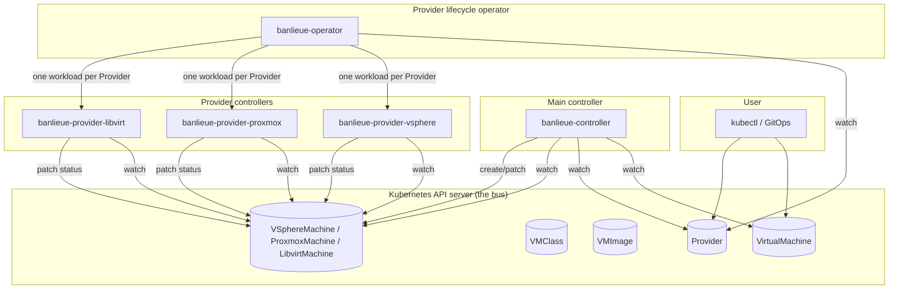

# Architecture

banlieue is a multi-controller Kubernetes operator. Three kinds of
controllers share the work: **one main controller** (the banlieue
controller), **one provider lifecycle operator** (banlieue-operator), and
**N provider controllers** (one per backend instance: vSphere, libvirt, …).
Everything else is CRDs.

!!! info "Machine-checked architecture"

    Two companion pages, **[System Diagram (CALM)](../architecture/system.md)**
    and **[Architecture Flows (CALM)](../architecture/flows.md)**, are rendered
    from a single [FINOS CALM](https://calm.finos.org/) document at
    `docs/architecture/calm/architecture.json`. The CALM document is
    validated against the meta-schema in CI (`make calm-validate`) and is
    the canonical source of truth for nodes, relationships, flows, and
    controls. Edit it — not the rendered Markdown — to change the diagrams.

## Components

```mermaid
flowchart TB
    subgraph User
      u[kubectl / GitOps]
    end

    subgraph "Kubernetes API server (the bus)"
      vm[(VirtualMachine)]
      vmc[(VMClass)]
      vmi[(VMImage)]
      prov[(Provider)]
      infra[(VSphereMachine / ProxmoxMachine / LibvirtMachine)]
    end

    subgraph "Main controller"
      mc[banlieue-controller]
    end

    subgraph "Provider lifecycle operator"
      op[banlieue-operator]
    end

    subgraph "Provider controllers"
      pv[banlieue-provider-vsphere]
      pp[banlieue-provider-proxmox]
      pl[banlieue-provider-libvirt]
    end

    u --> vm
    u --> prov
    mc -- watch --> vm
    mc -- watch --> prov
    mc -- watch --> infra
    mc -- create/patch --> infra
    op -- watch --> prov
    op -- one workload per Provider --> pv
    op -- one workload per Provider --> pp
    op -- one workload per Provider --> pl
    pv -- watch --> infra
    pp -- watch --> infra
    pl -- watch --> infra
    pv -- patch status --> infra
    pp -- patch status --> infra
    pl -- patch status --> infra
```

### Source of truth

The Rust types under
[`crates/banlieue-api/`](https://github.com/firestoned/banlieue/tree/main/crates/banlieue-api)
are the source of truth for every CRD. The generated YAMLs in `deploy/crds/`
are produced by the `crdgen` binary and **never hand-edited**.

### Crates

| Crate | Phase | Role |
| --- | --- | --- |
| `banlieue` | 1A | The single binary. Dispatches `controller` / `provider <name>` subcommands into the role crates ([ADR-0004](https://github.com/firestoned/banlieue/blob/main/docs/adr/0004-single-binary-subcommand-dispatch.md)); no logic of its own. |
| `banlieue-api` | 0 (done) | CRD types: `Provider`, `VMClass`, `VMImage`, `VirtualMachine`, and infra CRDs. |
| `banlieue-controller` | 1A | Library for the main controller. Watches `VirtualMachine`, creates infra CRs, mirrors status. Run via `banlieue controller`. |
| `banlieue-operator` | 2 | Provider lifecycle controller. Watches `Provider` / `ProviderClass`, mints one workload (Deployment, ServiceAccount, Role, RoleBinding, ClusterRoleBinding) per Provider. Also hosts `banlieue bootstrap`. Run via `banlieue operator`. |
| `banlieue-provider-sdk` | 1A | Shared library for controllers (process bootstrap, status, finalizers, SSA, client, leader election). |
| `banlieue-provider-vsphere` | 1B | Library for the first reference provider. Run via `banlieue provider vsphere`. |
| `banlieue-provider-proxmox` | 1C | Second provider (`banlieue provider proxmox`). |
| `banlieue-provider-libvirt` | 1D | Third provider (`banlieue provider libvirt`). |

Every role ships in **one `banlieue` binary**; the role is chosen at runtime by
the subcommand (in-cluster, via the container `args`). Providers are gated
behind per-provider Cargo features (default = all available).

## Why the controller and the operator are separate processes

One binary, one image — but the controller and the operator always run as
**separate Deployments with separate ServiceAccounts and ClusterRoles**. The
reason is privilege separation:

- **The operator can mint workloads and grant permissions.** Its ClusterRole
  holds create/update on Deployments, ServiceAccounts, Roles, RoleBindings and
  ClusterRoleBindings — the union of what it hands to provider pods. That is
  the most powerful identity banlieue runs.
- **The controller cannot.** Its ClusterRole reaches only banlieue's own CRDs
  (`VirtualMachine`, `VMImage`, the infra CRs), IPAM claims, leases and
  events. No workload creation, no RBAC writes.

Merged into one pod, every `VirtualMachine` reconcile — driven by the
least-trusted input in the system, tenant-authored CRs — would run in a
process holding RBAC-granting rights. Separated, a bug in the VM path has no
workload-minting privilege to reach.

The split also matches how the two scale and fail. Operator work scales with
the number of `Provider`s (a handful, owned by the platform team); controller
work scales with the number of `VirtualMachine`s (potentially thousands,
owned by tenants). A crash loop or a pathological VM must not stall provider
lifecycle management, and shipping a scheduler bugfix must not restart the
process that holds finalizers on provider workloads.

The same reasoning extends one level down: the operator never talks to a
backend SDK and holds no backend credentials — it creates workloads through
the Kubernetes API, and each spawned provider talks to its own backend with
its own narrowly-scoped identity.

The role split is recorded in
[ADR-0012](https://github.com/firestoned/banlieue/blob/main/docs/adr/0012-providerclass-crd-and-operator-role.md),
the per-instance topology in
[ADR-0003](https://github.com/firestoned/banlieue/blob/main/docs/adr/0003-provider-deployment-topology.md),
and the single-binary dispatch in
[ADR-0004](https://github.com/firestoned/banlieue/blob/main/docs/adr/0004-single-binary-subcommand-dispatch.md).

## Reconcile flow (happy path)

1. **User applies a `VirtualMachine`.**
2. **Main controller** sees the new CR, resolves `class` (→ `VMClass`),
   `image` (→ `VMImage`), and `providerRef` (→ `Provider`).
3. **Main controller** creates a provider-specific infra CR
   (e.g. `VSphereMachine`) carrying the uniform spec, owned by the
   `VirtualMachine`.
4. **Provider controller** sees the infra CR, talks to its backend's native
   API, and provisions the VM.
5. **Provider controller** patches `.status` on the infra CR with the CAPI
   v1beta2-shaped conditions (`Ready`, `Provisioned`, `addresses`, etc.).
6. **Main controller** watches the infra status and **mirrors** it onto the
   `VirtualMachine.status`. `VirtualMachine.status.ready=true` *only* when the
   infra says so.

No step in that flow uses any protocol other than the Kubernetes API.

## Watches, not polling

Every controller uses `kube-runtime`'s event-driven `Controller::new()`. There
are no polling loops, no `sleep()`-based synchronisation, no timers. State
changes propagate through K8s watch events.

## Idempotency, finalisers, server-side apply

- **Idempotent reconciliation.** Reconcilers compute the desired state and
  patch toward it. Replays are safe.
- **Finalisers.** The main controller adds a finaliser on `VirtualMachine`s so
  it can guarantee infra cleanup on delete. Each provider adds its own
  finaliser on its infra CR for the same reason.
- **Server-side apply.** Owned objects are reconciled with SSA so that
  ownership of individual fields is explicit and conflicts are surfaced
  rather than silently overwritten. Each controller uses a distinct field
  manager (`banlieue.io/controller`, `banlieue.io/provider-vsphere`, …).

## Where the design decisions live

- The *why* of every architectural choice on this page is in
  [Why banlieue?](../reasoning/index.md). Specifically:
    - [Abstraction principle](../reasoning/abstraction-principle.md) — why
      `VirtualMachine` has no backend-specific fields.
    - [CRD-only contract](../reasoning/crd-only-contract.md) — why no RPC.
    - [Infrastructure CRDs & CAPI](infra-crds-capi.md) — why we satisfy CAPI's
      v1beta2 InfraMachine contract.
