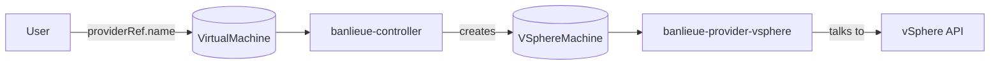

# Provider Model

A **provider** is the unit of pluggability in banlieue. A provider is whatever
turns a uniform `VirtualMachine` request into a real VM on a specific backend
(vSphere, Proxmox, libvirt, …).

This page explains what a provider *is* on the wire, what it implements, and
how it plugs in. For the reasoning behind the design, see
[Abstraction principle](../reasoning/abstraction-principle.md) and
[CRD-only contract](../reasoning/crd-only-contract.md).

## Two things make a provider

A provider is **two artifacts**:

1. **A `Provider` CR** — declares the existence of a backend in this cluster
   and carries its connection settings (endpoints, credential references,
   defaults). One per backend instance.
2. **A provider controller** — a Kubernetes controller that watches an
   infrastructure CRD (e.g. `VSphereMachine`) and drives the corresponding
   backend.

The user only ever sees (1). The controller (2) is plumbing.



## The `Provider` CR

```yaml
apiVersion: banlieue.io/v1alpha1
kind: Provider
metadata:
  name: prod-vsphere
spec:
  providerClassRef:
    name: vsphere
  connection:
    endpoint: https://vcenter.example.com/sdk
    credentialsRef:
      name: vsphere-creds
    insecureSkipTLSVerify: false
  capabilities:
    storageClasses:
      - name: gold
        target: { datastore: ssd-tier-0 }
    networkClasses:
      - name: prod
        target: { portGroup: vmnet-prod }
```

Notes:

- `providerClassRef.name` identifies the backend type — a name drawn from a
  well-known set (`vsphere`, `proxmox`, `libvirt`). A future `ProviderClass`
  CRD will carry install metadata without changing this reference.
- The user never sees the `connection:` / `capabilities:` blocks. They're owned
  by whoever administers the cluster's `Provider`s.
- `connection.credentialsRef` points at a `Secret`. Credentials are *not*
  embedded in the CR.
- `capabilities` is the **explicit** capability declaration: every storage /
  network class a `VMClass` or `VMImage` may request must be listed here for
  this provider to be considered by the scheduler. The provider's controller
  then verifies them and reports per-failure-domain availability in
  `status.failureDomains[]`.
- A cluster can have many `Provider`s, including multiple of the same class
  (`prod-vsphere`, `dr-vsphere`, `lab-vsphere`).
- When provisioning Kubernetes clusters via CAPI, a `VSphereCluster`
  (InfraCluster) aggregates the `status.failureDomains[]` of one or more
  `Provider`s — so a single cluster can span multiple vCenters. See
  [Infrastructure CRDs & CAPI](infra-crds-capi.md#infracluster-cluster-side-failure-domain-spread).

The authoritative type is in
[`crates/banlieue-api/src/banlieue/provider.rs`](https://github.com/firestoned/banlieue/blob/main/crates/banlieue-api/src/banlieue/provider.rs).
For a full deploy walkthrough see the
[vSphere provider guide](../guides/vsphere-provider.md).

## What a provider controller does

A provider controller is a Kubernetes controller. Its responsibilities:

1. **Watch its infrastructure CRD** (`VSphereMachine`,
   `VSphereMachineTemplate`, etc.).
2. **Reconcile to the backend.** Translate the uniform spec into native API
   calls (govmomi for vSphere, proxmoxer for Proxmox, libvirt for libvirt).
3. **Report status uniformly.** Patch `.status` on the infra CR with the CAPI
   v1beta2 condition vocabulary, regardless of how the backend natively
   surfaces errors. See [Infrastructure CRDs & CAPI](infra-crds-capi.md).
4. **Add and clear finalisers** so deletes block until the backend is actually
   torn down.
5. **Use server-side apply** with a provider-specific field manager
   (`banlieue.io/provider-vsphere`, etc.) — so ownership of fields is explicit.

## What a provider controller does **not** do

- It does **not** speak directly to the banlieue main controller. The bus is
  the K8s API. See [CRD-only contract](../reasoning/crd-only-contract.md).
- It does **not** publish a service. There is nothing to expose, nothing to
  authenticate against, nothing to load-balance.
- It does **not** mutate `VirtualMachine`. It only mutates its own infra CR.
  Status mirroring is the main controller's job.
- It does **not** see `Provider` credentials except by resolving the Secret it
  was pointed at.

## Anatomy of a provider crate

Each provider is a **library crate** — it has no `main.rs`. The single
`banlieue` binary owns the one entrypoint and dispatches the
`banlieue provider <name>` subcommand into the provider's `run()`
([ADR-0004](https://github.com/firestoned/banlieue/blob/main/docs/adr/0004-single-binary-subcommand-dispatch.md)).
All providers share `banlieue-provider-sdk`:

```
crates/banlieue-provider-vsphere/
├── Cargo.toml              # [lib] only — no [[bin]]
└── src/
    ├── lib.rs              # library root; `pub use app::{Cli, run}`
    ├── app.rs              # the `banlieue provider vsphere` subcommand: Cli (clap::Args) + run()
    ├── context.rs          # reconciler Context
    ├── error.rs            # typed errors
    ├── client/             # backend-agnostic vSphere client surface
    │   ├── mod.rs          # VSphereClient / VSphereClientFactory traits
    │   ├── vim.rs          # production impl (vim_rs)
    │   └── fake.rs         # in-memory fake for unit tests
    └── reconciler/
        ├── mod.rs
        ├── provider.rs     # Provider inventory walk → failureDomains[]
        └── vmimage.rs      # VMImage template-availability check
```

The crate exports `Cli` (a `clap::Args` payload) and `pub async fn run(cli)`;
the `banlieue` binary embeds `Cli` as the `provider vsphere` subcommand and
calls `run()`. The reconcilers depend only on the `VSphereClient` trait, so
they're unit-tested against an in-memory `FakeClient` without compiling or
connecting through `vim_rs`.

The SDK
([`banlieue-provider-sdk`](https://github.com/firestoned/banlieue/tree/main/crates/banlieue-provider-sdk))
gives you:

- `client::build_client` — Kubernetes client with sensible timeouts.
- `status::set_condition` / `find_condition` / `is_condition_true` —
  CAPI-shaped condition handling.
- `finalizer::ensure_finalizer` / `remove_finalizer` — patch-based finalisers.
- `ssa::server_side_apply` — server-side apply with a per-provider field
  manager.
- `reconciler::{requeue_default, requeue_on_error, requeue_long, no_requeue}`
  — small helpers around `kube::runtime::Action`.

## Writing a third-party provider

banlieue's provider model is open. To ship a new provider:

1. Define your infrastructure CRD(s) in a separate crate, satisfying the
   [CAPI v1beta2 InfraMachine contract](https://cluster-api.sigs.k8s.io/developer/providers/contracts/).
   The provider CRD shape used in `crates/banlieue-api/src/infrastructure/`
   (`VSphereMachine`, `VSphereMachineTemplate`) is the reference.
2. Build a controller against your CRD using `banlieue-provider-sdk`.
3. Ship a container image and a Helm chart / Kustomize manifest.

That's it. No registration with the banlieue project. No code changes to
`banlieue-api`. No coordination with the main controller team. The whole point
of the [CRD-only contract](../reasoning/crd-only-contract.md) is that you
*don't have to be us* to add a provider.
