# How a Claim Works: the whole path, in diagrams

This page describes *how the claim path is wired*: *who talks to whom*, in
order, from a developer typing `kubectl` to a sandbox VM destroyed by its own
deadline. For the task-level view — which fields to set, and what each one
means — read the [VirtualMachine Claims](../guides/virtualmachine-claims.md)
guide instead; the two are companions.

Every diagram here is drawn from the shipped code, not from intent. Where
something is designed but not built, it says so in the diagram itself.

## The cast

Claims involve more actors than most banlieue resources, because identity is
part of the design: a claim records *who* a sandbox was handed to, so the
thing that establishes "who" is inside the picture.

| Actor | What it is | Where it lives |
| --- | --- | --- |
| **Developer** | A human who wants a sandbox VM | a laptop |
| **kubectl** | The CLI | the same laptop |
| **kubelogin** | `kubectl oidc-login`, an exec credential plugin. Runs the browser flow, caches the ID token | the same laptop |
| **Browser** | Where the OAuth2 consent happens | the same laptop |
| **GitHub** | The identity provider. **OAuth2, not OIDC** — it mints no ID tokens | the internet |
| **Dex** | The OIDC bridge in front of GitHub. Mints the ID token the API server will accept | in-cluster |
| **API server** | Authenticates the token, then runs admission | control plane |
| **Admission policy** | `ValidatingAdmissionPolicy` — checks `spec.subject` against the caller (ADR-0047 D10) | control plane |
| **Claim controller** | Binds a member, holds it, releases it | `banlieue-controller` |
| **Pool controller** | Keeps `warmReplicas` Ready members | `banlieue-controller` |
| **Provider controller** | Creates and destroys the real VM | `banlieue-provider-libvirt`, `-vsphere` |
| **Hypervisor** | libvirtd / vCenter | a host somewhere |
| **Broker** | Hands sandboxes out on behalf of other people (roadmap phase C) | *not built* |
| **In-guest agent** | Receives the subject's credential and verifies it (ADR-0049) | *not built, separate repo* |

!!! note "Dex is a development convenience, not a requirement"
    Any OIDC issuer the API server trusts works the same way — Google, Auth0,
    your corporate IdP. Dex appears here because **GitHub is OAuth2 and has
    no ID tokens**, so it cannot be an API server issuer on its own. See
    [OAuth client setup](../developer/oauth-clients.md) and
    [Testing claim authorization](../guides/testing-claim-authorization.md).

## 1. Identity: how a developer becomes a username

Nothing about a claim makes sense until this has happened. The API server
can only vouch for `request.userInfo`, and this is how that gets populated.

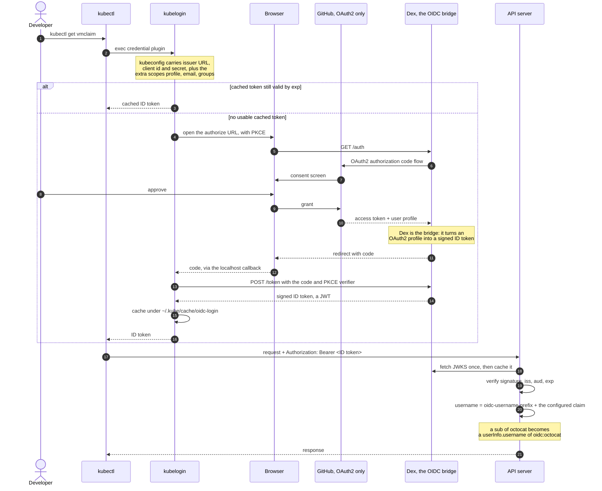

Two failure modes worth recognising, both learned the hard way:

!!! warning "kubelogin decides freshness from `exp` alone"
    If the issuer rotates its signing keys, the cached token is still
    *unexpired* and kubelogin keeps serving it — while the API server
    rejects it, forever. No amount of re-running the login escapes it. The
    only cure is `rm -rf ~/.kube/cache/oidc-login`. Dex with
    `storage: type: memory` rotates keys on every restart, so this is not
    hypothetical.

!!! warning "`iss` must match byte-for-byte across three consumers"
    The browser, kubectl and the API server must all reach the issuer at the
    *same* URL, because `iss` inside the token is compared literally against
    `--oidc-issuer-url`. In kind this forces a NodePort plus a host-port
    mapping, and therefore an **IP SAN** rather than a DNS name.

### Where the prefix goes, and where it does not

This distinction is the reason ADR-0047 Decision 9 was amended:

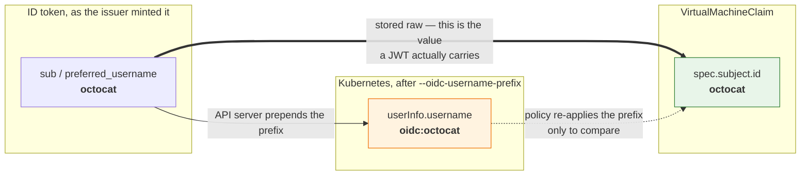

`spec.subject.id` stores the **raw** subject. The in-guest agent compares it
against a JWT, and no token anywhere carries an `oidc:` prefix — so storing
the prefixed Kubernetes username would make the field uncomparable to the
only thing it exists to be compared against. The admission policy adds the
prefix at check time instead, from `usernamePrefix` in its params ConfigMap.

## 2. Creating a claim: what admission checks

`spec.subject` is a free-text assertion by whoever created the claim, and
without this policy anyone with `create virtualmachineclaims` can attribute
a VM to any identity they like — with the audit log recording it as genuine.
The check has to happen at admission, while the requesting principal still
exists; by reconcile time the controller sees an object, never a caller.

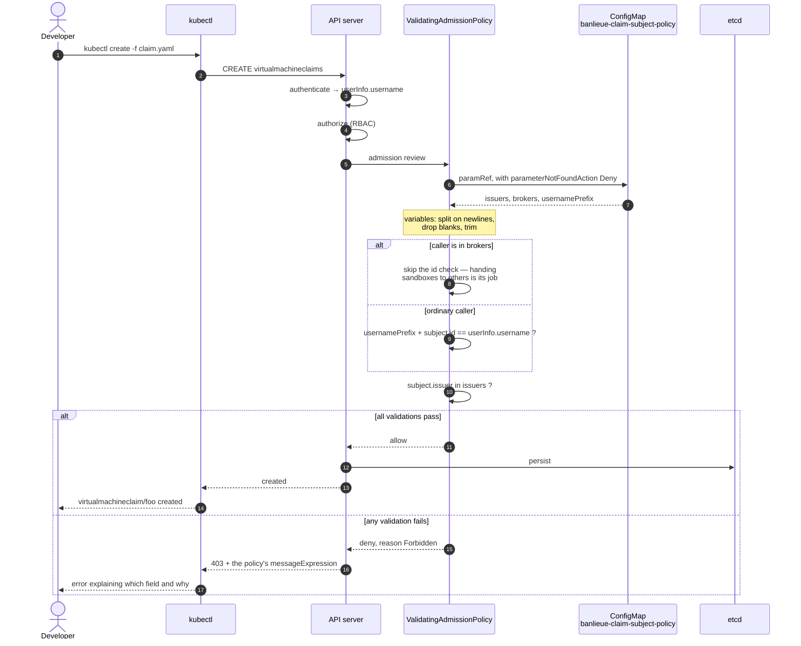

### The five validations, and why each is scoped as it is

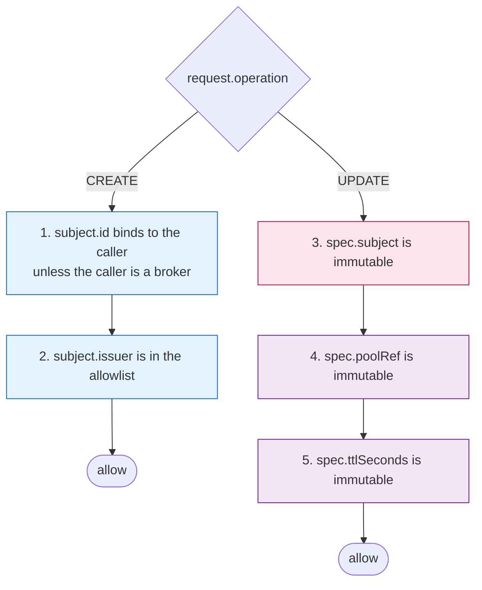

!!! danger "Checks 1 and 2 are CREATE-only, and that is load-bearing"
    On UPDATE the requester is whoever is touching the object *now* — which
    is normally **the claim controller adding its finalizer**, not the person
    the claim is for. Applying the identity check to updates denies the
    controller, so claims are created and then never reconciled: `Bound` is
    never reached and no VM is ever bound. The visible symptom is
    indistinguishable from "banlieue is not running".

    Nothing is lost by the scoping, because check 3 freezes `subject`: an
    attribution authorized at creation cannot be edited afterwards by
    anyone, controller included. Checks 4 and 5 exist for a plainer reason —
    mutating those fields would silently do nothing, which is worse than
    being refused.

## 3. Binding: how a claim gets a VM

The claim controller never locks anything. The API server is already the
serialisation point, so a `resourceVersion` precondition on the member patch
is the entire concurrency story.

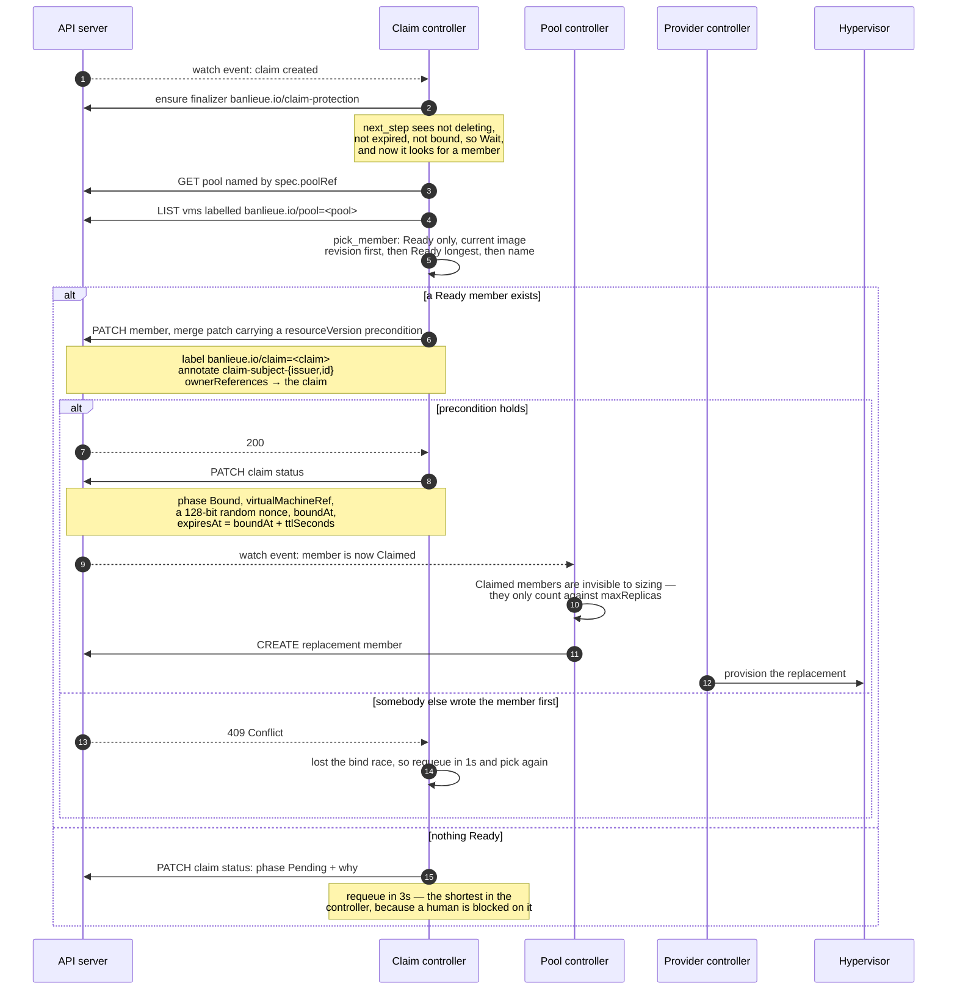

Three consequences of that shape:

- **Re-parenting is what makes a claim safe.** The member's owner becomes the
  claim, not the pool, so deleting the pool cannot destroy a sandbox somebody
  is using (ADR-0047 D3).
- **The subject is stamped onto the VM** as
  `banlieue.io/claim-subject-issuer` / `-id` annotations. That is the whole
  of banlieue's interest in `subject`: it records the attribution and reads
  it no further.
- **The nonce is minted at bind**, is single-use, and is *not secret*. Its
  only job is to stop an attestation quote captured from one sandbox being
  replayed against another.

### Two consumers, one member

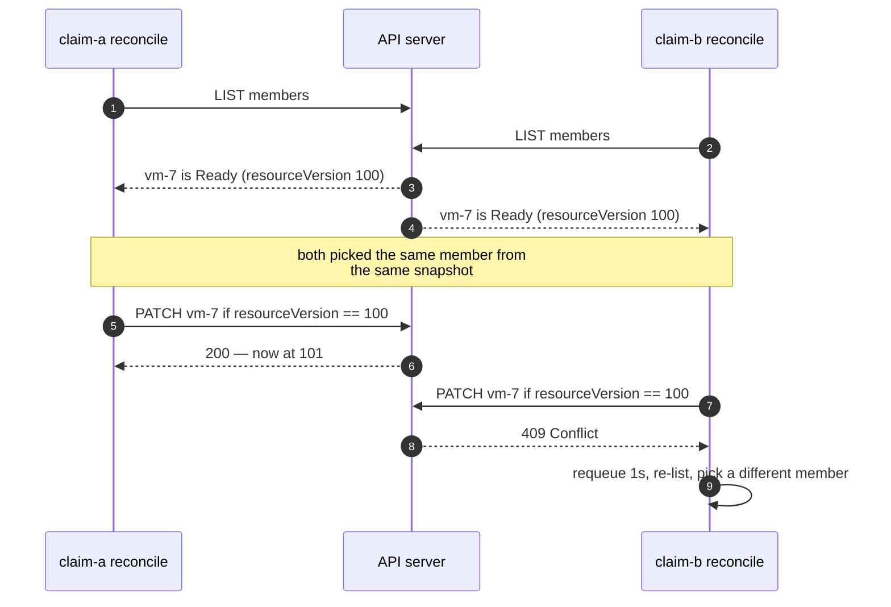

No lease, no lock, no leader coordination for the hand-out itself. A
`Claimed` member is never offered by `pick_member` again, which is the
invariant the whole design rests on.

## 4. The claim state machine

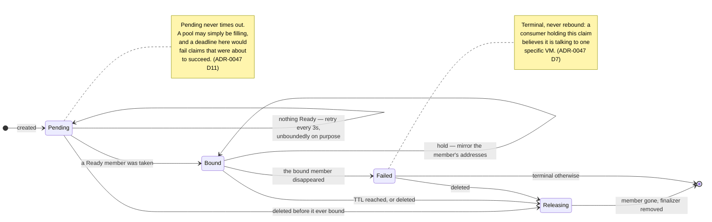

### Precedence is the interesting part

`next_step` is a pure function of a snapshot, and the order it tests things
in is a design decision rather than an implementation detail:

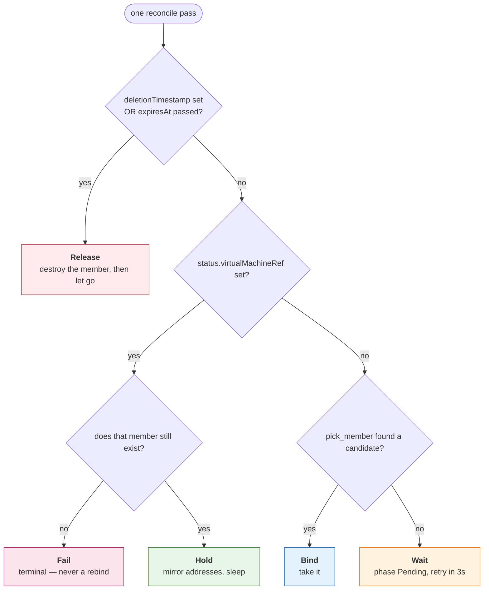

Release outranks everything, **including a healthy binding**: once a claim is
going away, or its deadline has passed, the only remaining job is to destroy
the member. And a vanished member fails the claim even when a replacement is
sitting Ready, because rebinding would hand the consumer a different VM than
the one it believes it holds.

## 5. Release: the deadline, and the two finalizers

A claim's TTL is a **deadline**, not an idle timer. It is counted from the
bind instant — so a claim that waited ten minutes for capacity still gets its
full TTL — and nothing extends it.

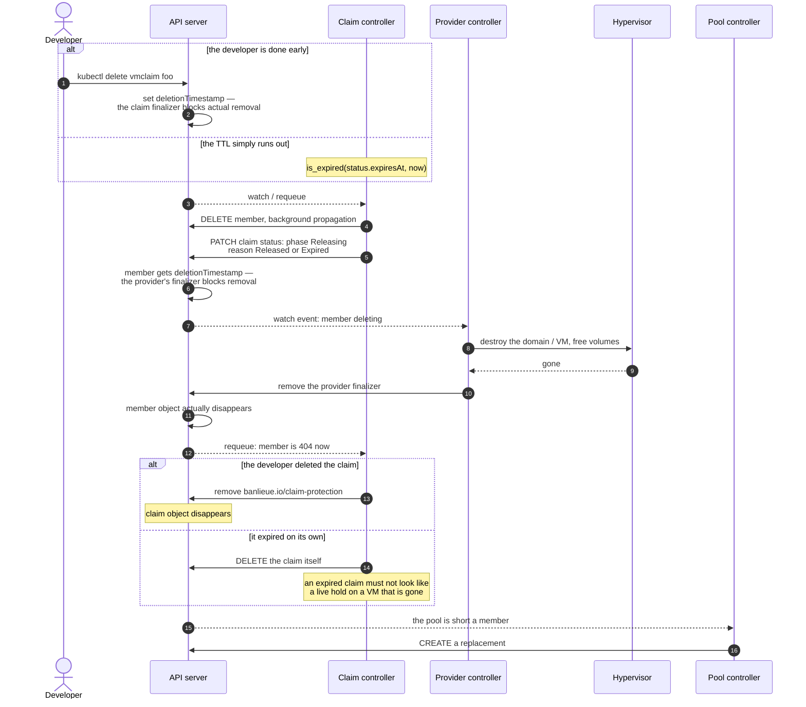

!!! tip "\"Claim gone\" means \"sandbox gone\", transitively"
    The ordering is the guarantee. The claim keeps its finalizer until the
    member is gone from the API server, and the member's own finalizer keeps
    *it* until the backend VM is actually destroyed. Neither layer trusts
    the other to have finished — each one waits and re-checks.

## 6. Delivering the subject's credential

!!! danger "Designed, not built — ADR-0049 is Proposed"
    Nothing in this section ships today. It is here because it is the reason
    `status.nonce` and `status.tpmEndorsementCertificates` exist, and because
    "how does the JWT get into the VM?" is the first question the claim model
    provokes. ADR-0049 also depends on ADR-0045 (EK certificates), which is
    itself not landed.

A claim deliberately carries no credential: a custom resource is readable by
every reader of the namespace and lands in the audit log, so a token in it is
a token disclosed. And a warm pool member **exists before any claim does**,
so nothing baked in at build or boot can be subject-specific. The credential
therefore has to arrive later, over a channel banlieue is not part of.

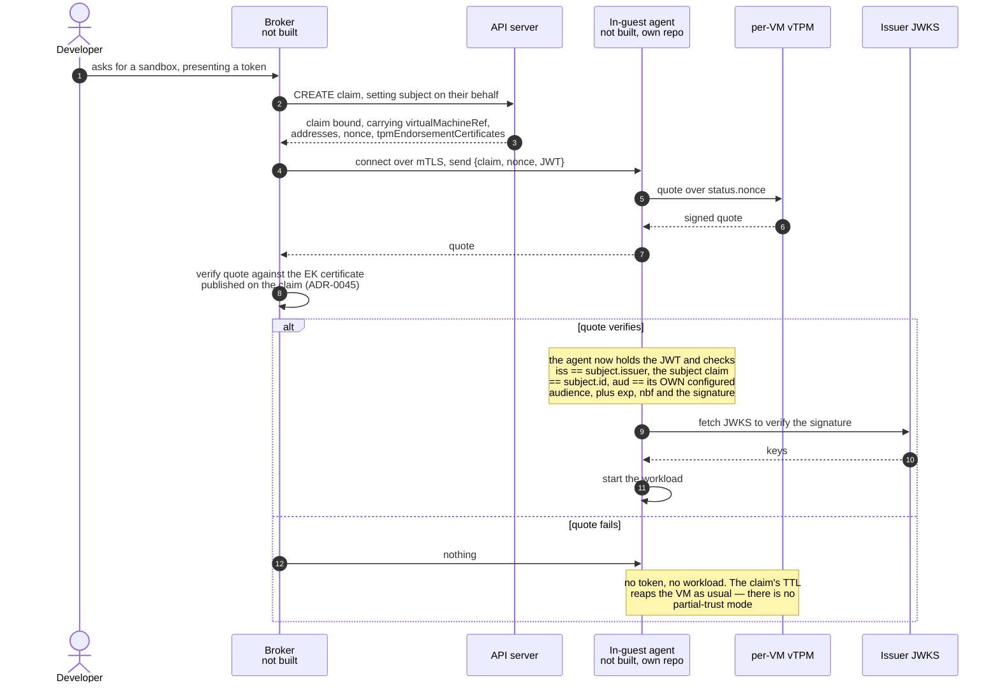

Three points that are decisions rather than mechanics:

- **banlieue neither carries nor validates the token.** It records the
  attribution, publishes the nonce, and mirrors the EK certificate.
  Verification belongs to the agent, the only party that can legitimately
  hold the credential — which is what keeps subject credentials out of the
  controller's compromise radius.
- **`aud` must be the agent's own configured audience, never read from the
  claim.** Taking it from the claim is the obvious implementation, and it
  silently removes the guarantee: whoever wrote the claim would choose the
  audience, so a token minted for any other service would satisfy the check.
- **The issuer allowlist turns out to be load-bearing twice.** The agent
  learns *which* issuer to trust from `subject.issuer` — a field on a CR — so
  without the admission allowlist, anyone who could create a claim would
  point the agent at their own JWKS and every token they minted would
  validate. It was added for audit honesty; it is also what makes signature
  verification meaningful.

!!! note "`GuestReady` is a different signal, and must not be conflated"
    A guest that announced itself has booted from its installed disk
    (ADR-0043). Only a verified quote says *which* guest it is.

## 7. Everything at once

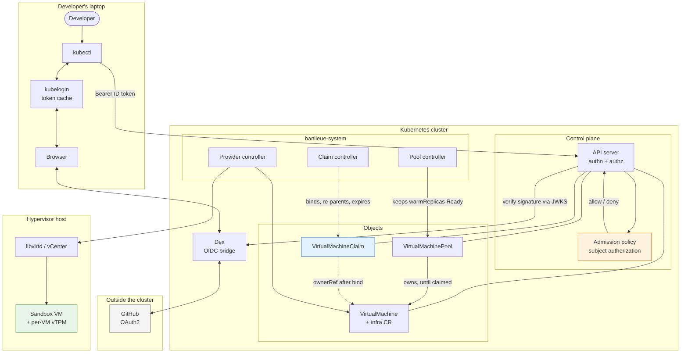

The trust boundaries worth naming on that picture:

1. **Laptop → cluster.** Crossed by a bearer token. The API server is the
   only thing that decides what the developer is called.
2. **API server → admission policy.** The last point at which the *caller*
   still exists. Everything after this sees objects.
3. **Controller → hypervisor.** Crossed by provider credentials, never by
   consumer credentials.
4. **Cluster → sandbox guest.** Crossed only by the broker's attested
   channel, in a design that is not built yet. banlieue itself never reaches
   into the guest to deliver anything.

## Where to go next

- [VirtualMachine Claims](../guides/virtualmachine-claims.md) — the field-by-field guide
- [VirtualMachine Pools](../guides/virtualmachine-pools.md) — where members come from
- [Testing claim authorization](../guides/testing-claim-authorization.md) — run the
  whole OIDC flow against a kind cluster with your own GitHub account
- [OAuth client setup](../developer/oauth-clients.md) — GitHub, Google, Auth0
- ADR-0047 (claims), ADR-0049 (attestation), ADR-0043 (`GuestReady`),
  ADR-0045 (EK certificates)
