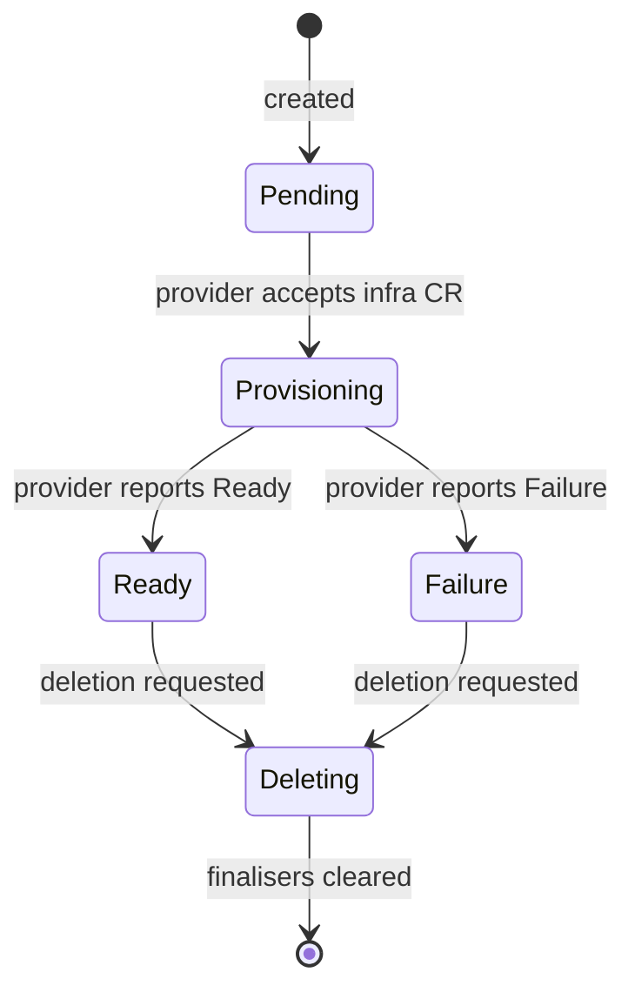

# VirtualMachine

`VirtualMachine` is the user-facing CRD. Everything in banlieue's design is
oriented around keeping its shape small, uniform, and provider-agnostic.

The authoritative definition lives in
[`crates/banlieue-api/src/banlieue/virtualmachine.rs`](https://github.com/firestoned/banlieue/blob/main/crates/banlieue-api/src/banlieue/virtualmachine.rs).
Generated CRD YAML lives in `deploy/crds/` and is produced by the `crdgen`
binary — see [Architecture](architecture.md).

## Shape (illustrative)

```yaml
apiVersion: banlieue.io/v1alpha1
kind: VirtualMachine
metadata:
  name: db-prod-01
spec:
  class: db-prod-large       # name of a VMClass (CPU/memory/disk shape)
  image: ubuntu-22-04         # name of a VMImage (boot image)
  providerRef:
    name: prod-vsphere        # name of a Provider (which backend)
  userData: |                 # optional cloud-init / ignition / sysprep
    #cloud-config
    runcmd:
      - echo hello
```

Note what is **not** there: no `vsphere:` block, no `proxmox:` block, no
backend-specific knobs. That's deliberate; see
[Abstraction principle](../reasoning/abstraction-principle.md).

## Status, uniformly

`VirtualMachine.status` follows the K8s conventions: a `conditions[]` array
plus a small set of well-known fields. Every provider produces the same
condition vocabulary:

| Condition `type` | Meaning |
| --- | --- |
| `Ready` | The VM exists, is provisioned, and is reachable. |
| `Provisioned` | The backend has accepted the spec and the VM exists. |
| `ImageReady` | The referenced image is resolvable and importable on the backend. |
| `Failure` | A terminal error has occurred. `reason` and `message` are populated. |

Status is **mirrored** from the underlying infrastructure CR; the main
controller never sets `provisioned=true` on its own. See
[Architecture → Reconcile flow](architecture.md#reconcile-flow-happy-path).

## Lifecycle



## Spec field reference

> The list below is illustrative for Phase 0–1A. Use `kubectl explain
> virtualmachine.spec` (or
> [the API reference](../reference/roadmap.md)) for the authoritative shape.

- `class` *(string, required)* — references a `VMClass` (CPU / memory / disks).
- `image` *(string, required)* — references a `VMImage` (boot image).
- `providerRef.name` *(string, required)* — references a `Provider` (which
  backend).
- `userData` *(string, optional)* — cloud-init / ignition / sysprep payload.

## Related CRDs

- **[VMClass](../reference/roadmap.md)** — flavour / size shape (CPU, memory, disk).
- **[VMImage](../reference/roadmap.md)** — boot image source.
- **[Provider](providers.md)** — which backend serves this VM.

The infrastructure CRDs (`VSphereMachine`, future `ProxmoxMachine`,
`LibvirtMachine`) are documented under [Provider Model](providers.md) and
[Infrastructure CRDs & CAPI](infra-crds-capi.md). The user normally doesn't
touch them.
