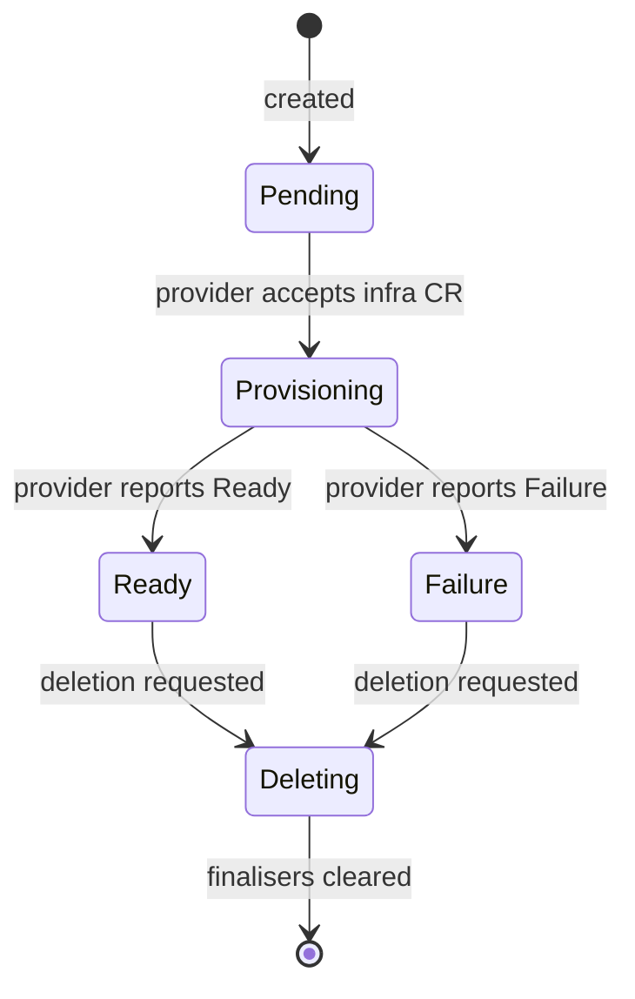

# VirtualMachine

`VirtualMachine` is the user-facing CRD. Everything in banlieue's design is
oriented around keeping its shape small, uniform, and provider-agnostic.

The authoritative definition lives in
[`crates/banlieue-api/src/banlieue/virtualmachine.rs`](https://github.com/firestoned/banlieue/blob/main/crates/banlieue-api/src/banlieue/virtualmachine.rs).
Generated CRD YAML lives in `deploy/crds/` and is produced by the `crdgen`
binary — see [Architecture](architecture.md).

## Shape (illustrative)

```yaml
apiVersion: banlieue.io/v1alpha1
kind: VirtualMachine
metadata:
  name: db-prod-01
spec:
  classRef:
    name: db-prod-large       # name of a VMClass (CPU/memory/disk shape)
  imageRef:
    name: ubuntu-22-04         # name of a VMImage (boot image)
  placement:
    providerSelector:
      matchLabels: { dc: dc1, env: prod }  # which Provider(s) may schedule this VM
  userData:                   # optional cloud-init / ignition / sysprep
    secretRef:                 # or configMapRef for non-sensitive data
      name: db-prod-01-cloudinit
      key: user-data           # defaults to "user-data" when omitted
  desiredPowerState: PoweredOn
```

Note what is **not** there: no `vsphere:` block, no `proxmox:` block, no
backend-specific knobs. That's deliberate; see
[Abstraction principle](../reasoning/abstraction-principle.md).

## Status, uniformly

`VirtualMachine.status` follows the K8s conventions: a `conditions[]` array
plus a small set of well-known fields. Every provider produces the same
condition vocabulary:

| Condition `type` | Meaning |
| --- | --- |
| `Ready` | The VM exists, is provisioned, and is reachable. |
| `Scheduled` | A `Provider` matching `placement` has been selected. |
| `PlacementValid` | The requested `VMClass`/`VMImage`/placement combination is resolvable. |
| `InfrastructureReady` | The backend infrastructure CR reports Ready. |
| `Migrating` | (optional) A recreate-based migration to a new `Provider`/failure domain is in progress. |

`status.initialization.provisioned` (a boolean, not a condition) tracks
whether the backend has ever accepted the spec.

Status is **mirrored** from the underlying infrastructure CR; the main
controller never sets `provisioned=true` on its own. See
[Architecture → Provision a VM](architecture.md#provision-a-vm).

## Lifecycle


```mermaid
stateDiagram-v2
    [*] --> Pending: created
    Pending --> Provisioning: provider accepts infra CR
    Provisioning --> Ready: provider reports Ready
    Provisioning --> Failure: provider reports Failure
    Ready --> Deleting: deletion requested
    Failure --> Deleting: deletion requested
    Deleting --> [*]: finalisers cleared
```

## Spec field reference

> The list below is illustrative for Phase 0–1A. Use `kubectl explain
> virtualmachine.spec` (or
> [the API reference](../reference/api.md)) for the authoritative shape.

- `classRef.name` *(string, required)* — references a `VMClass` (CPU / memory / disks).
- `imageRef.name` *(string, required)* — references a `VMImage` (boot image).
- `placement.providerSelector` / `placement.failureDomainSelector` *(label
  selectors, optional)* — which `Provider`(s)/failure domains may schedule
  this VM. There is no direct-by-name `Provider` reference; the scheduler
  matches labels.
- `desiredPowerState` *(string, optional)* — `PoweredOn` (default) |
  `PoweredOff` | `Suspended`.
- `userData` *(object, optional)* — references a Secret (`secretRef`) or
  ConfigMap (`configMapRef`) carrying the cloud-init / ignition / sysprep
  payload (exactly one must be set). See
  [ADR-0025](https://github.com/firestoned/banlieue/blob/main/docs/adr/0025-vspheremachine-userdata-secret-rbac.md)
  and [ADR-0038](https://github.com/firestoned/banlieue/blob/main/docs/adr/0038-userdata-configmap-support.md).

## Per-VM overrides (deltas, not primary definitions)

A `VirtualMachine` inherits its hardware shape and network topology from the
`VMClass` it references. Two optional fields let you override specific values
**for a single VM** without creating a new class:

| Field | What it overrides | Type |
| --- | --- | --- |
| `hardwareOverride.cpus` | CPUs from `VMClass.spec.hardware.cpus` | `u32?` |
| `hardwareOverride.memoryMiB` | Memory from `VMClass.spec.hardware.memoryMiB` | `u32?` |
| `hardwareOverride.diskOverrides` | Disk sizes from `VMClass.spec.hardware.disks` | list, keyed by `name` |
| `networkOverrides` | IPAM on a named interface from `VMClass.spec.network.interfaces` | list, keyed by `name` |

**These are deltas, not primary definitions.** The `VMClass` remains the
authoritative source for the VM's shape. Only the fields you set in an
override replace the class value; everything else is inherited unchanged.

Use overrides sparingly. Their purpose is to accommodate the rare VM that
genuinely needs a different budget than its class defines — for example, a
database primary bumped to 16 CPUs while all other replicas use the 4-CPU
class shape, one VM that needs a larger data disk, or one VM that needs a
static IP while the rest use DHCP. If you find yourself setting the same
override on every VM of a given class, create a new `VMClass` instead.

```yaml
spec:
  classRef:
    name: db-prod-large
  # Delta: bump memory + data disk for this one VM; CPUs and OS disk stay as
  # the class defines.
  hardwareOverride:
    memoryMiB: 65536
    diskOverrides:
      - name: data
        sizeGiB: 2000
  # Delta: pin eth0 to a static address; other interfaces use the class IPAM.
  networkOverrides:
    - name: eth0
      static:
        address: 192.0.2.90
        prefix: 24
        gateway: 192.0.2.1
        nameservers: [192.0.2.53]
```

## Related CRDs

- **[VMClass](../reference/api.md)** — flavour / size shape (CPU, memory, disk).
- **[VMImage](../reference/api.md)** — boot image source.
- **[Provider](providers.md)** — which backend serves this VM.

The infrastructure CRDs (`VSphereMachine`, future `ProxmoxMachine`,
`LibvirtMachine`) are documented under [Provider Model](providers.md) and
[Infrastructure CRDs & CAPI](infra-crds-capi.md). The user normally doesn't
touch them.
