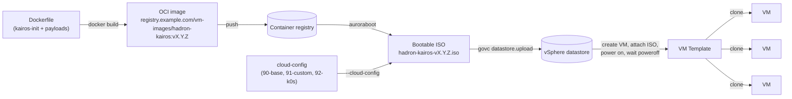

# Guide: Building a Kairos Hadron VM Template

This guide builds a **custom Kairos [Hadron](https://github.com/kairos-io/hadron)
image** — Kairos's musl/immutable, *package-manager-less* base — into a
bootable ISO and, from there, a vSphere VM template. It covers the step
**before** the one [Using banlieue-imagebuilder](using-banlieue-imagebuilder.md)
starts from: that guide takes an already-built OCI image and turns it into a
`VMImage` build artifact; this guide is how you produce that OCI image in the
first place when the stock `kairos-io/hadron` release needs extra payloads
(an EDR/security agent, org-specific hardening, static tooling, orchestrator
directories) baked in.



Two independent ways to consume the result:

1. **Manual / govc**, as shown at the end of this guide — useful for a first
   build, air-gapped environments, or debugging the pipeline itself.
2. **banlieue-native** — push the OCI image, point a `VMImage` with
   `sources: [{kind: Url, ...}]` at it, and let `banlieue-imagebuilder` + the
   [vSphere provider](vsphere-provider.md) do the ISO build, upload, VM
   creation, install-wait, and templating per the
   [ADR-0021](https://github.com/firestoned/banlieue/blob/main/docs/adr/0021-vsphere-template-install-and-generalize.md)
   contract. The cloud-config contract in that ADR (an `admin`-group `users`
   entry, `install.poweroff: true`, identity wipe in `after-install-chroot`)
   is a strict subset of what this guide's cloud-config already does.

---

## Why Hadron needs a custom image at all

Kairos ships several base families (`core` on Ubuntu/openSUSE, `alpine`,
and `hadron` — a from-scratch musl build). Hadron trades the convenience of
`apk`/`apt`/`dnf` for a much smaller, more auditable image: **it ships with
no package manager whatsoever.** That single fact drives most of this
Dockerfile's shape:

- Anything that would normally be `apk add`/`dnf install`-ed at build time
  has to be **assembled elsewhere and copied in as plain files.**
- Any glibc-linked third-party binary (most commercial EDR/security agents,
  for example) needs `gcompat` (a musl→glibc compatibility shim) and its own
  runtime libraries copied alongside it — Hadron's own musl libc must never
  be overwritten, since that risks an ABI mismatch for the whole system.
- VMware guest integration (`vmtoolsd`, used below to read `guestinfo` at
  boot) has to be extracted from a package that does ship it (Alpine, in
  this guide) rather than installed normally.

## Prerequisites

- Docker (or another OCI builder) with BuildKit.
- Network reachability to `quay.io/kairos-io` (or an internal mirror of it)
  and to the base images your organization pins (Alpine, in the `payloads`
  stage below).
- [`auroraboot`](https://github.com/kairos-io/auroraboot) (run via
  `docker run`, no separate install needed) to turn the built OCI image into
  a bootable ISO.
- If targeting vSphere: `govc` and a datacenter/cluster/datastore to upload
  to — see the [Alpine template guide](alpine-vsphere-template.md)'s `govc`
  setup section, which applies unchanged here.

---

## The Dockerfile

Multi-stage: one stage assembles anything that needs a package manager
(`payloads`), one stage grabs a statically-linked `curl` from Hadron's own
toolchain image, and the final stage starts `FROM kairos-io/hadron` and never
touches a package manager again.

```dockerfile
# ---- versions ----
ARG KAIROS_INIT_VERSION=v0.17.3
ARG HADRON_VERSION=v0.5.1
# Keep in sync with any sibling Alpine-based build — the payloads stage
# below relies on this release's apk package names/layouts.
ARG ALPINE_VERSION=3.21
ARG VERSION=0.1.0
ARG MODEL=generic
ARG TRUSTED_BOOT=false
# Pin your own agent's version here if you bake one in (see the payloads
# stage below) — resolve it at build time (CI queries your artifact registry)
# rather than hardcoding, so CVE fixes land on every rebuild.
ARG SECURITY_AGENT_VERSION="latest.el9.x86_64"
ARG STATIC_CURL_VERSION

FROM quay.io/kairos-io/kairos-init:${KAIROS_INIT_VERSION} AS kairos-init

# ---- Alpine payload stage: everything that needs a package manager to
# assemble, done once. Hadron ships with NO package manager at all, so
# anything requiring `apk`/`rpm2cpio` has to be built here and copied into
# the final image as plain files.
#   - Third-party security agent: unpacked via rpm2cpio+cpio (files only, no
#     scriptlets) — safer than `rpm -ivh` when the target rootfs can't run
#     the RPM's glibc-assuming post-install hooks. If it's glibc-linked,
#     gcompat + its runtime deps (musl-obstack, libucontext) are pulled in
#     and copied alongside it.
#   - vmtoolsd (for reading VMware guestinfo at boot): Alpine's build is
#     musl-linked, same libc family as Hadron, so it's extracted directly —
#     no gcompat shim needed, unlike the glibc agent above.
# musl libc itself (ld-musl-*.so.1) is deliberately NOT copied for either —
# Hadron already provides its own, and overwriting it risks an ABI mismatch
# affecting the whole system.
FROM alpine:${ALPINE_VERSION} AS payloads
ARG SECURITY_AGENT_VERSION
RUN apk add --no-cache \
      rpm curl gcompat libc6-compat libgcc musl-obstack libucontext \
      open-vm-tools && \
    mkdir -p /payload-root/usr/bin /payload-root/usr/lib && \
    curl -fsSL \
      "https://artifactory.example.com/security-agents/agent-${SECURITY_AGENT_VERSION}.rpm" \
      -o /tmp/agent.rpm && \
    ( mkdir -p /agent-extract && cd /agent-extract && \
      rpm2cpio /tmp/agent.rpm | cpio -idm --quiet && \
      rm -f /tmp/agent.rpm && \
      cp -a etc opt usr /payload-root/ ) && \
    for pkg in gcompat libgcc musl-obstack libucontext; do \
      for f in $(apk info -L "$pkg" | grep -E '^(lib(64)?|usr/lib)/'); do \
        cp -aL "/$f" /payload-root/usr/lib/; \
      done; \
    done && \
    cp -aL /usr/bin/vmtoolsd /payload-root/usr/bin/ && \
    cp -aL /usr/lib/libvmtools.so.0 /usr/lib/libgmodule-2.0.so.0 \
           /usr/lib/libgobject-2.0.so.0 /usr/lib/libglib-2.0.so.0 \
           /usr/lib/libintl.so.8 /usr/lib/libtirpc-nokrb.so.3 \
           /usr/lib/libffi.so.8 /usr/lib/libpcre2-8.so.0 \
           /payload-root/usr/lib/

# ---- latest static musl curl, pinned via --build-arg ----
FROM ghcr.io/kairos-io/hadron-toolchain:${HADRON_VERSION} AS tools
ARG STATIC_CURL_VERSION
RUN curl -fsSL -o /curl \
      "https://github.com/moparisthebest/static-curl/releases/download/v${STATIC_CURL_VERSION}/curl-amd64" \
 && chmod +x /curl

# ---- final: kairosified Hadron, core (no k3s) ----
FROM ghcr.io/kairos-io/hadron:${HADRON_VERSION} AS base

ARG VERSION
ARG MODEL
ARG TRUSTED_BOOT

LABEL org.opencontainers.image.title="Example Org Hadron Kairos Image"
LABEL org.opencontainers.image.version="${VERSION}"
LABEL org.opencontainers.image.description="Example Org immutable Kairos Hadron (musl) base image"
LABEL io.kairos.family="hadron"
LABEL io.kairos.variant="core"

RUN --mount=type=bind,from=kairos-init,src=/kairos-init,dst=/kairos-init \
    /kairos-init -l debug -s install --model "${MODEL}" -t "${TRUSTED_BOOT}" --version "${VERSION}" && \
    /kairos-init -l debug -s init    --model "${MODEL}" -t "${TRUSTED_BOOT}" --version "${VERSION}"

# Payload COPYs run AFTER kairos-init so its cleanup can't remove them.
COPY --from=tools /curl /usr/bin/curl

# Directories the immutable rootfs needs to exist so bind mounts declared in
# cloud-config (see 90-base.yaml below) have somewhere to land.
RUN mkdir -p \
    /oem \
    /system/oem \
    /etc/k0s \
    /opt/k0s \
    /opt/cni/bin \
    /var/lib/k0s/bin \
    /var/lib/k0s/manifests \
    /var/lib/k0s/images \
    /var/lib/k0s/pki \
    /var/lib/k0s/kubelet \
    /var/lib/k0s/containerd \
    /var/lib/k0s/etcd

# OEM cloud-configs — see the "Cloud-config anatomy" section below.
COPY cloud-config/90-base.yaml /system/oem/
COPY cloud-config/91-custom.yaml /system/oem/
COPY cloud-config/92-k0s.yaml /system/oem/

# configure-network is invoked directly by 91-custom.yaml's initramfs/boot
# stage commands.
COPY bin/configure-network.sh /opt/acme/configure-network
RUN chmod 0755 /opt/acme/configure-network

# Security agent + gcompat + vmtoolsd — all assembled in the payloads stage
# above; a single COPY here lands everything at once.
COPY --from=payloads /payload-root/ /
RUN mkdir -p /etc/systemd/system/multi-user.target.wants \
 && ln -sf /usr/lib/systemd/system/security-agent.service \
           /etc/systemd/system/multi-user.target.wants/security-agent.service
```

A few things worth calling out if you diverge from this shape:

- **Order matters for the final `COPY --from=payloads`.** It runs *after*
  `kairos-init`, which performs its own cleanup pass — copying payloads
  earlier means kairos-init can silently delete them.
- **`gcompat` is only needed for glibc-linked payloads.** The musl-built
  `vmtoolsd` extracted from Alpine doesn't need it — Alpine and Hadron are
  both musl, so it's a direct copy.
- Pin `STATIC_CURL_VERSION` (and any agent version) via `--build-arg` at
  build time rather than hardcoding a default, so CI can resolve the latest
  patched release on every rebuild instead of the Dockerfile drifting behind
  it.

---

## Cloud-config anatomy

Kairos's `#cloud-config` is layered — every file under `/system/oem/` (or
passed via `--cloud-config` to `auroraboot`) is merged, later files
overriding earlier ones by key. Splitting by concern instead of one giant
file keeps each piece independently testable and reusable across variants
(Hadron/Alpine/RHEL, in the source project this guide is drawn from).

### `90-base.yaml` — install + persistence

```yaml
#cloud-config

install:
  auto: true
  device: /dev/sda
  reboot: true
  grub-entry-name: "Example Org — Kairos"
  grub_options:
    timeout: 3

eject-cd: true

# Directories that MUST exist in the immutable rootfs for the bind mounts
# below to have targets (created in the Dockerfile; listed here for
# documentation — Kairos does not create them for you).
extra-dirs-rootfs:
  - /opt/acme
  - /etc/k0s
  - /opt/k0s
  - /opt/cni/bin
  - /var/lib/k0s
  - /var/lib/k0s/bin
  - /var/lib/k0s/manifests
  - /var/lib/k0s/images
  - /var/lib/k0s/pki
  - /var/lib/k0s/kubelet
  - /var/lib/k0s/containerd
  - /var/lib/k0s/etcd

# Bind mounts overlay these with persistent storage — writable and
# preserved across reboots/upgrades, unlike the rest of the immutable rootfs.
bind_mounts:
  - /opt/k0s        # k0smotron downloads the k0s binary here
  - /var/lib/k0s    # k0s data directory (etcd, kubelet, etc.)
  - /etc/k0s        # k0s configuration
  - /opt/cni/bin    # CNI plugins installed by k0s

# tmpfs — fast, but cleared on every reboot. Fine for runtime data that
# doesn't need to survive one.
ephemeral_mounts:
  - /run/k0s
  - /tmp
```

### `91-custom.yaml` — datasource, network, hardening

This is where **stage `if:` conditionals** earn their keep — Kairos's
cloud-config stages (built on [`yip`](https://github.com/mudler/yip)) accept
an `if:` shell condition per step; the step only runs if it exits `0`. The
network-configuration step below is the pattern from the earlier discussion
in this session: run something only once networking is actually up and an
IP has been assigned, instead of assuming it during `initramfs`.

```yaml
#cloud-config

stages:
  # initramfs runs after rootfs is mounted but before init starts — network
  # config written here is picked up on first boot.
  initramfs:
    - name: "Configure network from guestinfo"
      commands:
        - /opt/acme/configure-network

  boot:
    - name: "Set the kairos datasource to VMware"
      datasource:
        providers:
          - "vmware"

    - name: "Mask unwanted network services"
      commands:
        - ln -sf /dev/null /etc/systemd/system/NetworkManager.service || true
        - ln -sf /dev/null /etc/systemd/system/systemd-networkd-wait-online.service || true

    - name: "Configure network from guestinfo"
      commands:
        - /opt/acme/configure-network

    # Only proceed once networking actually has a global IP — guards any
    # step that depends on outbound connectivity (registration callbacks,
    # NTP checks, etc.) instead of racing systemd-networkd at boot.
    - name: "Run once network is up with an IP"
      if: '[ -n "$(ip -4 -o addr show scope global up 2>/dev/null)" ]'
      commands:
        - echo "network is up" >> /var/log/first-boot.log

    - name: "Set falcon-sensor stop timeout (systemd)"
      if: 'command -v systemctl > /dev/null 2>&1'
      files:
        - path: /etc/systemd/system/security-agent.service.d/override.conf
          permissions: 0644
          content: |
            [Service]
            TimeoutStopSec=30s
      commands:
        - systemctl daemon-reload

    # Runs last so the integrity baseline reflects this VM's own first-boot
    # state (network/hostname/hardening already applied above), not a
    # database shared across every VM cloned from the same template. Guarded
    # on the DB file existing so it initializes once, not on every boot —
    # re-running --init each boot would silently reset real tampering.
    - name: "Initialize AIDE integrity baseline (first boot only)"
      if: 'command -v aide > /dev/null 2>&1 && [ ! -f /var/lib/aide/aide.db.gz ]'
      commands:
        - mkdir -p /var/lib/aide
        - aide --init
        - mv /var/lib/aide/aide.db.new.gz /var/lib/aide/aide.db.gz

  after-install-chroot:
    - name: "Mask unwanted network services (systemd)"
      if: 'command -v systemctl > /dev/null 2>&1'
      commands:
        - mkdir -p /etc/systemd/system
        - ln -sf /dev/null /etc/systemd/system/NetworkManager.service

    - name: "Set GRUB timeout"
      commands:
        - echo "GRUB_TIMEOUT=3" >> /oem/grub_oem_env
```

### `92-k0s.yaml` — orchestrator directories

```yaml
#cloud-config

name: "k0s Base Setup"
stages:
  after-install-chroot:
    - name: "Setup k0s dirs"
      directories:
        - path: /opt/k0s
          permissions: 0755
        - path: /etc/k0s
          permissions: 0755
        - path: /run/k0s
          permissions: 0755
        - path: /opt/cni/bin
          permissions: 0755
        - path: /var/lib/k0s
          permissions: 0755
```

---

## `configure-network.sh` — guestinfo-driven networking

VMware's `guestinfo` interface is the standard way to hand a static IP,
gateway, and DNS to a VM at boot without a DHCP server or cloud-init's
NoCloud datasource. This script reads it via `vmtoolsd` (the binary
extracted in the Dockerfile's `payloads` stage) and writes either
`systemd-networkd` or `ifupdown` config depending on what's available —
POSIX `sh` only, since it has to run under both `bash`-as-`/bin/sh` (Hadron,
RHEL) and busybox `ash` (Alpine) with no bash installed.

```sh
#!/bin/sh
set -u

log()  { echo "[configure-network] $*"; }
warn() { echo "[configure-network] WARNING: $*" >&2; }

guestinfo() {
    vmtoolsd --cmd "info-get $1" 2>/dev/null || echo ""
}

IP=$(guestinfo guestinfo.network.ip)
PREFIX=$(guestinfo guestinfo.network.prefix)
PREFIX="${PREFIX:-24}"
GW=$(guestinfo guestinfo.network.gateway)
DNS=$(guestinfo guestinfo.network.dns)
DOMAIN=$(guestinfo guestinfo.network.domain)
DOMAIN="${DOMAIN:-corp.example.com}"

HOSTNAME=$(hostname -s 2>/dev/null | tr -d '\n\r')
case "${HOSTNAME}" in
    kairos*|localhost|"")
        HOSTNAME=$(guestinfo guestinfo.network.hostname)
        [ -z "${HOSTNAME}" ] && HOSTNAME=$(hostname -s 2>/dev/null || echo "localhost")
        ;;
esac
FQDN="${HOSTNAME}.${DOMAIN}"

echo "${FQDN}" > /etc/hostname
hostname "${FQDN}" 2>/dev/null || true

if [ -n "${IP}" ] && [ -n "${GW}" ]; then
    if command -v systemctl >/dev/null 2>&1; then
        mkdir -p /etc/systemd/network
        {
            echo "[Match]"
            echo "Name=en*"
            echo ""
            echo "[Network]"
            echo "DHCP=no"
            echo "Address=${IP}/${PREFIX}"
            echo "Gateway=${GW}"
            for server in $(echo "$DNS" | tr ',' ' '); do
                echo "DNS=${server}"
            done
        } > /etc/systemd/network/10-static.network
        systemctl restart systemd-networkd 2>/dev/null || true
    fi
    echo "${IP} ${FQDN} ${HOSTNAME}" >> /etc/hosts
    log "Wrote network config: ${IP}/${PREFIX} gw=${GW}"
else
    warn "IP or gateway not set in guestinfo — skipping network configuration"
fi
```

---

## Building the ISO with auroraboot

Once the image builds and pushes:

```sh
docker run --rm --pull=always \
    -v "$(pwd)/output:/tmp/auroraboot" \
    -v /var/run/docker.sock:/var/run/docker.sock \
    -v "$(pwd)/config/cloud-config:/cloud-config:ro" \
    --privileged \
    quay.io/kairos-io/auroraboot:latest \
    --set "name=hadron-kairos-${VERSION}" \
    --set "container_image=docker:registry.example.com/vm-images/hadron-kairos:${VERSION}" \
    --set "artifact_version=${VERSION}" \
    --set "disable_http_server=true" \
    --set "disable_netboot=true" \
    --set "state_dir=/tmp/auroraboot" \
    --cloud-config /cloud-config/90-base.yaml
```

This produces `output/hadron-kairos-${VERSION}.iso` — a self-installing ISO
that boots, partitions the target disk, writes the immutable rootfs, applies
every merged cloud-config, and (per `install.reboot`/`install.poweroff`)
either reboots into the installed system or powers itself off.

## Getting the ISO onto vSphere and templating it

```sh
export GOVC_URL="https://vcenter.example.com/sdk"
export GOVC_USERNAME="svc-banlieue"
export GOVC_PASSWORD="********"
export GOVC_DATACENTER="DC1"

# 1. Upload the ISO
govc datastore.mkdir -ds=DC1-cluster-01-DS001 hadron-kairos-iso
govc datastore.upload -ds=DC1-cluster-01-DS001 \
    output/hadron-kairos-${VERSION}.iso hadron-kairos-iso/hadron-kairos-${VERSION}.iso

# 2. Create the VM, attach the ISO, power on
govc vm.create -m 4096 -c 2 -disk 40G -g rhel9_64Guest -net "VM Network" \
    -ds DC1-cluster-01-DS001 -on=false hadron-kairos-build
govc device.cdrom.add -vm hadron-kairos-build
govc device.cdrom.insert -vm hadron-kairos-build \
    -ds DC1-cluster-01-DS001 hadron-kairos-iso/hadron-kairos-${VERSION}.iso
govc vm.power -on hadron-kairos-build

# 3. Wait for the unattended install to power the VM off itself
#    (install.poweroff: true in cloud-config — see ADR-0021 for the full
#    contract if you're feeding this into banlieue instead of doing it by
#    hand), then remove the ISO and mark as a template.
govc device.cdrom.eject -vm hadron-kairos-build
govc device.remove -vm hadron-kairos-build -keep=false cdrom-*
govc vm.markastemplate hadron-kairos-build
```

If you'd rather have this driven for you across every failure domain — with
retries, status conditions, and a `VMImage` CR as the source of truth instead
of a one-off shell session — that's exactly what `banlieue-imagebuilder` and
the [vSphere provider](vsphere-provider.md) do once you push the OCI image
and point a `VMImage` at it; see
[Using banlieue-imagebuilder](using-banlieue-imagebuilder.md).

---

## Gotchas

- **No package manager on Hadron, period.** If a build step reaches for
  `apk`/`dnf`/`rpm -ivh` inside the final stage, it will fail — everything
  has to be assembled in the `payloads` stage and `COPY`'d in as files.
- **`gcompat` only for glibc payloads.** A musl-built binary (like
  `vmtoolsd` pulled from Alpine) doesn't need it; a glibc-linked one
  (most commercial agents) does, plus its own runtime deps.
- **Never copy `ld-musl-*.so.1` from the payloads stage.** Hadron already
  has its own; overwriting it risks an ABI mismatch for the entire system,
  not just the payload.
- **Payload `COPY`s go after `kairos-init`,** or its cleanup pass deletes
  them.
- **`sshd` only honors the *first* occurrence of a directive** across all
  its `Include`d config files. If Hadron already ships its own hardening
  drop-ins, name yours to sort *before* them (`00-...` beats `99-...`) or
  your overrides are silently ignored.
- **Kairos 3.3.x+ refuses to run its install stage without an `admin`-group
  user** anywhere in the merged cloud-config (`users:` with `groups:
  ["admin"]`, or explicit `install.nousers: true`). Skipping this looks
  identical to a missing `install.poweroff`/`reboot` pair — the install just
  never completes and whatever's waiting on it times out. Documented in
  detail in [ADR-0021](https://github.com/firestoned/banlieue/blob/main/docs/adr/0021-vsphere-template-install-and-generalize.md).
- **Gate the AIDE (or similar integrity-baseline) `--init` on the database
  not already existing.** Re-running it on every boot silently resets any
  real tampering it should have caught.
