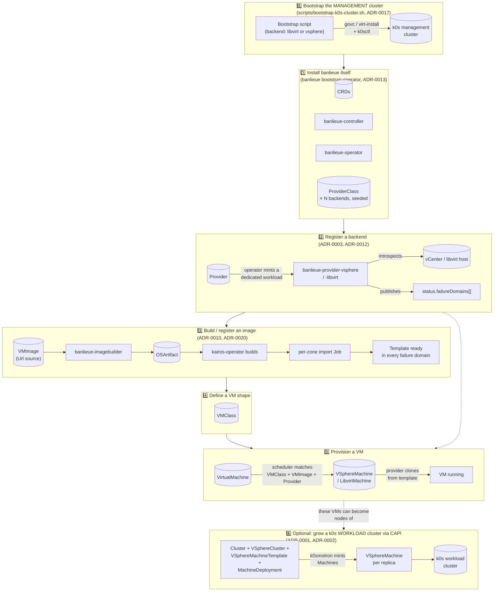

# Guide: End-to-End Setup — Bootstrap to Running VMs

Every other guide in this section zooms into **one** step of the pipeline.
This page is the map: it walks the whole chain, from "nothing exists yet"
to a running VM (and, optionally, that VM joining a k0s cluster), and links
out to the guide that covers each step in depth.

> Steps 3 and 5 are drawn for both backends to show the target shape. Only
> the vSphere path is fully wired end-to-end today: `banlieue-provider-libvirt`
> handles registration + image import (steps 2–3) but has no
> `LibvirtMachine` reconciler yet, so step 5 only clones/powers on a real VM
> on vSphere. See [Project status](../index.md#project-status).

## Walkthrough

### 0. Bootstrap the management cluster

Before any of banlieue's own CRDs exist, *something* has to run the cluster
banlieue's controllers will live on. `scripts/bootstrap-k0s-cluster.sh`
does this the old-fashioned way — no banlieue CRDs involved yet, because
banlieue doesn't exist in this cluster yet:

- **`libvirt` backend** — clones/installs Kairos VMs via `virt-install` on
  a KVM host.
- **`vsphere` backend** — clones cluster-specific Kairos templates via
  `govc`, spreading nodes evenly across compute clusters so each is its own
  etcd failure domain.
- Either way, [k0sctl](https://github.com/k0sproject/k0sctl) installs k0s
  onto the resulting VMs. An opt-in `flux` step (`FLUX_ENABLED=true`) pulls
  a registry credential from HashiCorp Vault and pushes
  `flux-operator`/`flux-core` manifests onto the first controller node.

No environment-specific identifier is ever committed — every value comes
from the `GOVC_*` environment, `govc` discovery, or an untracked operator
config (ADR-0017, ADR-0018).

**Output of this phase:** a running k0s **management** cluster with nothing
banlieue-specific on it yet.

### 1. Install banlieue

`banlieue bootstrap operator` (ADR-0013) — same binary, `bootstrap`
subcommand — applies, in order: namespace → CRDs (built at runtime from the
binary's own Rust types, so schema and binary can never disagree) →
`banlieue-controller` → `banlieue-operator` → one `ProviderClass` per
backend compiled into the binary. `--dry-run` prints the exact YAML instead
of applying it, for a GitOps repo.

**Output:** CRDs installed, two controllers running, zero backends
registered yet. See **[Core Controller](core-controller.md)**.

### 2. Register a backend

Apply a `Provider` (endpoint, credentials, declared storage/network
classes). `banlieue-operator` mints a dedicated Deployment + ServiceAccount
+ Role + RoleBinding for it (one per `Provider`, so a hung backend never
stalls another — ADR-0003), and that pod logs in, introspects the backend,
and publishes `status.failureDomains[]`.

**Output:** one or more reachable failure domains, ready for scheduling.
See **[vSphere Provider](vsphere-provider.md)** /
**[libvirt Provider](libvirt-provider.md)**, and
**[Environment / Provider Isolation](environment-provider-isolation.md)**
before you reach for a *second* `Provider` for what's actually the same
backend.

### 3. Build or register an image

A `VMImage` with a `Template`/`BackingFile` source just needs the named
template/file to already exist on the backend — the provider verifies it.
A `Url` source (an OCI-referenced Kairos image) triggers the actual build
pipeline: `banlieue-imagebuilder` requests an `OSArtifact` from
[kairos-operator](https://kairos.io), and once it's `Ready`, each matching
provider fans out **one import Job per failure domain**, turning the
built artifact into a template/volume in every zone.

**Output:** a template (or raw disk) available in every failure domain a
matching `VMClass` could schedule onto. See
**[Using banlieue-imagebuilder](using-banlieue-imagebuilder.md)** and
**[Setting up the Kairos Operator](kairos-operator-setup.md)**.

### 4. Define a VM shape

A `VMClass` names a hardware tier (CPU/memory/disks) plus the *abstract*
storage/network classes a `Provider` must satisfy — no backend-specific
field. It's shared by every `VirtualMachine` that wants this shape, and
(since [ADR-0030](https://github.com/firestoned/banlieue/blob/main/docs/adr/0030-per-zone-capability-targets.md))
portable across every cluster of a `Provider`, and across multiple
`Provider`s, without being rewritten per zone.

### 5. Provision a VM

A `VirtualMachine` references a `classRef`/`imageRef` and (optionally)
placement constraints. `banlieue-controller` resolves the scheduling
decision and server-side-applies the backend-specific infra CR
(`VSphereMachine` today; a `LibvirtMachine` is the design target but not
implemented yet — see [libvirt Provider](libvirt-provider.md)) owned by the
`VirtualMachine`, and that provider clones a real VM from the template
resolved in step 3.

**Output:** a running VM, with `VirtualMachine.status` mirroring the infra
CR's own status. See **[vSphere Provider](vsphere-provider.md)** step 6.

### 6. Optional: use these VMs as a k0s workload cluster

Nothing above required Cluster API. If you *do* want CAPI-driven
replication — "N replicas spread across failure domains" — apply a CAPI
`Cluster` + `VSphereCluster` (an `InfraCluster`, aggregating the selected
`Provider`s' failure domains) + `VSphereMachineTemplate` +
`MachineDeployment`, and a control-plane provider (k0smotron for k0s).
CAPI mints one `Machine` per replica; banlieue's `VSphereMachine`
reconciler realizes each exactly as it would for a hand-applied one.
banlieue ships **no native replica/tier controller of its own** — that's a
deliberate non-negotiable (ADR-0001): cluster-level replica management is
CAPI's job, not banlieue's, so the same provider can serve *any* CAPI
consumer (kubeadm, RKE2, k0smotron), not just banlieue's own
`VirtualMachine`.

See **[Infrastructure CRDs & CAPI](../concepts/infra-crds-capi.md)**.

## Why phase 0 is not "banlieue all the way down"

It's a fair question: doesn't the management cluster itself need VMs, and
couldn't banlieue provision *those*? It could, in principle — but at that
point in time there is no Kubernetes cluster for banlieue's controllers to
run *on* yet, so there's no CRD API to apply a `VirtualMachine` against.
Phase 0 is deliberately the one piece that talks to `govc`/`virt-install`
directly, precisely so it has no circular dependency on the thing it's
building. Once the management cluster exists, everything from phase 1
onward — including, if you choose, a *second*, CAPI-provisioned k0s
cluster in phase 6 — goes through banlieue's own CRD-only contract.

## Full detail, phase by phase

| Phase | Guide |
| --- | --- |
| 0 — Bootstrap | `scripts/bootstrap-k0s-cluster.sh --help`; ADR-0017, ADR-0018 |
| 1 — Install banlieue | [Core Controller](core-controller.md) |
| 2 — Register a backend | [vSphere Provider](vsphere-provider.md), [libvirt Provider](libvirt-provider.md), [Provider Lifecycle & Install](provider-lifecycle.md), [Environment / Provider Isolation](environment-provider-isolation.md) |
| 3 — Build an image | [Using banlieue-imagebuilder](using-banlieue-imagebuilder.md), [Setting up the Kairos Operator](kairos-operator-setup.md), [Building an Alpine VM Template](alpine-vsphere-template.md), [Building a Kairos Hadron VM Template](building-kairos-hadron-template.md) |
| 4 / 5 — VMClass / VirtualMachine | [vSphere Provider](vsphere-provider.md) steps 4–7 |
| 6 — CAPI workload cluster | [Infrastructure CRDs & CAPI](../concepts/infra-crds-capi.md) |

Every field of every CRD used along the way: **[API Reference](../reference/api.md)**.
