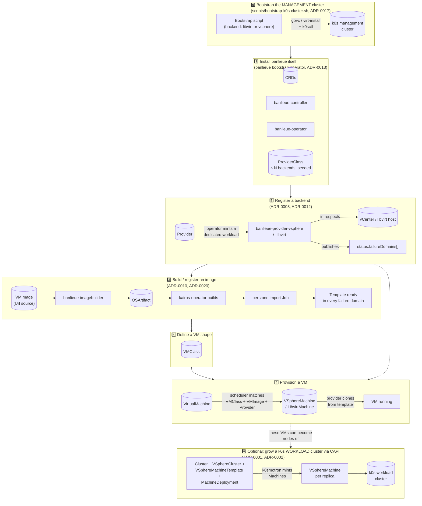

# Guide: End-to-End Setup — Bootstrap to Running VMs

Every other guide in this section zooms into **one** step of the pipeline.
This page is the map: it walks the whole chain, from "nothing exists yet"
to a running VM (and, optionally, that VM joining a k0s cluster), and links
out to the guide that covers each step in depth.


```mermaid
flowchart TB
    subgraph P0["0️⃣ Bootstrap the MANAGEMENT cluster<br/>(scripts/bootstrap-k0s-cluster.sh, ADR-0017)"]
      direction LR
      script["Bootstrap script<br/>(backend: libvirt or vsphere)"] -->|"govc / virt-install<br/>+ k0sctl"| mgmt[("k0s management<br/>cluster")]
    end

    subgraph P1["1️⃣ Install banlieue itself<br/>(banlieue bootstrap operator, ADR-0013)"]
      direction LR
      crds[(CRDs)]
      mc["banlieue-controller"]
      op["banlieue-operator"]
      pc[("ProviderClass<br/>× N backends, seeded")]
    end

    subgraph P2["2️⃣ Register a backend<br/>(ADR-0003, ADR-0012)"]
      direction LR
      prov[("Provider")] -->|"operator mints a\ndedicated workload"| provpod["banlieue-provider-vsphere\n/ -libvirt"]
      provpod -->|introspects| backend[("vCenter / libvirt host")]
      provpod -->|publishes| fds["status.failureDomains[]"]
    end

    subgraph P3["3️⃣ Build / register an image<br/>(ADR-0010, ADR-0020)"]
      direction LR
      vmi[("VMImage\n(Url source)")] --> ib["banlieue-imagebuilder"]
      ib --> osa[("OSArtifact")]
      osa --> kairos["kairos-operator builds"]
      kairos --> impjob["per-zone import Job"]
      impjob --> tmpl["Template ready\nin every failure domain"]
    end

    subgraph P4["4️⃣ Define a VM shape"]
      vmc[("VMClass")]
    end

    subgraph P5["5️⃣ Provision a VM"]
      direction LR
      vm[("VirtualMachine")] -->|"scheduler matches\nVMClass + VMImage + Provider"| infra[("VSphereMachine\n/ LibvirtMachine")]
      infra -->|"provider clones\nfrom template"| runningvm["VM running"]
    end

    subgraph P6["6️⃣ Optional: grow a k0s WORKLOAD cluster via CAPI<br/>(ADR-0001, ADR-0002)"]
      direction LR
      capi["Cluster + VSphereCluster +\nVSphereMachineTemplate +\nMachineDeployment"] -->|"k0smotron mints\nMachines"| infra2["VSphereMachine\nper replica"]
      infra2 --> k0swl[("k0s workload\ncluster")]
    end

    P0 --> P1 --> P2 --> P3
    P3 --> P4 --> P5
    P2 -.-> P5
    P5 -.->|"these VMs can become\nnodes of"| P6
```

> Steps 3 and 5 are drawn for both backends to show the target shape. Only
> the vSphere path is fully wired end-to-end today: `banlieue-provider-libvirt`
> handles registration + image import (steps 2–3) but has no
> `LibvirtMachine` reconciler yet, so step 5 only clones/powers on a real VM
> on vSphere. See [Project status](../index.md#project-status).

## Walkthrough

### 0. Bootstrap the management cluster

!!! tip "Starting from bare metal?"
    `bootstrap-k0s-cluster.sh` assumes its substrate already exists — a working
    `libvirtd` with storage pools, or a reachable vCenter plus `govc`. If you
    are starting from a machine with nothing on it, do
    [Host Bootstrap](host-bootstrap.md) first.

Before any of banlieue's own CRDs exist, *something* has to run the cluster
banlieue's controllers will live on. `scripts/bootstrap-k0s-cluster.sh`
does this the old-fashioned way — no banlieue CRDs involved yet, because
banlieue doesn't exist in this cluster yet:

- **`libvirt` backend** — clones/installs Kairos VMs via `virt-install` on
  a KVM host.
- **`vsphere` backend** — clones cluster-specific Kairos templates via
  `govc`, spreading nodes evenly across compute clusters so each is its own
  etcd failure domain.
- Either way, [k0sctl](https://github.com/k0sproject/k0sctl) installs k0s
  onto the resulting VMs. An opt-in `flux` step (`FLUX_ENABLED=true`) pulls
  a registry credential from HashiCorp Vault and pushes
  `flux-operator`/`flux-core` manifests onto the first controller node.

No environment-specific identifier is ever committed — every value comes
from the `GOVC_*` environment, `govc` discovery, or an untracked operator
config (ADR-0017, ADR-0018).

```sh
./scripts/bootstrap-k0s-cluster.sh --help
```

#### vSphere

```sh
# Scaffold the untracked env file (BACKEND must be set explicitly — it
# defaults to libvirt otherwise, even for this template-only step)
BACKEND=vsphere ./scripts/bootstrap-k0s-cluster.sh --print-env-template \
  > ~/.k0s/banlieue.env

# Fill in the node table (name/cluster/ip/role) and per-cluster placement
# maps (VSPHERE_RP / VSPHERE_DSC / VSPHERE_NET / VSPHERE_TPL), then:
BANLIEUE_ENV_FILE=~/.k0s/banlieue.env BACKEND=vsphere \
  ./scripts/bootstrap-k0s-cluster.sh all
```

Subcommands run individually: `vms | config | apply | kubeconfig | label |
flux | destroy`. `GOVC_*` (URL/creds/datacenter/CA) comes from the ambient
environment; nothing environment-specific is ever committed to the env file
(`rules/no-real-infrastructure.md`).

#### libvirt (default)

```sh
LIBVIRT_URI=qemu:///system \
VM_COUNT=4 VCPUS=2 MEM_MB=8192 DISK_GB=25 \
  ./scripts/bootstrap-k0s-cluster.sh all
```

Run on the KVM/libvirt host itself, or point `LIBVIRT_URI` at a remote one.
Kairos installs itself from `IMAGE_URL`'s ISO onto an empty disk before
`k0sctl` takes over.

#### libvirt: a long-lived cluster (kine, bridge, Kairos on Debian)

For a management cluster you keep, three options change what the defaults
give you (ADR-0085), and a fourth puts the control plane behind a virtual IP
(ADR-0086). Put them in an untracked env file
(`BANLIEUE_ENV_FILE`), since one holds a password:

```sh
# Kairos v4 ships ISOs only for Hadron; build one on Debian 13 instead.
OUT_DIR=$HOME/builds/kairos-iso ./scripts/build-kairos-debian-iso.sh
```

```sh
# ~/.config/banlieue/hosts/<name>.env  (never committed)
LIBVIRT_IMAGE_KIND=kairos
BASE_IMAGE_PATH=$HOME/builds/kairos-iso/<the ISO it printed>
IMAGE_SHA256=<the digest it printed>

# Nodes on a host bridge, with addresses from the LAN's DHCP. Fixed MACs
# let the DHCP server reserve each node's address.
LIBVIRT_BRIDGE=br0
VM_MACS="52:54:00:00:00:01 52:54:00:00:00:02 52:54:00:00:00:03"

# Cluster state in PostgreSQL through kine, instead of etcd on the nodes.
K0S_STORAGE_TYPE=kine
KINE_DATASOURCE="postgres://k0s:<password>@db.example.com:5432/k0s?sslmode=require"

# A free LAN address for the API, outside DHCP and every MetalLB pool.
API_VIP=192.0.2.10/24
```

```sh
BANLIEUE_ENV_FILE=~/.config/banlieue/hosts/<name>.env \
VM_COUNT=3 NODE_ROLES="controller+worker controller+worker controller+worker" \
  ./scripts/bootstrap-k0s-cluster.sh all
```

| Setting | Default | Effect |
| --- | --- | --- |
| `LIBVIRT_BRIDGE` | empty (use `LIBVIRT_NETWORK`) | Attach the VMs to this host bridge. Their addresses are read from the guest agent (the Debian ISO carries `qemu-guest-agent`), then the host's neighbour table. |
| `VM_MACS` | empty (libvirt picks) | One MAC per VM, in order. Reserve them in your DHCP server: k0s nodes must not change address. |
| `K0S_STORAGE_TYPE` | `etcd` | `kine` stores cluster state in the database `KINE_DATASOURCE` names. |
| `KINE_DATASOURCE` | none | The kine data source, password included. The generated `k0sctl.yaml` is written `0600`. |
| `API_VIP` | none; **required** with more than one controller | A virtual IP (`address/prefix`) keepalived floats between the controllers. k0s's reverse proxy on the holder balances the API over every controller. It becomes `externalAddress`, a certificate SAN and the kubeconfig server. With `TAILSCALE_AUTHKEY`, each node advertises it as a `/32` subnet route. |
| `API_VIP_ROUTER_ID` | `51` | VRRP virtual router ID. Must be unique on the LAN. |
| `API_VIP_AUTH_PASS` | generated into `$WORKDIR/api-vip-authpass` | VRRP password (up to 8 letters or digits), identical on every controller. It prevents collisions between clusters; it is not authentication. |
| `NO_API_VIP` | `false` | `true` accepts a multi-controller cluster with one controller as its only entry point. |
| `K0S_DISABLE_KONNECTIVITY` | `true` | Konnectivity's agents can only hold connections to one controller, which breaks webhooks, `metrics.k8s.io` and `kubectl logs` on the others. Both backends build flat networks where it is not needed. |

The database is then the cluster's single point of failure, and its backups
are the cluster's backups. The API itself survives losing any one
controller: the VIP moves, and the `kubernetes` Service lists every
controller.

If the tailnet routes are not auto-approved, approve `<VIP>/32` once per node
in the Tailscale admin console. Clients off the LAN reach the VIP through
whichever node is up.

##### Converting an existing cluster to a VIP

A cluster built before ADR-0086 has its first controller as
`externalAddress` and konnectivity running. Setting `API_VIP` and rerunning
`config` then `apply` rewrites each controller's `k0s.yaml` and, through
k0sctl's reinstall phase, its install flags. Two steps remain by hand:

1. Remove what konnectivity left behind. k0s stops managing the stack but
   does not delete it, and removing its manifest directory does not prune it
   either. On **every** controller, move the directory away so a restart
   cannot reapply it:
   `sudo mv /var/lib/k0s/manifests/konnectivity /var/lib/k0s/konnectivity-manifests.removed`
   Then delete the objects the stack created (label
   `k0s.k0sproject.io/stack=konnectivity`):

   ```sh
   kubectl -n kube-system delete daemonset/konnectivity-agent serviceaccount/konnectivity-agent
   kubectl delete clusterrolebinding system:konnectivity-server
   ```
2. Point existing kubeconfigs, and the host-resident providers'
   `/etc/banlieue/credentials/kubeconfig`, at the VIP.

Check the result with `kubectl get endpointslices -n default -l
kubernetes.io/service-name=kubernetes`, which should list every controller,
and `kubectl get apiservice v1beta1.metrics.k8s.io`, which should stay
`True`.

**Output of this phase:** a running k0s **management** cluster with nothing
banlieue-specific on it yet.

### 1. Install banlieue

`banlieue bootstrap operator` (ADR-0013) — same binary, `bootstrap`
subcommand — applies, in order: namespace → CRDs (built at runtime from the
binary's own Rust types, so schema and binary can never disagree) →
`banlieue-controller` → `banlieue-operator` → one `ProviderClass` per
backend compiled into the binary. `--dry-run` prints the exact YAML instead
of applying it, for a GitOps repo.

**Output:** CRDs installed, two controllers running, zero backends
registered yet. See **[Core Controller](core-controller.md)**.

### 2. Register a backend

Apply a `Provider` (endpoint, credentials, declared storage/network
classes). `banlieue-operator` mints a dedicated Deployment + ServiceAccount
+ Role + RoleBinding for it (one per `Provider`, so a hung backend never
stalls another — ADR-0003), and that pod logs in, introspects the backend,
and publishes `status.failureDomains[]`.

**Output:** one or more reachable failure domains, ready for scheduling.
See **[vSphere Provider](vsphere-provider.md)** /
**[libvirt Provider](libvirt-provider.md)**, and
**[Environment / Provider Isolation](environment-provider-isolation.md)**
before you reach for a *second* `Provider` for what's actually the same
backend.

### 3. Build or register an image

A `VMImage` with a `Template`/`BackingFile` source just needs the named
template/file to already exist on the backend — the provider verifies it.
A `Url` source (an OCI-referenced Kairos image) triggers the actual build
pipeline: `banlieue-imagebuilder` requests an `OSArtifact` from
[kairos-operator](https://kairos.io), and once it's `Ready`, each matching
provider fans out **one import Job per failure domain**, turning the
built artifact into a template/volume in every zone.

**Output:** a template (or raw disk) available in every failure domain a
matching `VMClass` could schedule onto. See
**[Using banlieue-imagebuilder](using-banlieue-imagebuilder.md)** and
**[Setting up the Kairos Operator](kairos-operator-setup.md)**.

### 4. Define a VM shape

A `VMClass` names a hardware tier (CPU/memory/disks) plus the *abstract*
storage/network classes a `Provider` must satisfy — no backend-specific
field. It's shared by every `VirtualMachine` that wants this shape, and
(since [ADR-0030](https://github.com/firestoned/banlieue/blob/main/docs/adr/0030-per-zone-capability-targets.md))
portable across every cluster of a `Provider`, and across multiple
`Provider`s, without being rewritten per zone.

### 5. Provision a VM

A `VirtualMachine` references a `classRef`/`imageRef` and (optionally)
placement constraints. `banlieue-controller` resolves the scheduling
decision and server-side-applies the backend-specific infra CR
(`VSphereMachine` today; a `LibvirtMachine` is the design target but not
implemented yet — see [libvirt Provider](libvirt-provider.md)) owned by the
`VirtualMachine`, and that provider clones a real VM from the template
resolved in step 3.

**Output:** a running VM, with `VirtualMachine.status` mirroring the infra
CR's own status. See **[vSphere Provider](vsphere-provider.md)** step 6.

### 6. Optional: use these VMs as a k0s workload cluster

Nothing above required Cluster API. If you *do* want CAPI-driven
replication — "N replicas spread across failure domains" — apply a CAPI
`Cluster` + `VSphereCluster` (an `InfraCluster`, aggregating the selected
`Provider`s' failure domains) + `VSphereMachineTemplate` +
`MachineDeployment`, and a control-plane provider (k0smotron for k0s).
CAPI mints one `Machine` per replica; banlieue's `VSphereMachine`
reconciler realizes each exactly as it would for a hand-applied one.
banlieue ships **no native replica/tier controller of its own** — that's a
deliberate non-negotiable (ADR-0001): cluster-level replica management is
CAPI's job, not banlieue's, so the same provider can serve *any* CAPI
consumer (kubeadm, RKE2, k0smotron), not just banlieue's own
`VirtualMachine`.

See **[Infrastructure CRDs & CAPI](../concepts/infra-crds-capi.md)**.

## Why phase 0 is not "banlieue all the way down"

It's a fair question: doesn't the management cluster itself need VMs, and
couldn't banlieue provision *those*? It could, in principle — but at that
point in time there is no Kubernetes cluster for banlieue's controllers to
run *on* yet, so there's no CRD API to apply a `VirtualMachine` against.
Phase 0 is deliberately the one piece that talks to `govc`/`virt-install`
directly, precisely so it has no circular dependency on the thing it's
building. Once the management cluster exists, everything from phase 1
onward — including, if you choose, a *second*, CAPI-provisioned k0s
cluster in phase 6 — goes through banlieue's own CRD-only contract.

## Full detail, phase by phase

| Phase | Guide |
| --- | --- |
| 0 — Bootstrap | `scripts/bootstrap-k0s-cluster.sh --help`; ADR-0017, ADR-0018 |
| 1 — Install banlieue | [Core Controller](core-controller.md) |
| 2 — Register a backend | [vSphere Provider](vsphere-provider.md), [libvirt Provider](libvirt-provider.md), [Provider Lifecycle & Install](provider-lifecycle.md), [Environment / Provider Isolation](environment-provider-isolation.md) |
| 3 — Build an image | [Using banlieue-imagebuilder](using-banlieue-imagebuilder.md), [Setting up the Kairos Operator](kairos-operator-setup.md), [Building an Alpine VM Template](alpine-vsphere-template.md), [Building a Kairos Hadron VM Template](building-kairos-hadron-template.md) |
| 4 / 5 — VMClass / VirtualMachine | [vSphere Provider](vsphere-provider.md) steps 4–7 |
| 6 — CAPI workload cluster | [Infrastructure CRDs & CAPI](../concepts/infra-crds-capi.md) |

Every field of every CRD used along the way: **[API Reference](../reference/api.md)**.
