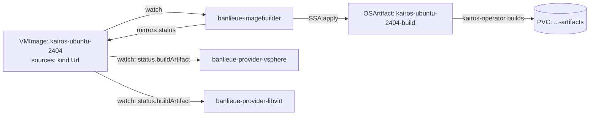

# Guide: Using banlieue-imagebuilder

This guide installs **`banlieue-imagebuilder`** (ADR-0010) — the
provider-agnostic controller that turns a `VMImage` sourced from an OCI
image (e.g. a nightly Kairos build) into a **build artifact** via
kairos-operator: a raw cloud image for libvirt sources, or a bootable ISO
with a baked-in default cloud-config for vSphere sources (ADR-0020).
Everything uses the released image `ghcr.io/firestoned/banlieue:v0.1.0`.



!!! info "What this pipeline delivers today"
    `banlieue-imagebuilder` drives a `VMImage`'s build all the way to
    `status.buildArtifact.phase: Ready`, and **both** in-tree providers
    complete the per-zone import from there:

    - **vSphere** (ADR-0020): one `image-import` Job per failure domain
      uploads the ISO to the zone's datastore, creates an EFI VM
      (pvscsi disk, vmxnet3 NIC), attaches the ISO as a CD-ROM, and marks
      it as a template. The Content Library path
      (`Provider.spec.useContentLibrary: true`, default off) is the one
      remaining stub — it reports `ContentLibraryNotImplemented`.
    - **libvirt** (ADR-0011): one import Job per declared storage pool
      streams the raw cloud image into a volume over mTLS.

## Prerequisites

- The **[core controller](core-controller.md) installed** (CRDs + controller
  running in `banlieue-system`).
- **[kairos-operator installed](kairos-operator-setup.md)**, smoke test
  passed.
- The repo checked out at the release tag (for the imagebuilder manifests):

    ```sh
    git clone --branch v0.1.0 --depth 1 https://github.com/firestoned/banlieue
    cd banlieue
    ```

## 1. Install banlieue-imagebuilder

`banlieue-imagebuilder` is the same `banlieue` image, run with the
`imagebuilder` subcommand. Its RBAC is deliberately narrow: it never reads
backend credentials, and only touches `vmimages`, `vmimages/status`,
kairos-operator's `osartifacts`, and the `cloudConfig` Secrets you point it
at — no vCenter or libvirt access of any kind passes through it.

```sh
kubectl apply -R -f deploy/imagebuilder/rbac/
kubectl apply -f deploy/imagebuilder/configmap.yaml
kubectl apply -f deploy/imagebuilder/deployment.yaml
kubectl apply -f deploy/imagebuilder/service.yaml
```

```sh
kubectl -n banlieue-system rollout status deploy/banlieue-imagebuilder --timeout=120s
```

`BANLIEUE_BUILD_NAMESPACE` (default `banlieue-imagebuild`, set in
`deploy/imagebuilder/configmap.yaml`) is where `OSArtifact` CRs — and the
artifacts PVCs kairos-operator creates for them — live. A provider's
per-zone import Jobs run in this same namespace to reach the shared PVC
(ADR-0010 / ADR-0016); leave it at the default unless you have a specific
reason to change it, and pass the same value to every provider via its own
`--build-namespace` flag so the Jobs land where the PVC is.

## 2. Create a `VMImage` with a `Url` source

Unlike a `Template` source (which names something that must already exist in
vCenter), a `Url` source names an OCI image `banlieue-imagebuilder` builds
for you. For a vSphere source the build produces a **bootable ISO**
(`auroraboot build-iso`); `spec.cloudConfig` bakes a default cloud-config
into it, and `spec.template` controls how the per-zone import turns the ISO
into a vCenter template (ADR-0020):

```yaml title="vmimage-kairos.yaml"
apiVersion: banlieue.io/v1alpha1
kind: VMImage
metadata:
  name: kairos-ubuntu-2404
spec:
  osFamily: linux
  osDistribution: ubuntu
  osVersion: "24.04"
  architecture: amd64
  guestAgent: cloud-init
  sources:
    - providerClass: vsphere
      kind: Url
      ref: unused-for-url-sources # required by the schema; ignored for kind: Url
      # Digest-pinned: the banlieue-vmimage-import-source admission policy
      # (security review 2026-07-31) rejects mutable tags when installed.
      importFrom: quay.io/kairos/ubuntu:24.04-standard-amd64-generic-v3.7.2-k0s-v1.34.3-k0s.0@sha256:e4860078c024269e81ce561ce91cf9639a4e75c23ea4cd32d3405005087192a7
  # Optional default cloud-config baked into the built ISO (ADR-0020).
  # Names a Secret in the imagebuild namespace; passed to the OSArtifact as
  # cloudConfigRef (auroraboot build-iso --cloud-config).
  cloudConfig:
    secretRef:
      name: kairos-base-cloud-config
      key: cloud-config.yaml
  # How the backend template is built from this Url source (ADR-0020).
  template:
    folder: templates/kairos   # vCenter folder, created if missing
    network: vmnet-prod        # template NIC port group (else zone default)
    disk:
      size: 100                # GiB; default 100
      type: thin               # thin | thick | eagerZeroed
      controller: pvscsi       # pvscsi | lsiLogic | lsiLogicSas | busLogic
    forceUpload: false         # delete + re-upload the ISO even if present
    forceCreate: false         # destroy + recreate the template even if present
```

(Also available as [`examples/07-vmimage-kairos-url-source.yaml`](https://github.com/firestoned/banlieue/blob/v0.1.0/examples/07-vmimage-kairos-url-source.yaml).)

```sh
kubectl apply -f vmimage-kairos.yaml
```

All of `cloudConfig` and `template` are optional: omit them for a vanilla
ISO and a thin 100 GiB pvscsi template in the datacenter's VM-folder root.
The per-zone import is idempotent — it skips an already-uploaded ISO and an
existing template; the force knobs replace a bad one without manual vCenter
cleanup.

## 3. Watch the artifact build

```sh
kubectl get vmimage kairos-ubuntu-2404 -o yaml | yq '.status.buildArtifact'
```

`phase` progresses `Pending -> Building -> Ready` (kairos-operator's own
`Exporting` phase is folded into `Building`; `Error` maps to `Failed`). You
can watch the underlying `OSArtifact` directly too:

```sh
kubectl -n banlieue-imagebuild get osartifact kairos-ubuntu-2404-build -w
```

Once `buildArtifact.phase` is `Ready`, `kind`, `pvcRef`, and `file` are
populated — that's the handoff a provider's per-zone import reads:

```text
buildArtifact:
  kind: iso                 # iso for vsphere sources, cloudImage for libvirt
  phase: Ready
  osArtifactRef: kairos-ubuntu-2404-build
  pvcRef:
    name: kairos-ubuntu-2404-build-artifacts
  file: kairos-ubuntu-2404-build.iso
```

## 4. Check per-provider / per-zone status

If a `vsphere` `Provider` is registered (see the
[vSphere Provider guide](vsphere-provider.md)), `banlieue-provider-vsphere`
picks up the `Url` source once the ISO is ready and starts one import Job
per failure domain:

```sh
kubectl get vmimage kairos-ubuntu-2404 -o yaml | yq '.status.perProvider'
```

```text
perProvider:
  - providerName: prod-vsphere
    providerNamespace: banlieue-system
    ready: true
    reason: Reconciled
    zones:
      - name: prod-vsphere-dc1-az1
        ready: true
        resolvedRef: "[ds-cluster-a] templates/kairos/kairos-ubuntu-2404"
      - name: prod-vsphere-dc1-az2
        ready: true
        resolvedRef: "[ds-cluster-b] templates/kairos/kairos-ubuntu-2404"
```

While a Job runs, its zone reports `reason: Importing`; a failed Job
reports `ImportFailed` (see the troubleshooting table below). The import
Jobs themselves live in the build namespace:

```sh
kubectl -n banlieue-imagebuild get jobs -l banlieue.io/vmimage=kairos-ubuntu-2404
```

## Integrity and lifecycle (security review 2026-07-31)

Two guarantees hold over everything above:

- **The build is bound to the `VMImage`.** The `OSArtifact` is owned by its
  `VMImage` (cluster-scoped owner of a namespaced dependent — deleting the
  image garbage-collects the build). `banlieue-imagebuilder` only mirrors a
  `Ready` from an `OSArtifact` that carries the current `VMImage`'s UID
  **and** requests the current `importFrom`; anything else — a stale object
  from before a spec change, or a foreign pre-created one — is deleted and
  rebuilt. kairos' status has no `observedGeneration` or digest to bind a
  `Ready` to the spec, so object identity is the anchor.
- **The artifact can be verified end to end.** Set `checksum: <alg>:<hex>`
  (`sha256` or `sha512`) on the `Url` source. It is copied to
  `status.buildArtifact.checksum`, and provider import Jobs hash the built
  artifact before any byte reaches a backend — both the libvirt and the
  vSphere import Jobs fail closed on mismatch or an unsupported algorithm,
  so a substituted or corrupted artifact never lands in a storage pool or
  datastore.

!!! warning "`banlieue-imagebuild` pod-create is node-root-equivalent (SEC-009)"
    The build namespace enforces PSA `privileged` because kairos' build pods
    need loop devices. That means anyone granted pod-create there can mount
    the host filesystem — treat every RoleBinding in `banlieue-imagebuild` as
    a node-root grant. Nothing but kairos' build pods, the providers' import
    Jobs, and the artifacts PVC should ever run there. The import Jobs
    mitigate this by running under a dedicated read-only ServiceAccount,
    never the provider controller's own identity (ADR-0016 §4).

## Troubleshooting

`VMImage.status.buildArtifact` not appearing at all:

- Confirm `banlieue-imagebuilder` is running:
  `kubectl -n banlieue-system logs deploy/banlieue-imagebuilder`
- Confirm the `VMImage` actually has a `Url`-kind source —
  `banlieue-imagebuilder` ignores `Template`/`BackingFile`-only images.

`buildArtifact.phase` stuck at `Pending` or `Building`:

- Check the `OSArtifact` directly:
  `kubectl -n banlieue-imagebuild describe osartifact <vmimage-name>-build`
- Check kairos-operator's own logs — a bad `importFrom` reference (typo,
  private registry needing `imageCredentialsSecretRef`, which
  `banlieue-imagebuilder` does not set) shows up there, not in
  `banlieue-imagebuilder`'s.

`buildArtifact.phase: Failed`:

- `buildArtifact.message` mirrors kairos-operator's own
  `OSArtifact.status.message` — usually a pull failure (bad `importFrom`,
  missing registry auth) or a build failure inside kairos-operator's builder
  pod.

`VMImage.status.perProvider[].reason` (vSphere provider):

| Reason | Meaning |
| --- | --- |
| `BuildPending` | `buildArtifact` isn't `Ready` yet (missing, `Pending`, or `Building`) |
| `BuildFailed` | `buildArtifact.phase == Failed` — see its `message` |
| `WrongArtifactKind` | Artifact is `Ready` but not `kind: iso` — the build pipeline is misconfigured (imagebuilder always requests `iso` for vSphere sources) |
| `NoFailureDomains` | ISO is `Ready`, but the `Provider` has no `status.failureDomains[]` published yet |
| `Importing` | A per-zone import Job is running (uploading the ISO / creating the template) |
| `ImportFailed` | The per-zone import Job failed — check the Job's logs in the build namespace |
| `ContentLibraryNotImplemented` | `Provider.spec.useContentLibrary: true` — the Content Library import path is a planned follow-up; leave it `false` |
| `UnsupportedSourceKind` | The vsphere source is `BackingFile` — not a vsphere concept, never supported here |

```sh
kubectl -n banlieue-system logs deploy/banlieue-imagebuilder
kubectl -n banlieue-system logs deploy/banlieue-provider-vsphere
kubectl -n banlieue-imagebuild logs job/<import-job-name>
kubectl describe vmimage kairos-ubuntu-2404   # Events
```

## Full schema reference

Every field of every CRD: **[API Reference](../reference/api.md)**.
