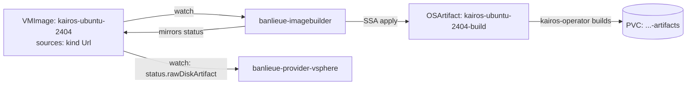

# Guide: Using banlieue-imagebuilder

This guide installs **`banlieue-imagebuilder`** (ADR-0010) — the
provider-agnostic controller that turns a `VMImage` sourced from an OCI
image (e.g. a nightly Kairos build) into a raw disk, via kairos-operator.
Everything uses the released image `ghcr.io/firestoned/banlieue:v0.1.0`.



!!! warning "What this pipeline delivers today"
    `banlieue-imagebuilder` reliably drives a `VMImage`'s raw-disk build all
    the way to `status.rawDiskArtifact.phase: Ready`. **Per-zone import into
    vCenter (convert the raw disk to VMDK, upload it, register a template) is
    not implemented yet** — `banlieue-provider-vsphere` reports each zone as
    `PerZoneImportNotImplemented` once the raw disk is ready. That is the
    explicitly-scoped follow-up in ADR-0010, not a bug. If you need a
    template today, build one manually — see
    [Building an Alpine VM Template on vSphere](alpine-vsphere-template.md) —
    or use a `Template`-kind source as in the
    [vSphere Provider guide](vsphere-provider.md#5-register-a-vmimage).

## Prerequisites

- The **[core controller](core-controller.md) installed** (CRDs + controller
  running in `banlieue-system`).
- **[kairos-operator installed](kairos-operator-setup.md)**, smoke test
  passed.
- The repo checked out at the release tag (for the imagebuilder manifests):

    ```sh
    git clone --branch v0.1.0 --depth 1 https://github.com/firestoned/banlieue
    cd banlieue
    ```

## 1. Install banlieue-imagebuilder

`banlieue-imagebuilder` is the same `banlieue` image, run with the
`imagebuilder` subcommand. Its RBAC is deliberately narrow: it never reads
Secrets or ConfigMaps, and only touches `vmimages`, `vmimages/status`, and
kairos-operator's `osartifacts` — no backend credentials of any kind pass
through it.

```sh
kubectl apply -R -f deploy/imagebuilder/rbac/
kubectl apply -f deploy/imagebuilder/configmap.yaml
kubectl apply -f deploy/imagebuilder/deployment.yaml
kubectl apply -f deploy/imagebuilder/service.yaml
```

```sh
kubectl -n banlieue-system rollout status deploy/banlieue-imagebuilder --timeout=120s
```

`BANLIEUE_BUILD_NAMESPACE` (default `banlieue-system`, set in
`deploy/imagebuilder/configmap.yaml`) is where `OSArtifact` CRs — and the
artifacts PVCs kairos-operator creates for them — live. A provider's
per-zone import work has to run in this same namespace to reach the shared
PVC (ADR-0010); leave it at the default unless you have a specific reason to
change it.

## 2. Create a `VMImage` with a `Url` source

Unlike a `Template` source (which names something that must already exist in
vCenter), a `Url` source names an OCI image `banlieue-imagebuilder` builds
for you:

```yaml title="vmimage-kairos.yaml"
apiVersion: banlieue.io/v1alpha1
kind: VMImage
metadata:
  name: kairos-ubuntu-2404
spec:
  osFamily: linux
  osDistribution: ubuntu
  osVersion: "24.04"
  architecture: amd64
  guestAgent: cloud-init
  sources:
    - providerClass: vsphere
      kind: Url
      ref: unused-for-url-sources # required by the schema; ignored for kind: Url
      # Digest-pinned: the banlieue-vmimage-import-source admission policy
      # (security review 2026-07-31) rejects mutable tags when installed.
      importFrom: quay.io/kairos/ubuntu:24.04-standard-amd64-generic-v3.7.2-k0s-v1.34.3-k0s.0@sha256:e4860078c024269e81ce561ce91cf9639a4e75c23ea4cd32d3405005087192a7
```

(Also available as [`examples/07-vmimage-kairos-url-source.yaml`](https://github.com/firestoned/banlieue/blob/v0.1.0/examples/07-vmimage-kairos-url-source.yaml).)

```sh
kubectl apply -f vmimage-kairos.yaml
```

## 3. Watch the raw-disk build

```sh
kubectl get vmimage kairos-ubuntu-2404 -o yaml | yq '.status.rawDiskArtifact'
```

`phase` progresses `Pending -> Building -> Ready` (kairos-operator's own
`Exporting` phase is folded into `Building`; `Error` maps to `Failed`). You
can watch the underlying `OSArtifact` directly too:

```sh
kubectl -n banlieue-system get osartifact kairos-ubuntu-2404-build -w
```

Once `rawDiskArtifact.phase` is `Ready`, `pvcRef` and `diskFile` are
populated — that's the handoff a provider's per-zone import reads:

```text
rawDiskArtifact:
  phase: Ready
  osArtifactRef: kairos-ubuntu-2404-build
  pvcRef:
    name: kairos-ubuntu-2404-build-artifacts
  diskFile: kairos-ubuntu-2404-build.raw
```

## 4. Check per-provider / per-zone status

If a `vsphere` `Provider` is registered (see the
[vSphere Provider guide](vsphere-provider.md)), `banlieue-provider-vsphere`
picks up the `Url` source once the raw disk is ready:

```sh
kubectl get vmimage kairos-ubuntu-2404 -o yaml | yq '.status.perProvider'
```

```text
perProvider:
  - providerName: prod-vsphere
    providerNamespace: banlieue-system
    ready: false
    reason: PerZoneImportNotImplemented
    message: "raw disk ready; 3 zone(s) pending per-zone import"
    zones:
      - name: prod-vsphere-dc1-az1
        ready: false
        reason: PerZoneImportNotImplemented
      - name: prod-vsphere-dc1-az2
        ready: false
        reason: PerZoneImportNotImplemented
      - name: prod-vsphere-dc1-az3
        ready: false
        reason: PerZoneImportNotImplemented
```

Seeing every zone stuck at `PerZoneImportNotImplemented` once the raw disk is
`Ready` is expected today (see the warning above) — it means the pipeline
worked exactly as far as it currently goes.

## Integrity and lifecycle (security review 2026-07-31)

Two guarantees hold over everything above:

- **The build is bound to the `VMImage`.** The `OSArtifact` is owned by its
  `VMImage` (cluster-scoped owner of a namespaced dependent — deleting the
  image garbage-collects the build). `banlieue-imagebuilder` only mirrors a
  `Ready` from an `OSArtifact` that carries the current `VMImage`'s UID
  **and** requests the current `importFrom`; anything else — a stale object
  from before a spec change, or a foreign pre-created one — is deleted and
  rebuilt. kairos' status has no `observedGeneration` or digest to bind a
  `Ready` to the spec, so object identity is the anchor.
- **The artifact can be verified end to end.** Set `checksum: <alg>:<hex>`
  (`sha256` or `sha512`) on the `Url` source. It is copied to
  `status.rawDiskArtifact.checksum`, and provider import Jobs hash the built
  disk before any byte reaches a backend — the libvirt import Job fails
  closed on mismatch or an unsupported algorithm, so a substituted or
  corrupted artifact never lands in a storage pool. (The vSphere per-zone
  import is not implemented yet; when it lands it inherits the same check.)

!!! warning "`banlieue-imagebuild` pod-create is node-root-equivalent (SEC-009)"
    The build namespace enforces PSA `privileged` because kairos' build pods
    need loop devices. That means anyone granted pod-create there can mount
    the host filesystem — treat every RoleBinding in `banlieue-imagebuild` as
    a node-root grant. Nothing but kairos' build pods and the artifacts PVC
    should ever run there.

## Troubleshooting

`VMImage.status.rawDiskArtifact` not appearing at all:

- Confirm `banlieue-imagebuilder` is running:
  `kubectl -n banlieue-system logs deploy/banlieue-imagebuilder`
- Confirm the `VMImage` actually has a `Url`-kind source —
  `banlieue-imagebuilder` ignores `Template`/`BackingFile`-only images.

`rawDiskArtifact.phase` stuck at `Pending` or `Building`:

- Check the `OSArtifact` directly:
  `kubectl -n banlieue-system describe osartifact <vmimage-name>-build`
- Check kairos-operator's own logs — a bad `importFrom` reference (typo,
  private registry needing `imageCredentialsSecretRef`, which
  `banlieue-imagebuilder` does not set) shows up there, not in
  `banlieue-imagebuilder`'s.

`rawDiskArtifact.phase: Failed`:

- `rawDiskArtifact.message` mirrors kairos-operator's own
  `OSArtifact.status.message` — usually a pull failure (bad `importFrom`,
  missing registry auth) or a build failure inside kairos-operator's builder
  pod.

`VMImage.status.perProvider[].reason`:

| Reason | Meaning |
| --- | --- |
| `BuildPending` | `rawDiskArtifact` isn't `Ready` yet (missing, `Pending`, or `Building`) |
| `BuildFailed` | `rawDiskArtifact.phase == Failed` — see its `message` |
| `NoFailureDomains` | Raw disk is `Ready`, but the `Provider` has no `status.failureDomains[]` published yet |
| `PerZoneImportNotImplemented` | Raw disk is `Ready`; per-zone conversion + import isn't implemented yet (see the warning above) |
| `UnsupportedSourceKind` | The vsphere source is `BackingFile` — not a vsphere concept, never supported here |

```sh
kubectl -n banlieue-system logs deploy/banlieue-imagebuilder
kubectl -n banlieue-system logs deploy/banlieue-provider-vsphere
kubectl describe vmimage kairos-ubuntu-2404   # Events
```

## Full schema reference

Every field of every CRD: **[API Reference](../reference/api.md)**.
