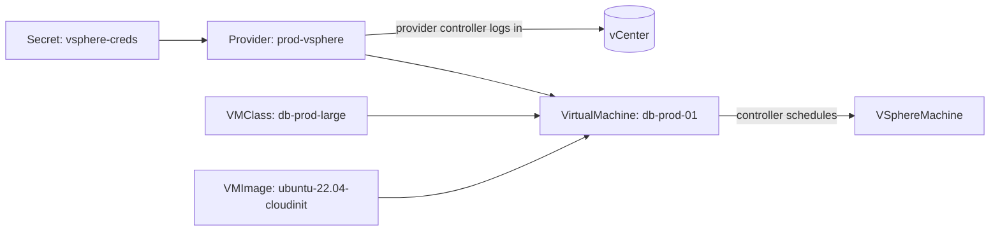

# Guide: vSphere Provider

This guide takes you from a cluster that already runs the
[core controller](core-controller.md) to a **scheduled `VirtualMachine` on
vCenter** — installing the vSphere provider, registering a vCenter, and applying
every `VMClass`, `VMImage`, and `VirtualMachine` along the way. Everything uses
the released image `ghcr.io/firestoned/banlieue:v0.1.0`; nothing is built
locally and there is no simulator. (For `vcsim`/local development, see
[Developer → Local Development](../developer/local-development.md).)



## Prerequisites

- The **[core controller](core-controller.md) installed** (CRDs + controller
  running in `banlieue-system`).
- A reachable **vCenter** and credentials with read access to inventory
  (datacenters, clusters, datastores, networks, and the VM templates you'll
  reference).
- A **VM template** present in vCenter for the image you'll register (this guide
  uses one named `ubuntu-22.04-cloudinit`).
- The repo checked out at the release tag (for the provider manifests):

    ```sh
    git clone --branch v0.1.0 --depth 1 https://github.com/firestoned/banlieue
    cd banlieue
    ```

## 1. Install the vSphere provider

The provider is the same `banlieue` image run with the `provider vsphere`
subcommand. It needs its own ServiceAccount/RBAC, a ConfigMap, and a Deployment
(all in `banlieue-system`, reusing the namespace from the controller guide).

```sh
kubectl apply -R -f deploy/provider-vsphere/rbac/
kubectl apply -f deploy/provider-vsphere/configmap.yaml
kubectl apply -f deploy/provider-vsphere/deployment.yaml
kubectl apply -f deploy/provider-vsphere/service.yaml
```

The Deployment (excerpt) — single binary, role-selected by `args`, pinned to the
release:

```yaml
# deploy/provider-vsphere/deployment.yaml (excerpt)
containers:
  - name: provider
    image: ghcr.io/firestoned/banlieue:v0.1.0
    args: ["provider", "vsphere"]
    envFrom:
      - configMapRef: { name: banlieue-provider-vsphere-config }
```

The provider's ClusterRole is read-only on `providers` (it only patches their
`status`), reads `secrets` for credentials, and reconciles `vmimages/status` and
`vspheremachines`. Wait for it:

```sh
kubectl -n banlieue-system rollout status deploy/banlieue-provider-vsphere --timeout=120s
```

## 2. Create the vCenter credentials Secret

The provider never embeds credentials in the `Provider` CR — it reads a `Secret`
referenced by `spec.connection.credentialsRef`. vSphere needs `username` and
`password` keys:

```sh
kubectl -n banlieue-system create secret generic vsphere-creds \
  --from-literal=username='administrator@vsphere.local' \
  --from-literal=password='REPLACE-ME'
```

!!! tip "Already use `govc`?"
    If your shell has `GOVC_URL` / `GOVC_USERNAME` / `GOVC_PASSWORD` set, you can
    derive the Secret and `Provider` straight from them — see the mapping table
    in [Developer → Local Development](../developer/local-development.md#from-your-govc-environment).

## 3. Register the `Provider`

A `Provider` declares one vCenter and the storage/network classes it exposes.
The `capabilities` block is the explicit contract the scheduler matches a
`VMClass` against — every class a workload requests must be listed here.

```yaml title="provider.yaml"
apiVersion: banlieue.io/v1alpha1
kind: Provider
metadata:
  name: prod-vsphere
  namespace: banlieue-system
  labels:
    dc: dc1
    env: prod
spec:
  providerClassRef:
    name: vsphere
  connection:
    endpoint: https://vcenter.example.com/sdk
    credentialsRef:
      name: vsphere-creds
    # insecureSkipTLSVerify: true     # self-signed only; prefer caBundle below
    # caBundle: |
    #   -----BEGIN CERTIFICATE-----
    #   ...
  capabilities:
    storageClasses:
      - name: gold
        target: { datastore: ds-fast-01 }
    networkClasses:
      - name: prod
        target: { portGroup: vmnet-prod }
    features: [hotAddCPU, hotAddMemory, efiSecureBoot]
```

```sh
kubectl apply -f provider.yaml
```

Within a few seconds the provider controller logs into vCenter, walks the
inventory, and populates `status.failureDomains[]` (one per datacenter/cluster):

```sh
kubectl -n banlieue-system get provider prod-vsphere
# NAME           CLASS     READY
# prod-vsphere   vsphere   True

kubectl -n banlieue-system get provider prod-vsphere -o yaml | yq '.status.failureDomains'
```

If `READY` is not `True`, jump to [Troubleshooting](#troubleshooting).

## 4. Define a `VMClass`

A `VMClass` is the reusable hardware "shape" plus the abstract classes/features a
backend must satisfy. It is cluster-scoped (no namespace). The classes named here
(`gold`, `prod`) and the features must be advertised by a candidate `Provider`.

```yaml title="vmclass.yaml"
apiVersion: banlieue.io/v1alpha1
kind: VMClass
metadata:
  name: db-prod-large
spec:
  hardware:
    cpus: 8
    memoryMiB: 32768
    disks:
      - { name: root, sizeGiB: 80,  storageClass: gold, provisioning: thin }
      - { name: data, sizeGiB: 500, storageClass: gold, provisioning: eagerZeroed }
  network:
    interfaces:
      - name: eth0
        networkClass: prod
        ipam:
          source: dhcp            # or static / pool — see the API reference
  firmware: efi-secure
  features: [hotAddCPU, hotAddMemory, efiSecureBoot]
```

```sh
kubectl apply -f vmclass.yaml
```

## 5. Register a `VMImage`

A `VMImage` maps a backend-agnostic OS name to a per-backend source. For vSphere
the source `kind: Template` and `ref` is the **template name in vCenter** (the
provider verifies it exists in every failure-domain datacenter).

```yaml title="vmimage.yaml"
apiVersion: banlieue.io/v1alpha1
kind: VMImage
metadata:
  name: ubuntu-22.04-cloudinit
spec:
  osFamily: linux
  osDistribution: ubuntu
  osVersion: "22.04"
  architecture: amd64
  guestAgent: cloud-init
  sources:
    - providerClass: vsphere
      kind: Template
      ref: ubuntu-22.04-cloudinit      # must exist as a template in vCenter
```

```sh
kubectl apply -f vmimage.yaml

# The provider flips per-provider readiness once it finds the template:
kubectl get vmimage ubuntu-22.04-cloudinit -o yaml | yq '.status.perProvider'
```

`ready: true` for `prod-vsphere` is the gate the scheduler waits on. If it stays
`false`, check the `reason` (`TemplateNotFound`, `ConnectFailed`, …).

## 6. Create a `VirtualMachine`

This is the only resource an end user writes. It references the class and image
by name and (optionally) constrains placement.

```yaml title="virtualmachine.yaml"
apiVersion: banlieue.io/v1alpha1
kind: VirtualMachine
metadata:
  name: db-prod-01
  namespace: banlieue-system
  labels: { app: db-prod }
spec:
  classRef: { name: db-prod-large }
  imageRef: { name: ubuntu-22.04-cloudinit }
  placement:
    providerSelector:
      matchLabels: { dc: dc1, env: prod }    # matches the Provider's labels
  desiredPowerState: PoweredOn
```

```sh
kubectl apply -f virtualmachine.yaml
```

## 7. Verify the end-to-end flow

```sh
kubectl -n banlieue-system get virtualmachine db-prod-01
# NAME         CLASS           IMAGE                    PROVIDER       POWER       READY
# db-prod-01   db-prod-large   ubuntu-22.04-cloudinit   prod-vsphere   PoweredOn   ...

# The controller created a backend infra CR, owned by the VM:
kubectl -n banlieue-system get vspheremachines -l app.kubernetes.io/name=banlieue
kubectl -n banlieue-system get vm db-prod-01 -o yaml | yq '.status.scheduled, .status.conditions'
```

A successful schedule populates `status.scheduled` (provider + failure domain +
resolved storage/network) and creates a `VSphereMachine` in the same namespace.

## Troubleshooting

`Provider` not `Ready` — read the condition `reason`:

| Reason | Meaning | Look at |
| --- | --- | --- |
| `SecretMissing` | `credentialsRef` Secret doesn't exist | `kubectl -n banlieue-system get secret vsphere-creds` |
| `SecretInvalid` | Secret missing `username`/`password` | `kubectl get secret … -o yaml` |
| `ConnectFailed` | bad creds / endpoint / TLS | provider logs |
| `InventoryFailed` | login OK, inventory walk failed | provider logs |

`VMImage` per-provider not ready: `TemplateNotFound` (template absent in a
datacenter), `ConnectFailed`, `LookupFailed`, `NoVSphereSource`.

`VirtualMachine` stuck `Scheduled=False`:

- `reason=ImageNotReady` — the `VMImage` isn't `ready` on any candidate provider
  (step 5).
- `reason=NoCandidates` — no `Provider` matches `placement.providerSelector`, or
  none advertises the requested storage/network class or feature. Check the
  `Provider.spec.capabilities` against the `VMClass`.

```sh
kubectl -n banlieue-system logs deploy/banlieue-provider-vsphere
kubectl -n banlieue-system logs deploy/banlieue-controller
kubectl -n banlieue-system describe virtualmachine db-prod-01   # Events
```

!!! warning "Phase 1B scope"
    This release ships capability introspection (`failureDomains`) and the
    `VMImage` template check. The `VSphereMachine` VM-lifecycle reconciler
    (clone → power-on → status mirror) lands in a later iteration, so the
    `VirtualMachine` schedules and a `VSphereMachine` is created, but the VM is
    not yet powered on in vCenter.

## Full schema reference

Every field of every CRD: **[API Reference](../reference/api.md)**.
