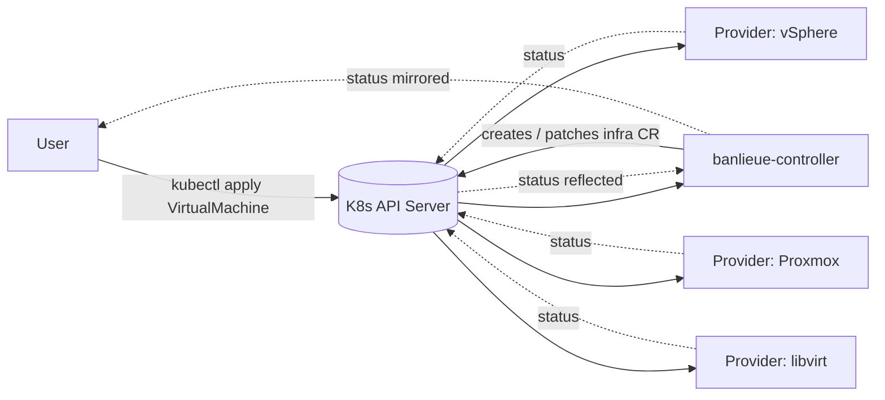

# banlieue

> A Kubernetes-native, **provider-agnostic** virtualization API.
> One CRD. Many backends. No touching the user's workflow when you swap them.

[](reference/license.md)
[](reference/roadmap.md)

---

## What is banlieue?

**banlieue** lets a Kubernetes user declare a virtual machine in the same way they
declare a `Deployment` or `Service`:

```yaml
apiVersion: banlieue.io/v1alpha1
kind: VirtualMachine
metadata:
  name: db-prod-01
spec:
  class: db-prod-large       # references a VMClass
  image: ubuntu-22-04         # references a VMImage
  providerRef:
    name: prod-vsphere        # which provider to schedule onto
```

That single CR is then **scheduled** onto whichever hypervisor or VM platform the
referenced `Provider` knows how to talk to: vSphere today, Proxmox or libvirt
tomorrow, or some other backend a third party writes — without changing the user's
manifest.

## Why does banlieue exist?

Because the **VM control plane is fragmented**, and every team that runs more than
one hypervisor ends up writing the same glue twice. The reasoning behind the
project — the abstraction philosophy, the "least-touch on the user workflow"
principle, the deliberate choice to keep providers behind CRDs instead of RPC —
is the subject of the [Why banlieue?](reasoning/index.md) section. Start there if
you want to understand the design before the code.

The short version:

- **One declarative API** for VMs, regardless of backend.
- **Swap or mix providers** without rewriting workloads — vSphere here, Proxmox there, libvirt for dev — all in the same cluster.
- **Zero new transports**: the contract between the controller and providers is the Kubernetes API itself. No gRPC, no REST, no custom auth.
- **Reuses an existing, battle-tested status model**: provider CRDs satisfy the [Cluster API v1beta2 InfraMachine contract](https://cluster-api.sigs.k8s.io/developer/providers/contracts/).

## What banlieue is **not**

- Not a hypervisor.
- Not a "lift-and-shift" tool that pretends VMs are containers (see Kubevirt for that).
- Not a CAPI replacement — banlieue happily coexists with CAPI but does not depend on it.
- Not a closed system: providers are a documented contract; anyone can write one.

See [Non-Goals](reasoning/non-goals.md) for the full list.

## How it works (one diagram)



The main controller never speaks directly to a provider. Both sides watch the
Kubernetes API; that is the bus. See [Architecture](concepts/architecture.md) and
[CRD-Only Contract](reasoning/crd-only-contract.md).

## Project status

banlieue is **early**. Phase 0 (the `banlieue-api` type system + CRDs) shipped.
Phase 1A (main controller + provider SDK + first vSphere provider) is in
progress. See the [roadmap](reference/roadmap.md) for the full plan.

The CRD surface is `v1alpha1` and will break before `v1`. Don't run production
workloads against it yet.

## Where to go next

- [Overview — what banlieue does, fundamentally](overview.md) ← start here
- [Why banlieue? — the case for this project](reasoning/index.md)
- [Architecture](concepts/architecture.md)
- [Quick Start](getting-started/quickstart.md)
- [Roadmap](reference/roadmap.md)
- [License](reference/license.md)

## Community & support

- **GitHub Issues**: <https://github.com/firestoned/banlieue/issues>
- **GitHub Discussions**: <https://github.com/firestoned/banlieue/discussions>

## License

banlieue is open-source software, licensed under the [Apache License 2.0](reference/license.md).
