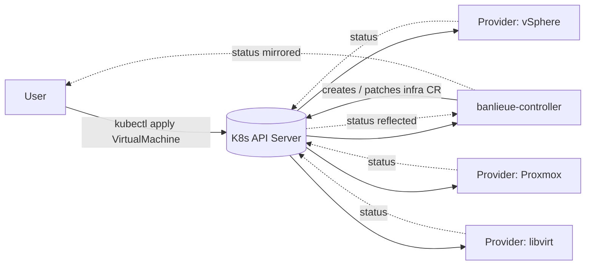

# banlieue

> **Pronunciation:** IPA `/bɑ̃.ljø/` — "bohn-lyuh": a nasalized "bon" (as in
> French "blanc") followed by "lyuh" with a rounded French **u** (like
> German ü, or French "tu").

> A Kubernetes-native, **provider-agnostic** virtualization API.
> One CRD. Many backends. No touching the user's workflow when you swap them.

[](https://github.com/firestoned/banlieue/actions/workflows/build.yaml)
[](reference/license.md)
[](https://www.rust-lang.org/)
[](https://github.com/firestoned/banlieue)

---

## What is banlieue?

**banlieue** lets a Kubernetes user declare a virtual machine in the same way they
declare a `Deployment` or `Service`:

```yaml
apiVersion: banlieue.io/v1alpha1
kind: VirtualMachine
metadata:
  name: db-prod-01
spec:
  classRef:
    name: db-prod-large       # references a VMClass
  imageRef:
    name: ubuntu-22-04         # references a VMImage
  placement:
    providerSelector:
      matchLabels: { dc: dc1, env: prod }  # which Provider(s) may schedule this VM
```

That single CR is then **scheduled** onto whichever `Provider` matches
`placement.providerSelector` and knows how to talk to a real backend: vSphere
can create and power on VMs today; libvirt can register hosts and import
images (VM lifecycle is landing next); Proxmox is planned; or any other
backend a third party writes — without changing the user's manifest.

## Why does banlieue exist?

Because the **VM control plane is fragmented**, and every team that runs more than
one hypervisor ends up writing the same glue twice. The reasoning behind the
project — the abstraction philosophy, the "least-touch on the user workflow"
principle, the deliberate choice to keep providers behind CRDs instead of RPC —
is the subject of the [Why banlieue?](reasoning/index.md) section. Start there if
you want to understand the design before the code.

The short version:

- **One declarative API** for VMs, regardless of backend.
- **Swap or mix providers** without rewriting workloads — vSphere here, libvirt for dev, Proxmox once it lands — all in the same cluster.
- **Zero new transports**: the contract between the controller and providers is the Kubernetes API itself. No gRPC, no REST, no custom auth.
- **Reuses an existing, battle-tested status model**: provider CRDs satisfy the [Cluster API v1beta2 InfraMachine contract](https://cluster-api.sigs.k8s.io/developer/providers/contracts/).

## What banlieue is **not**

- Not a hypervisor.
- Not a "lift-and-shift" tool that pretends VMs are containers (see Kubevirt for that).
- Not a CAPI replacement — banlieue happily coexists with CAPI but does not depend on it.
- Not a closed system: providers are a documented contract; anyone can write one.

See [Non-Goals](reasoning/non-goals.md) for the full list.

## How it works (one diagram)


```mermaid
flowchart LR
    user[User] -->|kubectl apply VirtualMachine| api[(K8s API Server)]
    api --> ctrl[banlieue-controller]
    ctrl -->|creates / patches infra CR| api
    api --> p1[Provider: vSphere]
    api --> p2[Provider: Proxmox]
    api --> p3[Provider: libvirt]
    p1 -.->|status| api
    p2 -.->|status| api
    p3 -.->|status| api
    api -.->|status reflected| ctrl
    ctrl -.->|status mirrored| user
```

The main controller never speaks directly to a provider. Both sides watch the
Kubernetes API; that is the bus. See [Architecture](concepts/architecture.md) and
[CRD-Only Contract](reasoning/crd-only-contract.md).

> The diagram shows the target shape of three interchangeable providers. Today
> only the vSphere provider actually creates VMs; the libvirt provider
> registers hosts and imports images (no VM lifecycle yet), and Proxmox has no
> provider implementation yet. See [Project status](#project-status).

## Project status

banlieue is **early**. Phase 0 (the `banlieue-api` type system + CRDs) shipped.
Phase 1A is far enough along that the main controller, `banlieue-operator`,
and the vSphere provider create and power on real VMs end-to-end (vSphere's
create path only — no update/drift/live-migration yet). The libvirt provider
registers hosts and imports images, but has no VM/domain lifecycle yet.
Proxmox has no provider implementation. Detailed phase plans are maintained
outside this repository.

The CRD surface is `v1alpha1` and will break before `v1`. Don't run production
workloads against it yet.

## Where to go next

- [Overview — what banlieue does, fundamentally](overview.md) ← start here
- [Why banlieue? — the case for this project](reasoning/index.md)
- [Guides — install the controller & vSphere provider](guides/index.md)
- [Architecture](concepts/architecture.md)
- [Developer — build from source & local dev](developer/local-development.md)
- [License](reference/license.md)

## Community & support

- **GitHub Issues**: <https://github.com/firestoned/banlieue/issues>
- **GitHub Discussions**: <https://github.com/firestoned/banlieue/discussions>

## License

banlieue is open-source software, licensed under the [Apache License 2.0](reference/license.md).
