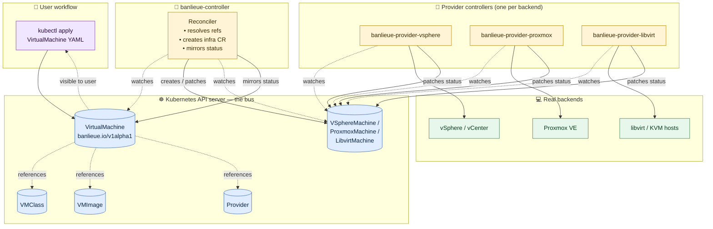

# Overview

> **What banlieue does, in one sentence:** it gives you a single
> Kubernetes-native API for describing virtual machines, then dispatches each
> VM to whichever hypervisor backend you've plugged in — vSphere, Proxmox,
> libvirt, or one you write yourself — without your manifest ever changing
> shape.

This page is the **fundamentals**: what banlieue is, what it does, and how the
pieces fit together at a single glance. For the *reasoning* behind these
choices, see [Why banlieue?](reasoning/index.md). For the wiring, see
[Architecture](concepts/architecture.md).

## The fundamental idea

There are three actors:

| Actor | What they do |
| --- | --- |
| **User** | Writes one `VirtualMachine` YAML. Runs `kubectl apply`. That's it. |
| **banlieue controller** | Watches `VirtualMachine`s, resolves their refs, creates a backend-specific *infrastructure* CR, and mirrors status back. |
| **Provider controller** | Watches its infrastructure CR and talks to a real hypervisor (vSphere / Proxmox / libvirt / …). |

Everything happens through the **Kubernetes API**. There is no second protocol,
no RPC, no message bus. CRDs are the messages. The K8s API server is the bus.

## High-level diagram



Three rules to remember when reading the diagram:

1. **Solid arrows are reads/writes against the K8s API.** That's the *only*
   form of communication between any two controllers.
2. **Dashed arrows are watches or references** — they exist in the data, not
   on a network wire.
3. **The user only ever interacts with the top-left box.** Everything else is
   plumbing they shouldn't have to see.

## A 10-second walkthrough

1. The user writes:

    ```yaml
    apiVersion: banlieue.io/v1alpha1
    kind: VirtualMachine
    metadata:
      name: db-prod-01
    spec:
      class: db-prod-large
      image: ubuntu-22-04
      providerRef:
        name: prod-vsphere
    ```

2. The **banlieue controller** sees it, looks up `db-prod-large`,
   `ubuntu-22-04`, and `prod-vsphere`, and creates a `VSphereMachine` carrying
   the resolved spec.

3. The **vSphere provider controller** sees the new `VSphereMachine`, talks to
   vCenter, provisions the VM, and writes status (`Ready=true`, addresses,
   provider ID) back onto the `VSphereMachine`.

4. The **banlieue controller** sees that status and mirrors it onto
   `VirtualMachine.status` so the user can `kubectl get vm db-prod-01` and
   see `READY=true`.

If the user later changes `providerRef` to `prod-proxmox`, the same sequence
happens — but now the **Proxmox** provider controller picks up the work, on
the same Kubernetes API, with the same status contract.

## What "fundamentally" buys you

Because everything below the user's CR is uniform and pluggable:

- **Swap a backend** by changing one field (`providerRef`).
- **Mix backends** in one cluster — prod on vSphere, dev on libvirt, edge on
  Proxmox — addressed by the same `kind: VirtualMachine`.
- **Add a new backend** by writing a provider once; every existing
  `VirtualMachine` becomes deployable there with no manifest change.
- **Audit, RBAC, GitOps, OPA, dashboards, etc.** all work the same way they
  work for any Kubernetes resource — no special tooling.

These properties are not features bolted onto banlieue. They are *consequences*
of two design choices: the [abstraction principle](reasoning/abstraction-principle.md)
and the [CRD-only contract](reasoning/crd-only-contract.md). If you only have
time to read two pages of *Why banlieue?*, read those.

## What banlieue is **not**

- Not a hypervisor — it does not run VMs, it drives existing hypervisors.
- Not [Kubevirt](https://kubevirt.io/) — VMs do not run as pods on K8s nodes.
- Not [CAPI](https://cluster-api.sigs.k8s.io/) — banlieue's `VirtualMachine`
  is not a `clusterv1.Machine`; the two coexist and even share providers, but
  banlieue's user-facing API is independent.
- Not generic — it is opinionated about *one* contract (VMs), not a framework
  for modelling arbitrary resources.

See [Comparisons](reasoning/comparisons.md) and [Non-goals](reasoning/non-goals.md)
for the full version.

## Where to go from here

- [Why banlieue?](reasoning/index.md) — the long-form argument.
- [Architecture](concepts/architecture.md) — the wiring, watches, and reconcile
  flow in depth.
- [Provider Model](concepts/providers.md) — what a provider looks like and how
  to write one.
- [Guides](guides/index.md) — install the controller and the vSphere provider on
  a real cluster.
