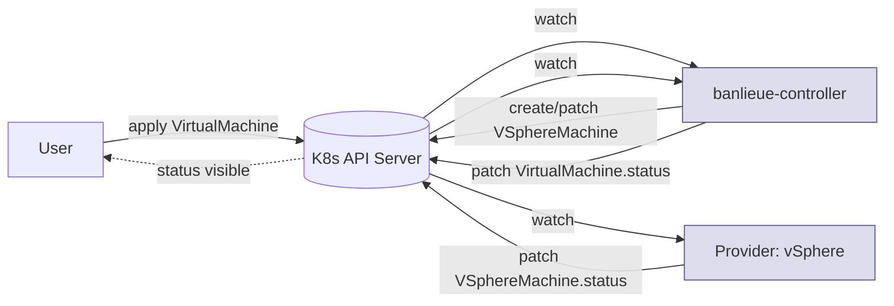

# CRD-only contract

This is the architectural decision that ties the [abstraction
principle](abstraction-principle.md) to a *working* system: **the main banlieue
controller and the provider controllers communicate only through the Kubernetes
API.** No gRPC. No REST. No internal message bus. No shared library version.

Said in one line:

> **The Kubernetes API server is the bus. CRDs are the messages.**

## What this means in practice

- The user patches `VirtualMachine`.
- The banlieue controller watches `VirtualMachine` and patches an infrastructure
  CR (e.g. `VSphereMachine`).
- The provider watches its own infrastructure CR and acts.
- The provider patches `.status` on the infrastructure CR.
- The banlieue controller watches that status and mirrors it up to the
  `VirtualMachine`.

**Every arrow in that diagram is a Kubernetes API call.** Nothing else.

## Why we picked this over RPC

The instinct in a multi-component system is to wire the components together
with RPC. It's faster (lower latency), more *imperative* (easier to reason about
at first glance), and feels like "proper" decoupling. We deliberately rejected
it. Here's why.

### 1. RPC re-creates the very fragmentation we set out to remove

If the controller speaks gRPC to a vSphere provider, it must *also* speak gRPC
to the Proxmox provider, and to the libvirt provider, and to whatever shows up
next. Each provider must implement the protocol, version it, secure it,
authenticate it, observe it. Now every provider author has a new burden — and
worse, that burden has nothing to do with hypervisors. It's plumbing.

CRDs don't have that burden. Every provider is *already* a Kubernetes
controller — it has to be — and Kubernetes controllers already know how to
read CRs and patch status. There is no second protocol to learn or implement.

### 2. RPC is a closed system

A gRPC contract is a *binary* contract: who's allowed to call, who's allowed
to be called, who has the proto. If a third party wants to write a provider,
they need to know our proto, link against our generated stubs, and stay in
sync with our schema bumps.

A CRD contract is *open*. The CRD is published in the cluster. Anyone with
RBAC can write a controller against it. The Kubernetes type system is the
schema language, server-side validation is the type checker, and `kubectl
explain` is the documentation. Outside contributors do not need to fork
anything to ship a provider.

### 3. RPC creates a status-of-truth problem

In RPC-coupled systems, two questions get hard:

- *"What's the real state of this VM right now?"*
- *"What did the controller think it was doing?"*

If the controller calls a provider over gRPC, the *truth* lives in the
provider's memory, ephemerally, between calls. The CR's `.status` is a delayed
projection of that memory. When things crash, the projections diverge.

With CRD-only: **the cluster IS the state.** There is no off-cluster memory of
record. If you want to know what's happening, you look at the CR. Reconcile
loops on both sides re-converge against that state with no special protocol.

### 4. RPC concentrates auth, networking, and version skew

Every gRPC channel is a service to expose, a TLS cert to rotate, a network
policy to write, an mTLS identity to provision, and a schema version to negotiate.
Multiply by N providers and you have a small platform of plumbing to operate
*before* you've started running a single VM.

CRD-only inherits the cluster's auth and networking: RBAC on the CRD is the
authorization story. The control plane's connectivity is the network story.
The CRD version field is the version story. We aren't reinventing any of
this; we're reusing what Kubernetes already operates.

### 5. CAPI already proved the pattern works

The Kubernetes
[Cluster API project](https://cluster-api.sigs.k8s.io/) made exactly this
choice years ago: CAPI's "infrastructure providers" don't speak RPC to the
core controller. They communicate through `InfraMachine` CRDs. CAPI now has
dozens of providers across every major cloud and on-prem platform, and they
interoperate because the contract is a *resource*, not a service.

banlieue's providers satisfy the same `InfraMachine` contract (v1beta2). That
means a banlieue provider can also be a CAPI infra provider with little extra
work — and it means we get a battle-tested status model for free. See
[Infrastructure CRDs & CAPI](../concepts/infra-crds-capi.md).

## What we give up — and why we don't care

CRD-only has costs, and we want to be honest about them.

| Cost | Why it doesn't matter for this problem |
| --- | --- |
| Higher latency (etcd write + watch delivery) | VM provisioning is seconds-to-minutes anyway. The bus is not the bottleneck. |
| Eventual consistency | Reconciliation is *defined* as converging to declared state. Eventual is the model. |
| Higher etcd load with N machines | Bounded and well-understood; mitigated by ordinary controller best practices (per-object reconcile, server-side apply, leader election). |
| No "request/response" semantics | We don't need them. The CR is the request; the status is the response. Status-mirroring already gives the user a stable feedback signal. |

In short: every cost is paid in the dimension where we have slack (latency,
write rate), and saved in the dimension where slack is precious (developer
time, provider author time, integration cost).

## The invariants this contract gives us

Because the bus is the K8s API and the messages are CRDs, we get for free:

- **Audit log.** Every state change is in the audit log. Forensics is `kubectl
  get` + `kubectl logs`.
- **RBAC.** Who can do what is in the cluster's RBAC, not in a per-provider
  config.
- **Authoring.** Anyone with `kubectl` can write a provider's test fixture.
- **Tooling.** Every CR works with `kubectl`, GitOps, Argo, Flux, OPA,
  Kyverno, kube-prometheus — without us writing adapters.
- **Federation.** A `VirtualMachine` in cluster A can reference a `Provider` in
  cluster A — and the *next* version of banlieue can extend that to remote
  clusters by reusing standard Kubernetes federation, not by building a custom
  one.

## In one line

> **No RPC, ever, between controllers. The Kubernetes API is sufficient,
> battle-tested, and the only bus that doesn't undo the abstraction we just
> built.**

The next page — [Comparisons](comparisons.md) — frames banlieue against the
other projects in this space.
