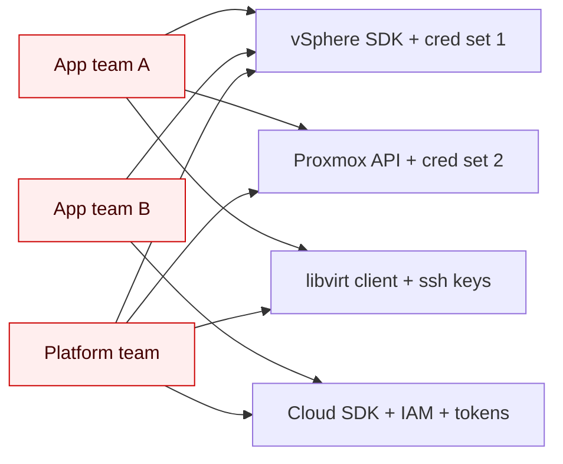

# The problem

The VM control plane is fragmented, and the cost of that fragmentation is paid
in the wrong place.

## What "fragmented" looks like in practice

Every serious shop that runs VMs runs **more than one** way of producing them:

- A vSphere cluster for production.
- A Proxmox cluster for a regional office or a lab.
- libvirt / KVM hosts for developer workstations or dev environments.
- A cloud provider somewhere for burst capacity.
- And — increasingly — an "edge" footprint of bare metal that someone has to
  templates onto.

Each of these has its own API, its own SDK, its own auth story, its own idea of
what a "VM template" is, its own quirks about how disks attach, its own network
model, and its own command-line conventions. None of them are *bad* — they are
all reasonable choices for the surface they were designed for. But put together,
they form a control plane that looks like this:

The variation is *fanned out* onto every consumer. That is what we mean by
"fragmented": the user — the app team, the platform team, the CI job — has to
care about which backend it lives on, and re-encode that caring in scripts,
Terraform modules, Ansible roles, custom CRDs, internal wrappers, and shell
glue.

## Where the cost actually lands

The fragmentation has four cumulative costs, each more expensive than the last.

### 1. Duplicated glue

Every team writes the same code: *"how do I get a VM with these specs on this
backend?"* — twice for vSphere and Proxmox, three times if libvirt is in the
mix. Some of it ends up in internal SDKs, most of it ends up in shell scripts
and Terraform modules that one person maintains.

### 2. Workloads coupled to backends

A workload that "lives on vSphere" doesn't just *live* on vSphere — it
*encodes* that fact. Its automation, its disaster-recovery story, its
provisioning manifests, its monitoring all assume vSphere semantics. Moving it
to Proxmox isn't a migration; it's a port.

### 3. Backend choice becomes irreversible

Because the workload encodes its backend, the *choice* of backend becomes
sticky. You can't try Proxmox in a corner without committing the team. You
can't move a project to libvirt for dev because dev manifests don't look like
prod manifests. The blast radius of *changing your mind* is enormous, which
means you stop trying.

### 4. New backends are a research project

Adding a new hypervisor — say, a colo provider that runs OpenStack, or a new
edge platform — is not "install a driver." It is: pick an automation tool, write
or fork a module, retrofit it into every workload that should be deployable
there, and re-train every team.

## Why this won't be solved by yet another SDK

The temptation is to write *one more abstraction* — an internal Python module,
a Terraform provider wrapper, a Go library — that hides the differences behind
function calls. Every shop has tried this. Most have shipped two or three of
them. They keep failing for the same reason:

> **An SDK lives in code. A control plane lives in declarations.**

Code-based abstractions are linked into the caller. Each caller must be rebuilt,
re-deployed, and re-authorized to upgrade them. The backend choice is still
encoded at the call site. You haven't removed the fragmentation — you've moved
it under a thin veneer.

What's needed instead is a **declarative** abstraction: one whose contract is a
*resource*, not a function call. One where the user describes *what they want*
and the system figures out *which backend produces it*. One that lives in the
control plane, not in every caller's binary.

That contract already exists in modern infrastructure: it's a Kubernetes CRD.
banlieue uses it.

## What banlieue moves where

| Concern | Before banlieue | With banlieue |
| --- | --- | --- |
| "I want a VM with these specs" | written per-backend, per-team | one `VirtualMachine` CR |
| "Which backend produces it?" | encoded in each workload's automation | one `providerRef` field |
| "What does ready-to-use look like?" | a different status story per backend | one set of conditions on the CR |
| "How do I add a new backend?" | retrofit every workload | write one provider; users don't change |
| "How do I mix backends in one cluster?" | usually you can't | swap the `providerRef` |

The next page — [The abstraction principle](abstraction-principle.md) — explains
the rule banlieue follows to keep this honest.
